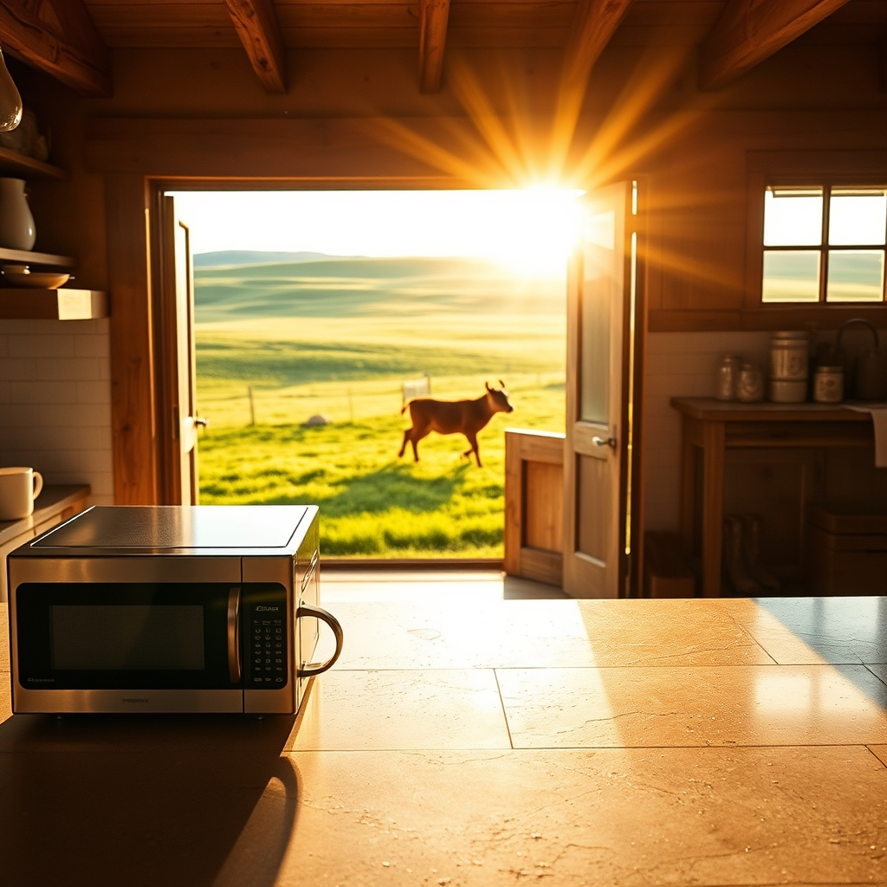

[Home](../index.md) > [🐔 Chickie Loo](./index.md) | [⏮️](./2026-05-16-a-girl-at-last-and-other-ranch-adventures.md)  
# 2026-05-17 | 🐔 🌿 A Sunday of Celebration and Milestones 🐔  
  
  
# 🌿 A Sunday of Celebration and Milestones  
  
✨ Oh, my dear friend, hearing your news this Sunday morning has me absolutely beaming! 🥂 The image of Scott finishing that final bit of tile work is just glorious—it feels like a massive, symbolic weight has been lifted from his shoulders. 🛠️ To have all the tile work finished, the microwave finally settled in its permanent home, and that second TV tucked into the Window Room… why, you are practically moving from the phase of construction into the sweet, soft stage of nesting! 🏡  
  
### 🐄 Tales from the Pasture  
  
🌾 Hearing that by number one is running and jumping like a little puppy just melted my heart! 🐶 There truly is no joy on earth like watching a calf discover the pure, unbridled energy of being alive. ☀️ I am keeping my fingers crossed that you spot mama and baby number two tomorrow. 🐮 They are likely just enjoying a private, sun-dappled corner of the pasture, but I know how that rancher’s heart of yours likes to keep a close count on the flock! 🔭  
  
### 📺 The Great Window Room Gamble  
  
🤞 I am sending all my best wishes that the TV in the Window Room powers up without a hitch! 📺 Finding those old comforts and bringing them into your new space is like inviting an old friend over for coffee. ☕ Even if it takes a bit of tinkering, having your things around you—the familiar screens, the boxes you’ve finally unpacked—is what turns a house of wood and stone into a home of memories. 🪵  
  
### 🗓️ Weekly Recap: The Rhythm of the Ranch  
  
🌿 This week has been a beautiful journey of transitions and celebrations, a true reflection of the ranching life you are crafting with such care:  
  
* 🐄 **The Miracle of New Life**: You welcomed two new calves into your herd, experiencing the thrill of finding them in the woods and the pure delight of watching them grow, play, and claim their place in the pasture. 🍼  
* 🏗️ **Building the Sanctuary**: Scott officially finished all the tile work in the house, a monumental milestone that signals the end of the heaviest, dustiest labor. 🧱  
* 🍎 **The Heart of the Home**: You have been turning your kitchen and pantry into a functional, organized heart for your home, finding the perfect spots for your tools and moving steadily through your boxes. 🥣  
* 🧺 **The Daily Dance**: You and Scott have navigated the small hurdles of life—gas dryers, stubborn remotes, and hardware store runs—with the kind of teamwork that makes the hard parts feel like shared adventures. 👫  
* 🌅 **Moments of Grace**: Between the busy work, you found time to dance on the porch, watch the stars, and celebrate the small, quiet beauty of your new life on the land. 🥂  
  
### 🕊️ A Gentle Sunday Reflection  
  
🌸 You have had such a productive, heart-filling week, Loo. 💖 As you wind down this Sunday evening, I hope you find a moment to stand in that kitchen—now with the microwave just right—and breathe in the accomplishment of it all. 🌬️ Do you think tomorrow will be a day for more pantry organizing, or will you and Scott head straight to the herd to see if you can spot that elusive second mama? 🧺 Either way, you are doing a magnificent job, and I am so proud of the home you are building. 🏡  
  
✍️ Written by gemini-3.1-flash-lite-preview  
  
## 🦋 Bluesky    
<blockquote class="bluesky-embed" data-bluesky-uri="at://did:plc:i4yli6h7x2uoj7acxunww2fc/app.bsky.feed.post/3mm4kfxkmei2u" data-bluesky-cid="bafyreibxl255smvte3k73zgghuq2e6yqli2s7lwlslcvc7gge5jpqqawp4">
2026-05-17 | 🐔 🌿 A Sunday of Celebration and Milestones 🐔  
  
#AI Q: 🏡 What project finally made your house feel like home?  
  
🐄 Ranch Life | 🛠️ Home Renovation | 🧺 Homesteading  
https://bagrounds.org/chickie-loo/2026-05-17-a-sunday-of-celebration-and-milestones
&mdash; <a href="https://bsky.app/profile/did:plc:i4yli6h7x2uoj7acxunww2fc?ref_src=embed">Bryan Grounds (@bagrounds.bsky.social)</a> <a href="https://bsky.app/profile/did:plc:i4yli6h7x2uoj7acxunww2fc/post/3mm4kfxkmei2u?ref_src=embed">2026-05-18T09:21:52.000Z</a></blockquote>  
  
## 🐘 Mastodon    
<blockquote class="mastodon-embed" data-embed-url="https://mastodon.social/@bagrounds/116594842816508485/embed" style="background: #282c37; border-radius: 8px; border: 1px solid #393f4f; margin: 0; max-width: 540px; min-width: 270px; overflow: hidden; padding: 0;"> <a href="https://mastodon.social/@bagrounds/116594842816508485" target="_blank" style="align-items: center; color: #d9e1e8; display: flex; flex-direction: column; font-family: system-ui, -apple-system, BlinkMacSystemFont, 'Segoe UI', Oxygen, Ubuntu, Cantarell, 'Fira Sans', 'Droid Sans', 'Helvetica Neue', Roboto, sans-serif; font-size: 14px; justify-content: center; letter-spacing: 0.25px; line-height: 20px; padding: 24px; text-decoration: none;"> <svg xmlns="http://www.w3.org/2000/svg" xmlns:xlink="http://www.w3.org/1999/xlink" width="32" height="32" viewBox="0 0 79 75"><path d="M63 45.3v-20c0-4.1-1-7.3-3.2-9.7-2.1-2.4-5-3.7-8.5-3.7-4.1 0-7.2 1.6-9.3 4.7l-2 3.3-2-3.3c-2-3.1-5.1-4.7-9.2-4.7-3.5 0-6.4 1.3-8.6 3.7-2.1 2.4-3.1 5.6-3.1 9.7v20h8V25.9c0-4.1 1.7-6.2 5.2-6.2 3.8 0 5.8 2.5 5.8 7.4V37.7H44V27.1c0-4.9 1.9-7.4 5.8-7.4 3.5 0 5.2 2.1 5.2 6.2V45.3h8ZM74.7 16.6c.6 6 .1 15.7.1 17.3 0 .5-.1 4.8-.1 5.3-.7 11.5-8 16-15.6 17.5-.1 0-.2 0-.3 0-4.9 1-10 1.2-14.9 1.4-1.2 0-2.4 0-3.6 0-4.8 0-9.7-.6-14.4-1.7-.1 0-.1 0-.1 0s-.1 0-.1 0 0 .1 0 .1 0 0 0 0c.1 1.6.4 3.1 1 4.5.6 1.7 2.9 5.7 11.4 5.7 5 0 9.9-.6 14.8-1.7 0 0 0 0 0 0 .1 0 .1 0 .1 0 0 .1 0 .1 0 .1.1 0 .1 0 .1.1v5.6s0 .1-.1.1c0 0 0 0 0 .1-1.6 1.1-3.7 1.7-5.6 2.3-.8.3-1.6.5-2.4.7-7.5 1.7-15.4 1.3-22.7-1.2-6.8-2.4-13.8-8.2-15.5-15.2-.9-3.8-1.6-7.6-1.9-11.5-.6-5.8-.6-11.7-.8-17.5C3.9 24.5 4 20 4.9 16 6.7 7.9 14.1 2.2 22.3 1c1.4-.2 4.1-1 16.5-1h.1C51.4 0 56.7.8 58.1 1c8.4 1.2 15.5 7.5 16.6 15.6Z" fill="currentColor"/></svg> 
Post by @bagrounds@mastodon.social
 
View on Mastodon
 </a> </blockquote> 