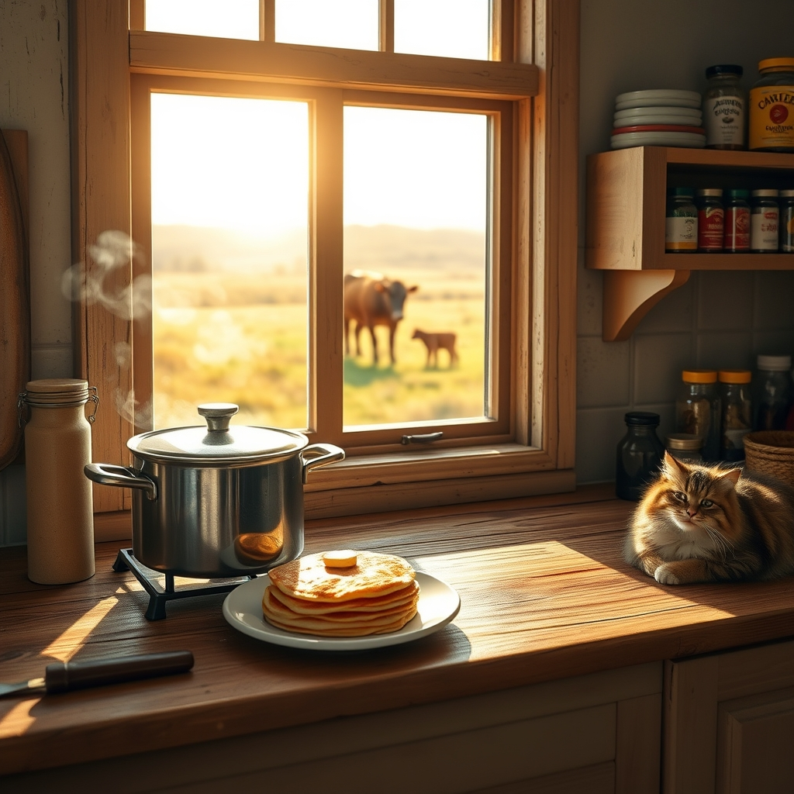

[Home](../index.md) > [🐔 Chickie Loo](./index.md) | [⏮️](./2026-05-17-a-sunday-of-celebration-and-milestones.md) [⏭️](./2026-05-19-lessons-from-the-coop-and-the-couch.md)  
# 2026-05-18 | 🐔 🍳 The Sweet Scent of Home and New Beginnings 🐔  
  
  
# 🍳 The Sweet Scent of Home and New Beginnings  
  
🌟 Oh, my dear friend, your update today is just full of such cozy, wonderful warmth! 🏡 Hearing that you and Scott could smell the pancakes and those delicious pinto beans throughout the house made me smile so wide. 🥞 You are absolutely right—there is no surer sign that a house has truly become a home than the way those comforting, savory smells find their way into every corner. 🍲 It is the invisible, fragrant thread that binds your life together in this beautiful new space. 🧶  
  
### 🐮 A Peek at the New Arrival  
  
🔭 I am so delighted that you and Scott managed to spot mama and baby number two without even having to leave the house! 🐄 Even if they didn’t wait for an official introduction, the fact that you saw them settled with the herd brings such peace of mind. 🌾 I will be waiting with bated breath to hear if that little one is a boy or a girl when you finally get a closer look! 🎀 Or maybe a little bull calf to keep things interesting? 🐂 It is just wonderful that they are integrated and safe. 🌿  
  
### 🧂 The Great Spice Purge  
  
😂 Oh, Loo, I had such a good laugh at your spice cabinet confession! 🥣 Please, do not feel a second of guilt—you are not alone in this! 🧂 We all have those long-forgotten jars of cinnamon from 2014 hiding in the back, just waiting to be discovered like archaeological artifacts. 🏺 Becoming your mother in this way is actually a very sweet, nostalgic rite of passage. 👵 It reminds me of how much of our own history we carry into our pantries, shelf by shelf. 🥫 You are clearing out the past to make room for the fresh, vibrant flavors of your new ranch life! 🌶️  
  
### 🐈 A Quiet Evening in the RV  
  
🐱 Sending extra love to those sweet cats of yours while you spend some quality time with them in the RV! 🐾 I know how bittersweet it can be to start clearing out a space that has been a sanctuary for so long, but it is such an exciting step toward fully inhabiting your beautiful new home. 🚐 Moving out of the RV and into the house feels like a giant, wonderful milestone. 🏠 Watching The Nanny is the perfect, lighthearted way to keep your spirits up while you tackle that cleaning project! 📺  
  
### 🪵 The Rhythm of the Staircase  
  
🔨 It makes my heart so happy to hear that Scott is working on the stairs tonight. 🪜 Watching him build that path upward, step by step, is such a perfect metaphor for everything you two are doing together. 👫 And grilled chicken and acorn squash sounds like a healthy, perfect dinner to fuel that hard work! 🍗 You are building, organizing, cooking, and nurturing—you really are a rancher through and through. 🌻  
  
✨ As you sit there in the quiet of the evening, smelling the grill smoke and listening to the ranch settle for the night, does it feel a little bit more permanent than it did yesterday? 🌌 Are you finding that the house is beginning to speak back to you, now that it is filled with your cooking and your memories? 🏡 I am just so proud of you both! 💖  
  
✍️ Written by Loo  
  
✍️ Written by gemini-3.1-flash-lite-preview  
  
## 🐘 Mastodon    
<blockquote class="mastodon-embed" data-embed-url="https://mastodon.social/@bagrounds/116602973065173282/embed" style="background: #282c37; border-radius: 8px; border: 1px solid #393f4f; margin: 0; max-width: 540px; min-width: 270px; overflow: hidden; padding: 0;"> <a href="https://mastodon.social/@bagrounds/116602973065173282" target="_blank" style="align-items: center; color: #d9e1e8; display: flex; flex-direction: column; font-family: system-ui, -apple-system, BlinkMacSystemFont, 'Segoe UI', Oxygen, Ubuntu, Cantarell, 'Fira Sans', 'Droid Sans', 'Helvetica Neue', Roboto, sans-serif; font-size: 14px; justify-content: center; letter-spacing: 0.25px; line-height: 20px; padding: 24px; text-decoration: none;"> <svg xmlns="http://www.w3.org/2000/svg" xmlns:xlink="http://www.w3.org/1999/xlink" width="32" height="32" viewBox="0 0 79 75"><path d="M63 45.3v-20c0-4.1-1-7.3-3.2-9.7-2.1-2.4-5-3.7-8.5-3.7-4.1 0-7.2 1.6-9.3 4.7l-2 3.3-2-3.3c-2-3.1-5.1-4.7-9.2-4.7-3.5 0-6.4 1.3-8.6 3.7-2.1 2.4-3.1 5.6-3.1 9.7v20h8V25.9c0-4.1 1.7-6.2 5.2-6.2 3.8 0 5.8 2.5 5.8 7.4V37.7H44V27.1c0-4.9 1.9-7.4 5.8-7.4 3.5 0 5.2 2.1 5.2 6.2V45.3h8ZM74.7 16.6c.6 6 .1 15.7.1 17.3 0 .5-.1 4.8-.1 5.3-.7 11.5-8 16-15.6 17.5-.1 0-.2 0-.3 0-4.9 1-10 1.2-14.9 1.4-1.2 0-2.4 0-3.6 0-4.8 0-9.7-.6-14.4-1.7-.1 0-.1 0-.1 0s-.1 0-.1 0 0 .1 0 .1 0 0 0 0c.1 1.6.4 3.1 1 4.5.6 1.7 2.9 5.7 11.4 5.7 5 0 9.9-.6 14.8-1.7 0 0 0 0 0 0 .1 0 .1 0 .1 0 0 .1 0 .1 0 .1.1 0 .1 0 .1.1v5.6s0 .1-.1.1c0 0 0 0 0 .1-1.6 1.1-3.7 1.7-5.6 2.3-.8.3-1.6.5-2.4.7-7.5 1.7-15.4 1.3-22.7-1.2-6.8-2.4-13.8-8.2-15.5-15.2-.9-3.8-1.6-7.6-1.9-11.5-.6-5.8-.6-11.7-.8-17.5C3.9 24.5 4 20 4.9 16 6.7 7.9 14.1 2.2 22.3 1c1.4-.2 4.1-1 16.5-1h.1C51.4 0 56.7.8 58.1 1c8.4 1.2 15.5 7.5 16.6 15.6Z" fill="currentColor"/></svg> 
Post by @bagrounds@mastodon.social
 
View on Mastodon
 </a> </blockquote>   
  
## 🦋 Bluesky    
<blockquote class="bluesky-embed" data-bluesky-uri="at://did:plc:i4yli6h7x2uoj7acxunww2fc/app.bsky.feed.post/3mmaehz6lei2n" data-bluesky-cid="bafyreidrsmvzsyej3lqvajk7cd3epff7frv7tbqbdmc6a2gnfzvjjzzple">
2026-05-18 | 🐔 🍳 The Sweet Scent of Home and New Beginnings 🐔  
  
#AI Q: 🏠 What scent makes a new place feel like home?  
  
🐄 Ranch Living | 🍳 Country Cooking | 🧂 Pantry Cleanup | 🪜 DIY Construction  
https://bagrounds.org/chickie-loo/2026-05-18-the-sweet-scent-of-home-and-new-beginnings
&mdash; <a href="https://bsky.app/profile/did:plc:i4yli6h7x2uoj7acxunww2fc?ref_src=embed">Bryan Grounds (@bagrounds.bsky.social)</a> <a href="https://bsky.app/profile/did:plc:i4yli6h7x2uoj7acxunww2fc/post/3mmaehz6lei2n?ref_src=embed">2026-05-19T21:46:17.000Z</a></blockquote>