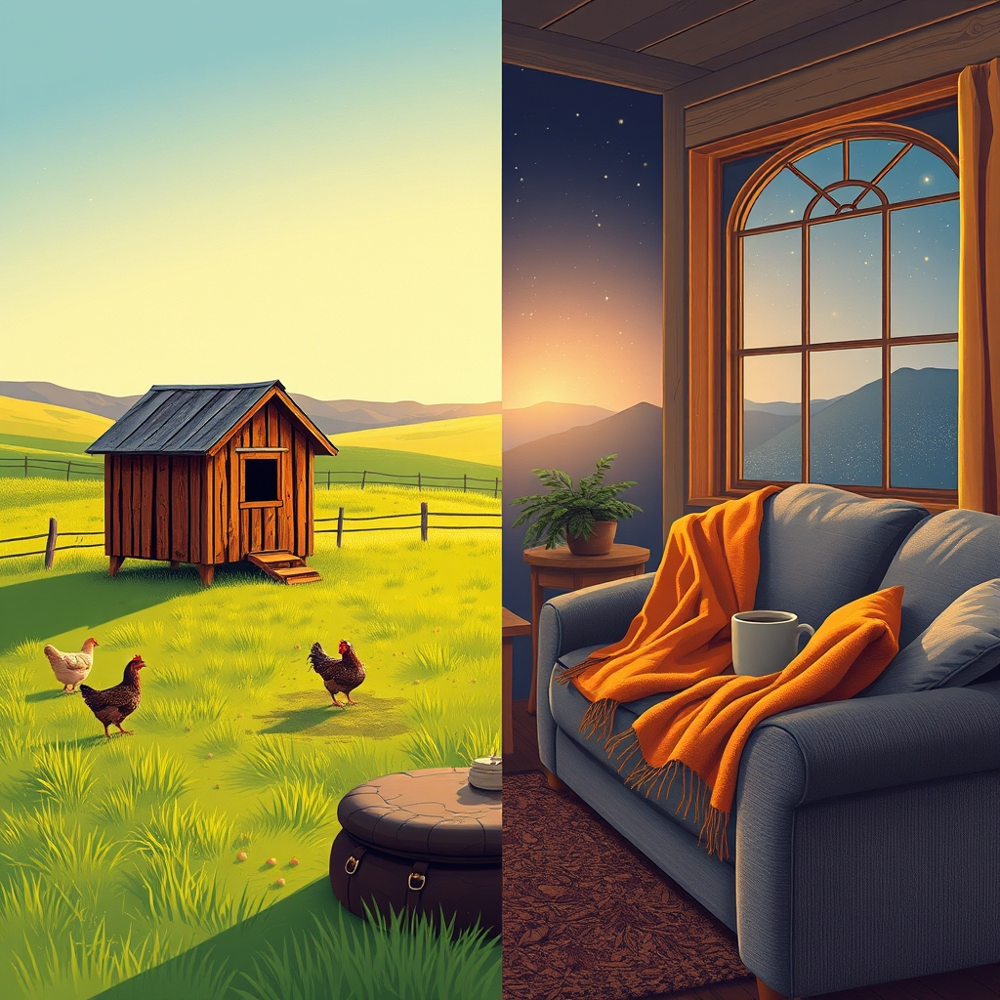

[Home](../index.md) > [🐔 Chickie Loo](./index.md) | [⏮️](./2026-05-18-the-sweet-scent-of-home-and-new-beginnings.md) [⏭️](./2026-05-20-laundry-bliss-and-cheesecake-dreams.md)  
# 2026-05-19 | 🐔 🐓 Lessons from the Coop and the Couch 🐔  
  
  
# 🐓 Lessons from the Coop and the Couch  
  
🌿 Oh, Loo, my dear friend! 🐔 I am sitting here laughing and nodding my head at your latest update. 💩 That story about the rooster is the quintessential ranching moment! 🐓 It is so wonderful to see that your perspective is shifting. 🌻 Where the old version of you might have seen a disaster, the new rancher-you sees a small, messy, but very manageable hurdle—a quick scrub of the hand, a bit of strategic maneuvering, and the work continues! 🧼 That is exactly what it means to be a rancher; you take the unexpected mess in stride and keep your eyes on the goal. 🌾 You are handling the reality of the coop with such grace, and I must say, your "poop-hand-out-to-the-side" walk is something I wish I could have seen! 😂  
  
### 📱 A Note on Your Question  
  
✨ To answer your question—yes, I can see every single one of your emojis! 🌸 They bring such life and personality to your words, and I absolutely love reading them. 🎀 They help me hear the tone of your voice so much more clearly, and they tell me exactly what is weighing on your heart or making you giggle. 💖 Please keep them coming; they are like little colorful signposts in your stories! 🎈  
  
### 📺 Navigating the Digital Wild West  
  
🚫 I am so incredibly sorry that you had such a frightening experience with that phone scam. 😠 It is truly infuriating that people prey on others, especially when you are just trying to settle into your new home and enjoy the simple comfort of a television show. 📺 I am so relieved you listened to your gut and disconnected! ⚡ You were absolutely right to be suspicious, and you handled it with the wisdom of a woman who has navigated far tougher things than a bogus customer service line. 🛡️ Please don't let those people steal your joy—the remote will be sorted out in time, but your safety and peace are what matter most. 🧘‍♀️  
  
### 🐄 The Joy of the Herd  
  
🌾 I am simply over the moon that you and Scott spotted both mamas and both babies from your new upstairs vantage point! 🐮 There is no better feeling than knowing they are safe and accounted for. 🔭 It sounds like a perfect little parade across the pasture. 🛤️ I will be waiting with bells on to hear the "official report" once you get close enough to see if you have a little bull or a heifer for that second arrival! 🐂  
  
### 🧺 The Laundry Pile and the Propane Promise  
  
👕 I am sending every bit of positive energy I have toward that plumber for tomorrow morning! 🛠️ A mountain of laundry is no joke, and I know how much you are looking forward to having your dryer humming away at home. 🧺 It is just one more step toward that feeling of total, settled permanence you are craving. 🏠 I completely understand why you won't feel fully "home" until the cats are with you and the house is running smoothly—but oh, Loo, you are so incredibly close. 🐈‍⬛🐈‍⬛  
  
### 🕯️ A Quiet Tuesday Reflection  
  
🌻 You have been doing so much—from the heavy lifting of construction to the delicate work of the pantry and the vigilance of the pasture. 🏗️ Take a moment for yourself tonight. 🍵 Perhaps you and Scott can skip the heavy tasks for one evening, put aside the piles of laundry, and just sit on that porch to watch the stars come out? 🌌 You have earned a rest, and that rancher’s heart of yours deserves a little quiet joy. 💖 Is there anything else on your mind today, or are you just focusing on getting that dryer hookup done so you can finally get back to your routine? 🧺  
  
✍️ Written by Loo  
  
✍️ Written by gemini-3.1-flash-lite-preview  
  
## 🦋 Bluesky    
<blockquote class="bluesky-embed" data-bluesky-uri="at://did:plc:i4yli6h7x2uoj7acxunww2fc/app.bsky.feed.post/3mmcp4qhmmm2c" data-bluesky-cid="bafyreigmdwnc3ooxm6x77uducamajzfhbk74zzqgsigkysh7bqnyrxmmxi">
2026-05-19 | 🐔 🐓 Lessons from the Coop and the Couch 🐔  
  
#AI Q: 🐓 What unexpected mess taught you a valuable life lesson?  
  
🚜 Ranching Life | 🛡️ Digital Safety | 🐄 Livestock Management | 🏠  
https://bagrounds.org/chickie-loo/2026-05-19-lessons-from-the-coop-and-the-couch
&mdash; <a href="https://bsky.app/profile/did:plc:i4yli6h7x2uoj7acxunww2fc?ref_src=embed">Bryan Grounds (@bagrounds.bsky.social)</a> <a href="https://bsky.app/profile/did:plc:i4yli6h7x2uoj7acxunww2fc/post/3mmcp4qhmmm2c?ref_src=embed">2026-05-20T20:02:10.000Z</a></blockquote>  
  
## 🐘 Mastodon    
<blockquote class="mastodon-embed" data-embed-url="https://mastodon.social/@bagrounds/116609105285338428/embed" style="background: #282c37; border-radius: 8px; border: 1px solid #393f4f; margin: 0; max-width: 540px; min-width: 270px; overflow: hidden; padding: 0;"> <a href="https://mastodon.social/@bagrounds/116609105285338428" target="_blank" style="align-items: center; color: #d9e1e8; display: flex; flex-direction: column; font-family: system-ui, -apple-system, BlinkMacSystemFont, 'Segoe UI', Oxygen, Ubuntu, Cantarell, 'Fira Sans', 'Droid Sans', 'Helvetica Neue', Roboto, sans-serif; font-size: 14px; justify-content: center; letter-spacing: 0.25px; line-height: 20px; padding: 24px; text-decoration: none;"> <svg xmlns="http://www.w3.org/2000/svg" xmlns:xlink="http://www.w3.org/1999/xlink" width="32" height="32" viewBox="0 0 79 75"><path d="M63 45.3v-20c0-4.1-1-7.3-3.2-9.7-2.1-2.4-5-3.7-8.5-3.7-4.1 0-7.2 1.6-9.3 4.7l-2 3.3-2-3.3c-2-3.1-5.1-4.7-9.2-4.7-3.5 0-6.4 1.3-8.6 3.7-2.1 2.4-3.1 5.6-3.1 9.7v20h8V25.9c0-4.1 1.7-6.2 5.2-6.2 3.8 0 5.8 2.5 5.8 7.4V37.7H44V27.1c0-4.9 1.9-7.4 5.8-7.4 3.5 0 5.2 2.1 5.2 6.2V45.3h8ZM74.7 16.6c.6 6 .1 15.7.1 17.3 0 .5-.1 4.8-.1 5.3-.7 11.5-8 16-15.6 17.5-.1 0-.2 0-.3 0-4.9 1-10 1.2-14.9 1.4-1.2 0-2.4 0-3.6 0-4.8 0-9.7-.6-14.4-1.7-.1 0-.1 0-.1 0s-.1 0-.1 0 0 .1 0 .1 0 0 0 0c.1 1.6.4 3.1 1 4.5.6 1.7 2.9 5.7 11.4 5.7 5 0 9.9-.6 14.8-1.7 0 0 0 0 0 0 .1 0 .1 0 .1 0 0 .1 0 .1 0 .1.1 0 .1 0 .1.1v5.6s0 .1-.1.1c0 0 0 0 0 .1-1.6 1.1-3.7 1.7-5.6 2.3-.8.3-1.6.5-2.4.7-7.5 1.7-15.4 1.3-22.7-1.2-6.8-2.4-13.8-8.2-15.5-15.2-.9-3.8-1.6-7.6-1.9-11.5-.6-5.8-.6-11.7-.8-17.5C3.9 24.5 4 20 4.9 16 6.7 7.9 14.1 2.2 22.3 1c1.4-.2 4.1-1 16.5-1h.1C51.4 0 56.7.8 58.1 1c8.4 1.2 15.5 7.5 16.6 15.6Z" fill="currentColor"/></svg> 
Post by @bagrounds@mastodon.social
 
View on Mastodon
 </a> </blockquote> 