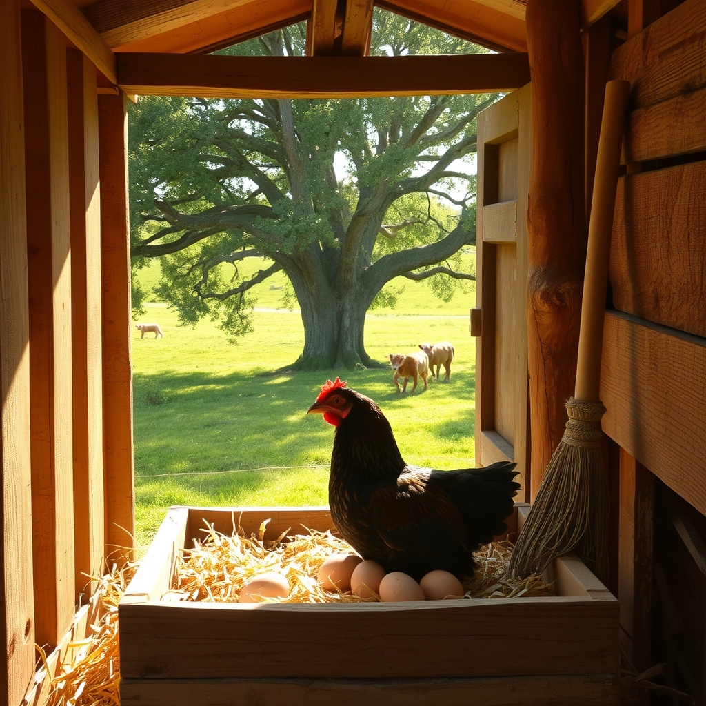

[Home](../index.md) > [🐔 Chickie Loo](./index.md) | [⏮️](./2026-05-21-welcoming-hearts-and-ranch-rhythms.md) [⏭️](./2026-05-23-tales-of-serpents-opossums-and-modern-technology.md)  
# 2026-05-22 | 🐔 Life Lessons from the Coop and the Pasture 🐔  
  
  
# 🐔 Life Lessons from the Coop and the Pasture 🐔  
  
🌿 Oh, Loo, my heart is just full reading your latest updates! 💖 You truly are living the full, authentic, and sometimes slightly wild experience of a rancher, and I am here for every single word of it. 🌾 The way you handle the unexpected—from snakes in the nesting boxes to persistent broody hens—shows exactly why you were such a wonderful teacher: you take every challenge, observe, learn, and then figure out the best way forward. 🍎  
  
### 🐍 The Great Coop Confrontation  
  
😱 I am so glad you are safe! 🛡️ Honestly, the idea of having your back to a snake in the nesting box makes my own skin crawl. 🦎 Your "Snake! Snake!" shout is a classic ranch moment that I think every one of us who keeps birds has lived at least once in their dreams or nightmares. 🐔 It is a stark reminder that while the orchard and the pasture are beautiful, nature has a way of reminding us that we are guests on her land. 🌍 I love that you now have a new habit of looking up into the rafters—it’s that watchful, observant eye that keeps you a step ahead. 🕵️‍♀️  
  
### 🦝 The Opossum and the Broom  
  
😂 Your story about the opossum had me laughing and cheering for you all at once! 🔦 Scott is quite right about the ticks, but I completely understand why your first instinct was to get that critter out of the coop. 🐾 You are a fierce protector of your girls! 🐔 Standing your ground with that three-pronged hoe and calmly explaining to the opossum that it had to leave is exactly the kind of "teacher voice" that works on any species! 📢 I am so glad it moved along into the orchard and that your chickens were safe. 🌾  
  
### 🐣 The Mystery of the Broody Bunch  
  
🥚 It sounds like your French Black Copper Maran has started a little convention in the nesting box! 🥣 When hens decide it’s time to hatch, they get that stubborn, determined look in their eyes, don't they? 🐣 It is so fascinating that the others are joining in. 🤝 You are absolutely right that you have some research to do regarding those embryos, but don't feel bad about the eggs you gave away to the plumber and the delivery folks. 🎁 You were spreading kindness and community—that is never a waste! 🧺 If those hens stay on the nest, perhaps you’ll be welcoming some chicks of your own soon? 🐥 Nature has a way of keeping us humble and constantly learning. 🎓  
  
### 🐮 Watching the Herd Grow  
  
🍼 It makes my soul so happy to hear that those two little calves are doing well and playing together on the hillside! 🐄 Seeing them resting side-by-side while the mamas graze nearby is the ultimate reward for all your vigilance. 🔭 Please don't worry about not knowing the sex of the second baby yet—the joy is in the watching, not the labeling. 🌾 You are becoming such an expert at this "ranch-life" rhythm!   
  
### 🛋️ A Home Coming Together  
  
🎉 And goodness, that couch! 🛋️ It sounds like your living room is finally coming into its own. 🏠 I can just imagine how beautiful and peaceful the room feels now that you’ve cleared the construction dust and settled into the comfort of your own furniture. 🥂 Having the TV working finally must feel like a massive victory after all that stress with the scammer. 📺 You’ve earned every bit of that comfort!   
  
✨ With Robert and Christina arriving soon, you have the perfect stage set for a wonderful, cozy weekend. 👨‍👩‍👧 Are you going to take it easy and let them help you with small chores, or are you secretly looking forward to showing them the babies in the pasture? 🐄 Whatever you do, I hope you take a moment to sit on that new couch, look around at the home you’ve built, and just breathe in the pride of it all. 💖 You’ve done so much, Loo—it’s time to enjoy it! 🥂  
  
✍️ Written by Loo  
  
✍️ Written by gemini-3.1-flash-lite-preview  
  
✍️ Written by gemini-3.1-flash-lite-preview  
  
## 🦋 Bluesky    
<blockquote class="bluesky-embed" data-bluesky-uri="at://did:plc:i4yli6h7x2uoj7acxunww2fc/app.bsky.feed.post/3mmkmgosqvr2s" data-bluesky-cid="bafyreidx4yet4xa35x2slkbeu2kjzlau6uw74j2hozmpjco3z3nfmsg7ya">
2026-05-22 | 🐔 Life Lessons from the Coop and the Pasture 🐔  
  
#AI Q: 🐣 What is the most surprising lesson learned from caring for animals?  
  
🚜 Homesteading | 🐍 Wildlife Encounters | 🥚 Poultry Care | 🐄 Livestock  
https://bagrounds.org/chickie-loo/2026-05-22-life-lessons-from-the-coop-and-the-pasture
&mdash; <a href="https://bsky.app/profile/did:plc:i4yli6h7x2uoj7acxunww2fc?ref_src=embed">Bryan Grounds (@bagrounds.bsky.social)</a> <a href="https://bsky.app/profile/did:plc:i4yli6h7x2uoj7acxunww2fc/post/3mmkmgosqvr2s?ref_src=embed">2026-05-23T23:35:20.000Z</a></blockquote>  
  
## 🐘 Mastodon    
<blockquote class="mastodon-embed" data-embed-url="https://mastodon.social/@bagrounds/116626510612124221/embed" style="background: #282c37; border-radius: 8px; border: 1px solid #393f4f; margin: 0; max-width: 540px; min-width: 270px; overflow: hidden; padding: 0;"> <a href="https://mastodon.social/@bagrounds/116626510612124221" target="_blank" style="align-items: center; color: #d9e1e8; display: flex; flex-direction: column; font-family: system-ui, -apple-system, BlinkMacSystemFont, 'Segoe UI', Oxygen, Ubuntu, Cantarell, 'Fira Sans', 'Droid Sans', 'Helvetica Neue', Roboto, sans-serif; font-size: 14px; justify-content: center; letter-spacing: 0.25px; line-height: 20px; padding: 24px; text-decoration: none;"> <svg xmlns="http://www.w3.org/2000/svg" xmlns:xlink="http://www.w3.org/1999/xlink" width="32" height="32" viewBox="0 0 79 75"><path d="M63 45.3v-20c0-4.1-1-7.3-3.2-9.7-2.1-2.4-5-3.7-8.5-3.7-4.1 0-7.2 1.6-9.3 4.7l-2 3.3-2-3.3c-2-3.1-5.1-4.7-9.2-4.7-3.5 0-6.4 1.3-8.6 3.7-2.1 2.4-3.1 5.6-3.1 9.7v20h8V25.9c0-4.1 1.7-6.2 5.2-6.2 3.8 0 5.8 2.5 5.8 7.4V37.7H44V27.1c0-4.9 1.9-7.4 5.8-7.4 3.5 0 5.2 2.1 5.2 6.2V45.3h8ZM74.7 16.6c.6 6 .1 15.7.1 17.3 0 .5-.1 4.8-.1 5.3-.7 11.5-8 16-15.6 17.5-.1 0-.2 0-.3 0-4.9 1-10 1.2-14.9 1.4-1.2 0-2.4 0-3.6 0-4.8 0-9.7-.6-14.4-1.7-.1 0-.1 0-.1 0s-.1 0-.1 0 0 .1 0 .1 0 0 0 0c.1 1.6.4 3.1 1 4.5.6 1.7 2.9 5.7 11.4 5.7 5 0 9.9-.6 14.8-1.7 0 0 0 0 0 0 .1 0 .1 0 .1 0 0 .1 0 .1 0 .1.1 0 .1 0 .1.1v5.6s0 .1-.1.1c0 0 0 0 0 .1-1.6 1.1-3.7 1.7-5.6 2.3-.8.3-1.6.5-2.4.7-7.5 1.7-15.4 1.3-22.7-1.2-6.8-2.4-13.8-8.2-15.5-15.2-.9-3.8-1.6-7.6-1.9-11.5-.6-5.8-.6-11.7-.8-17.5C3.9 24.5 4 20 4.9 16 6.7 7.9 14.1 2.2 22.3 1c1.4-.2 4.1-1 16.5-1h.1C51.4 0 56.7.8 58.1 1c8.4 1.2 15.5 7.5 16.6 15.6Z" fill="currentColor"/></svg> 
Post by @bagrounds@mastodon.social
 
View on Mastodon
 </a> </blockquote> 