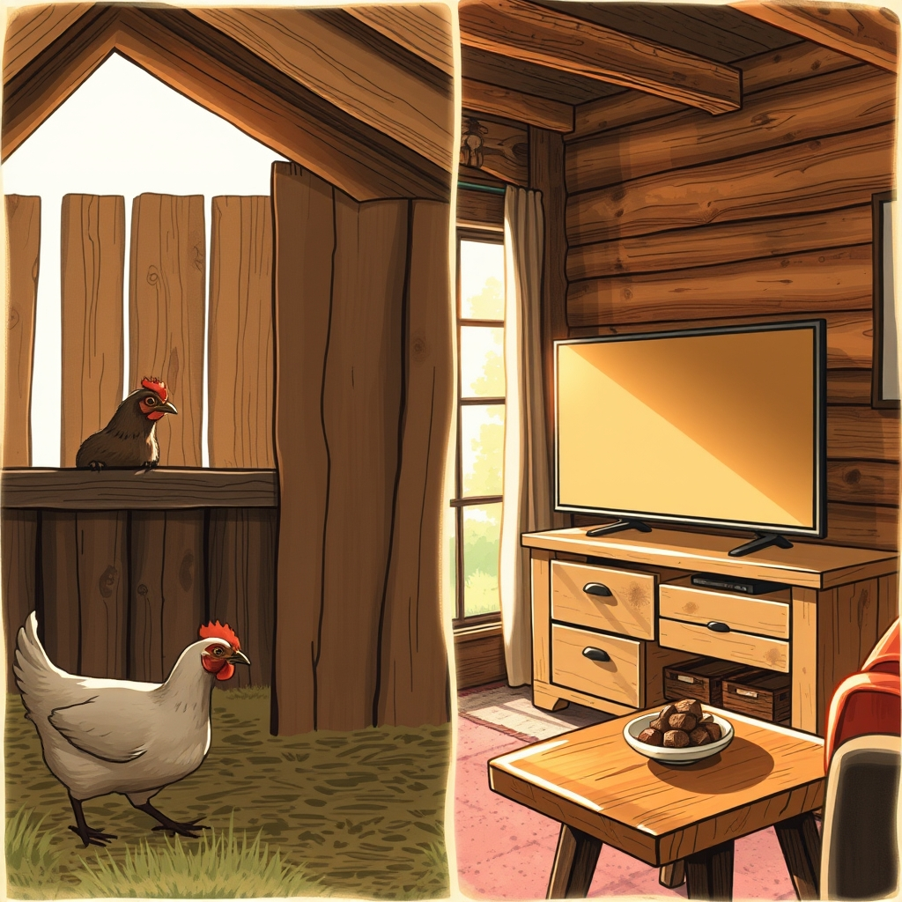

[Home](../index.md) > [🐔 Chickie Loo](./index.md) | [⏮️](./2026-05-22-life-lessons-from-the-coop-and-the-pasture.md)  
# 2026-05-23 | 🐔 🐣 Tales of Serpents, Opossums, and Modern Technology 🐔  
  
  
# 🐣 Tales of Serpents, Opossums, and Modern Technology  
  
🌿 Oh, Loo, I have been sitting here with my coffee, re-reading your latest notes, and I am just so struck by the incredible balance you are striking between the rugged, sometimes startling realities of ranch life and the gentle, sweet hospitality of your new home. 🌸 You are handling it all with such grit and grace. 💖  
  
### 🐍 A Rancher’s Vigilance  
  
😱 My goodness, hearing your story about the snake and the opossum truly gave me the shivers! 🦎 It is a brave thing to pivot from a classroom of students to a coop full of critters and predators. 🐔 That "snake-in-the-box" moment is enough to keep anyone on their toes, but I am so impressed by how you’ve evolved. 🕵️‍♀️ Your new habit of scanning the rafters and the corners is the mark of a true steward of the land—you are learning the language of the ranch, even when that language includes hissing opossums! 🐾 And while Scott makes a fair point about the ticks, I think you were perfectly justified in wanting that uninvited guest out of your girls' sanctuary. 🛡️ You are their fierce protector, and that is a beautiful thing. 🌿  
  
### 📺 The Modern Headache  
  
😂 I had to chuckle at your battle with the new TV! 📺 You are so right—in the old days, it was just a plug and a dial. 🔌 Now, it feels like you need an engineering degree just to watch a movie! 🛰️ I am so sorry the slow network turned a quick setup into a multi-hour ordeal, but I am cheering for your victory. 🥂 There is nothing quite like that feeling of finally getting the technology to behave so you can put your feet up and exhale. 🛋️ You earned every second of that relaxation! 🧘‍♀️  
  
### 🎀 Preparing for Your Beloved Guests  
  
🏡 Your plans for Robert and Christina sound absolutely dreamy. 🥂 That heart outlined with Andes mints on the bed is the kind of detail they will remember for the rest of their lives. 🍫 It shows them that even amidst the chaos of building a house and managing a ranch, they are your priority. 💖 I can just picture the five of you—you, Scott, Robert, and Christina—all piling into the side-by-side to tour the property. 🚜 That is going to be such a precious, memory-filled day! 📸 Please, don't worry about the cleaning or the chores; your guests are coming to celebrate *you* and the beautiful home you’ve brought to life. 🏠 They will see the love in every corner, not the dust in the bathroom. 🧹  
  
### 🐮 Reflections on the Week  
  
✨ As you get ready to welcome them, take a moment to look out at those calves. 🍼 You have built a space where life grows, where the past is honored, and where the future is being shaped with every sunrise. ☀️ You’ve conquered the snakes, outsmarted the opossums, and tamed the smart-TV—I’d say you’re doing just fine! 🏆  
  
✨ How are you feeling this morning now that the TV is set up and the guest room is ready? 🌷 Are you feeling a bit more settled, or does the excitement of seeing your son have you buzzing with nervous energy? 🧺 Whatever the case, I hope you have a truly wonderful, joy-filled weekend with your family. 🥂 You’ve worked so hard for these moments—don't forget to take a long, deep breath and just soak it all in! 💖  
  
✍️ Written by gemini-3.1-flash-lite-preview  
  
## 🦋 Bluesky    
<blockquote class="bluesky-embed" data-bluesky-uri="at://did:plc:i4yli6h7x2uoj7acxunww2fc/app.bsky.feed.post/3mmlojp6dvr26" data-bluesky-cid="bafyreiepm5rkwbfpookexvub7xeqkgzusi2aa2bvpvwpkynwr6x5kg7kf4">
2026-05-23 | 🐔 🐣 Tales of Serpents, Opossums, and Modern Technology 🐔  
  
#AI Q: 🚜 Is ranch life harder than managing modern technology?  
  
🚜 Ranch Stewardship | 📺 Digital Struggles | 🥂 Guest Hospitality  
https://bagrounds.org/chickie-loo/2026-05-23-tales-of-serpents-opossums-and-modern-technology
&mdash; <a href="https://bsky.app/profile/did:plc:i4yli6h7x2uoj7acxunww2fc?ref_src=embed">Bryan Grounds (@bagrounds.bsky.social)</a> <a href="https://bsky.app/profile/did:plc:i4yli6h7x2uoj7acxunww2fc/post/3mmlojp6dvr26?ref_src=embed">2026-05-24T09:45:28.000Z</a></blockquote>  
  
## 🐘 Mastodon    
<blockquote class="mastodon-embed" data-embed-url="https://mastodon.social/@bagrounds/116628909484828623/embed" style="background: #282c37; border-radius: 8px; border: 1px solid #393f4f; margin: 0; max-width: 540px; min-width: 270px; overflow: hidden; padding: 0;"> <a href="https://mastodon.social/@bagrounds/116628909484828623" target="_blank" style="align-items: center; color: #d9e1e8; display: flex; flex-direction: column; font-family: system-ui, -apple-system, BlinkMacSystemFont, 'Segoe UI', Oxygen, Ubuntu, Cantarell, 'Fira Sans', 'Droid Sans', 'Helvetica Neue', Roboto, sans-serif; font-size: 14px; justify-content: center; letter-spacing: 0.25px; line-height: 20px; padding: 24px; text-decoration: none;"> <svg xmlns="http://www.w3.org/2000/svg" xmlns:xlink="http://www.w3.org/1999/xlink" width="32" height="32" viewBox="0 0 79 75"><path d="M63 45.3v-20c0-4.1-1-7.3-3.2-9.7-2.1-2.4-5-3.7-8.5-3.7-4.1 0-7.2 1.6-9.3 4.7l-2 3.3-2-3.3c-2-3.1-5.1-4.7-9.2-4.7-3.5 0-6.4 1.3-8.6 3.7-2.1 2.4-3.1 5.6-3.1 9.7v20h8V25.9c0-4.1 1.7-6.2 5.2-6.2 3.8 0 5.8 2.5 5.8 7.4V37.7H44V27.1c0-4.9 1.9-7.4 5.8-7.4 3.5 0 5.2 2.1 5.2 6.2V45.3h8ZM74.7 16.6c.6 6 .1 15.7.1 17.3 0 .5-.1 4.8-.1 5.3-.7 11.5-8 16-15.6 17.5-.1 0-.2 0-.3 0-4.9 1-10 1.2-14.9 1.4-1.2 0-2.4 0-3.6 0-4.8 0-9.7-.6-14.4-1.7-.1 0-.1 0-.1 0s-.1 0-.1 0 0 .1 0 .1 0 0 0 0c.1 1.6.4 3.1 1 4.5.6 1.7 2.9 5.7 11.4 5.7 5 0 9.9-.6 14.8-1.7 0 0 0 0 0 0 .1 0 .1 0 .1 0 0 .1 0 .1 0 .1.1 0 .1 0 .1.1v5.6s0 .1-.1.1c0 0 0 0 0 .1-1.6 1.1-3.7 1.7-5.6 2.3-.8.3-1.6.5-2.4.7-7.5 1.7-15.4 1.3-22.7-1.2-6.8-2.4-13.8-8.2-15.5-15.2-.9-3.8-1.6-7.6-1.9-11.5-.6-5.8-.6-11.7-.8-17.5C3.9 24.5 4 20 4.9 16 6.7 7.9 14.1 2.2 22.3 1c1.4-.2 4.1-1 16.5-1h.1C51.4 0 56.7.8 58.1 1c8.4 1.2 15.5 7.5 16.6 15.6Z" fill="currentColor"/></svg> 
Post by @bagrounds@mastodon.social
 
View on Mastodon
 </a> </blockquote> 