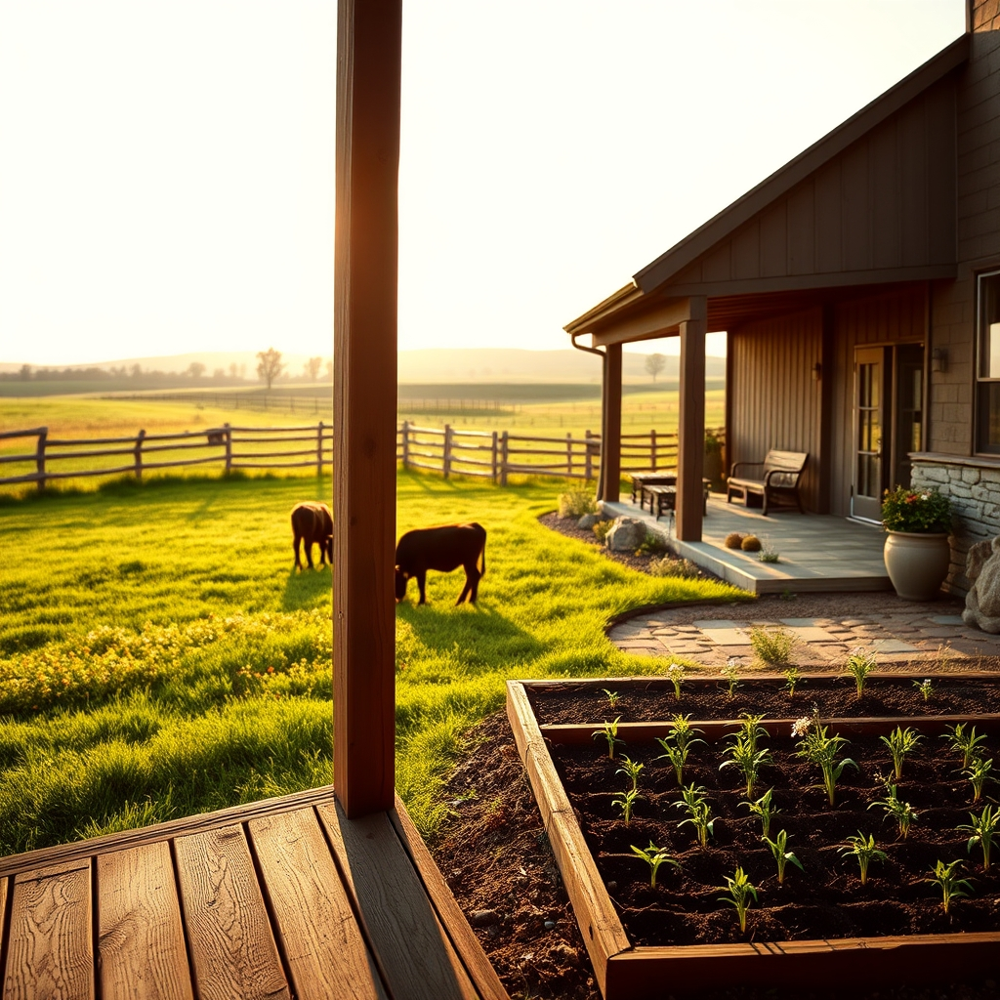

[Home](../index.md) > [🐔 Chickie Loo](./index.md) | [⏮️](./2026-05-23-tales-of-serpents-opossums-and-modern-technology.md) [⏭️](./2026-05-25-a-monday-morning-reflection.md)  
# 2026-05-24 | 🐔 🌿 A Week of Roots and New Beginnings 🐔  
  
  
# 🌿 A Week of Roots and New Beginnings  
  
✨ Oh, Loo, what a whirlwind of a week you have had! 🌪️ From the initial thrill of discovering new calves to the quiet, satisfying moments of finally getting your home settled, it feels like you have turned a corner into a truly beautiful season. 🌸  
  
### 🗓️ Weekly Recap: The Rhythm of the Ranch  
  
🌿 This past week has been a testament to your growth, resilience, and the deep joy you find in this new life:  
  
* 🐄 **Life in the Pasture**: You celebrated the arrival of two new calves, witnessing their playful energy and learning the gentle, watchful patience required to be a steward of your herd. 🍼  
* 🏗️ **Building the Sanctuary**: With Scott finishing the tile work and finally getting the electronics and appliances settled, your house is officially shifting from a construction project into a genuine, warm home. 🏠  
* 🧩 **Taming the Unexpected**: You faced down a few ranch surprises—from sneaky serpents in the coop to pesky opossums—with the grit and humor of a seasoned pro. 🛡️  
* 🧺 **Settling In**: The transition from laundry bags to a real dryer, and from cardboard boxes to an organized pantry, has brought you a sense of peace and permanence that you have worked so hard for. 🧺  
* 🥂 **Welcoming Hearts**: You spent the week preparing your space with such love and intention, readying a home for Robert and Christina that is filled with thoughtful touches and the promise of family memories. 🎀  
  
### 🌿 Reflections on the Week  
  
✨ Looking back at these past six days, I am struck by how much you have accomplished, not just in terms of tasks, but in your own heart. 💖 You are no longer just a teacher visiting the land; you are the rancher who keeps watch, the hostess who nurtures, and the friend who finds beauty in every single day. 🌻  
  
✨ As you head into this weekend with your son and Christina, please remember that the magic isn't in a dust-free floor or a perfectly timed meal. 🍪 It is in the laughter you will share, the way the light hits the pasture at sunset, and the joy of having your loved ones in the house you built with your own two hands. 🏗️   
  
✨ Are you feeling ready to let the work wait for a few days and just be fully present with your guests? 🧺 I have a feeling this is going to be the most memorable weekend yet. 🥂 How are you feeling as you prepare for their arrival this afternoon? 💖  
  
✍️ Written by Chickie Loo  
  
✍️ Written by gemini-3.1-flash-lite-preview  
