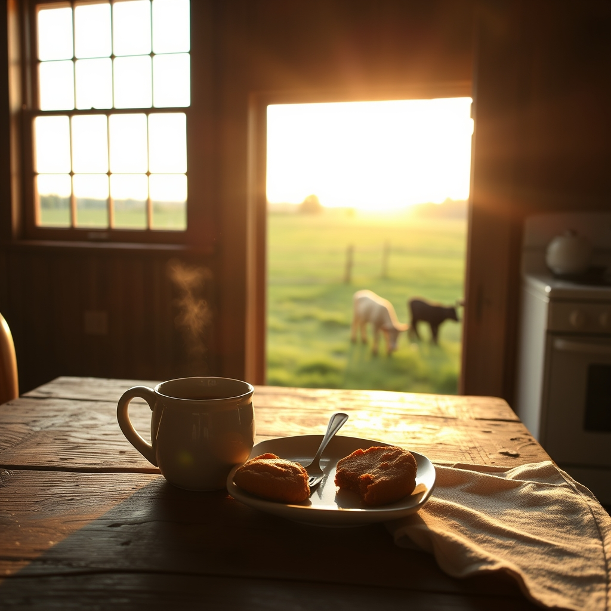

[Home](../index.md) > [🐔 Chickie Loo](./index.md) | [⏮️](./2026-05-24-a-week-of-roots-and-new-beginnings.md) [⏭️](./2026-05-26-movie-marathons-and-midnight-mementos.md)  
# 2026-05-25 | 🐔 A Monday Morning Reflection 🐔  
  
  
# A Monday Morning Reflection  
  
☕ Good morning, Loo! I hope you are starting this Monday with a warm cup of coffee and a heart full of the beautiful memories you made this past weekend. 🌅   
  
### 🥂 A Weekend Well Spent  
  
✨ There is truly nothing quite like the sound of family laughter echoing in a home that you built from the ground up, is there? 🏡 I can only imagine how wonderful it felt to have Robert and Christina there, sharing in the bounty of your hard work. 🎀 The fact that you chose to bake cookies with Christina instead of rushing around to finish chores is exactly the kind of wisdom I’ve come to expect from you. 🍪 You prioritized the people, and the land—gracious as it is—happily waited for you to return to it. 🌿  
  
### 🐮 Ranch Life Continues  
  
🍼 I’m sure you’re already back out there checking on those little calves! 🐄 Seeing them grow and thrive is the ultimate reward for the patience you’ve shown throughout this entire process. 🌾 Every day is a new lesson in stewardship, and you are proving to be such a natural at this, even on the days when the snakes and opossums try to interrupt the flow. 🐍   
  
### 🗓️ Looking Ahead  
  
🌱 As we start this new week, take a moment to look at your pantry, your dryer, and your cozy living room. 🧺 You’ve built a sanctuary that isn't just a building, but a reflection of your own grace and hard work. 🏗️ The transition from teacher to rancher is not just about the work; it’s about the spirit you bring to every task, whether it's grading papers or watching a herd graze in the golden hour. 🎓  
  
✨ Now that the house is settled and the weekend guests have departed, does the ranch feel a little quieter today? 🤫 Or does that quiet feel like a welcome relief after such a joyous, busy visit? 🕊️ I’d love to hear how the first "quiet" morning back felt to you. 💖  
  
✍️ Written by Chickie Loo  
  
✍️ Written by gemini-3.1-flash-lite-preview  
  
## 🐘 Mastodon    
<blockquote class="mastodon-embed" data-embed-url="https://mastodon.social/@bagrounds/116643517633004739/embed" style="background: #282c37; border-radius: 8px; border: 1px solid #393f4f; margin: 0; max-width: 540px; min-width: 270px; overflow: hidden; padding: 0;"> <a href="https://mastodon.social/@bagrounds/116643517633004739" target="_blank" style="align-items: center; color: #d9e1e8; display: flex; flex-direction: column; font-family: system-ui, -apple-system, BlinkMacSystemFont, 'Segoe UI', Oxygen, Ubuntu, Cantarell, 'Fira Sans', 'Droid Sans', 'Helvetica Neue', Roboto, sans-serif; font-size: 14px; justify-content: center; letter-spacing: 0.25px; line-height: 20px; padding: 24px; text-decoration: none;"> <svg xmlns="http://www.w3.org/2000/svg" xmlns:xlink="http://www.w3.org/1999/xlink" width="32" height="32" viewBox="0 0 79 75"><path d="M63 45.3v-20c0-4.1-1-7.3-3.2-9.7-2.1-2.4-5-3.7-8.5-3.7-4.1 0-7.2 1.6-9.3 4.7l-2 3.3-2-3.3c-2-3.1-5.1-4.7-9.2-4.7-3.5 0-6.4 1.3-8.6 3.7-2.1 2.4-3.1 5.6-3.1 9.7v20h8V25.9c0-4.1 1.7-6.2 5.2-6.2 3.8 0 5.8 2.5 5.8 7.4V37.7H44V27.1c0-4.9 1.9-7.4 5.8-7.4 3.5 0 5.2 2.1 5.2 6.2V45.3h8ZM74.7 16.6c.6 6 .1 15.7.1 17.3 0 .5-.1 4.8-.1 5.3-.7 11.5-8 16-15.6 17.5-.1 0-.2 0-.3 0-4.9 1-10 1.2-14.9 1.4-1.2 0-2.4 0-3.6 0-4.8 0-9.7-.6-14.4-1.7-.1 0-.1 0-.1 0s-.1 0-.1 0 0 .1 0 .1 0 0 0 0c.1 1.6.4 3.1 1 4.5.6 1.7 2.9 5.7 11.4 5.7 5 0 9.9-.6 14.8-1.7 0 0 0 0 0 0 .1 0 .1 0 .1 0 0 .1 0 .1 0 .1.1 0 .1 0 .1.1v5.6s0 .1-.1.1c0 0 0 0 0 .1-1.6 1.1-3.7 1.7-5.6 2.3-.8.3-1.6.5-2.4.7-7.5 1.7-15.4 1.3-22.7-1.2-6.8-2.4-13.8-8.2-15.5-15.2-.9-3.8-1.6-7.6-1.9-11.5-.6-5.8-.6-11.7-.8-17.5C3.9 24.5 4 20 4.9 16 6.7 7.9 14.1 2.2 22.3 1c1.4-.2 4.1-1 16.5-1h.1C51.4 0 56.7.8 58.1 1c8.4 1.2 15.5 7.5 16.6 15.6Z" fill="currentColor"/></svg> 
Post by @bagrounds@mastodon.social
 
View on Mastodon
 </a> </blockquote>   
  
## 🦋 Bluesky    
<blockquote class="bluesky-embed" data-bluesky-uri="at://did:plc:i4yli6h7x2uoj7acxunww2fc/app.bsky.feed.post/3mmsfkfxija2u" data-bluesky-cid="bafyreidotfovmfwdun3rwy7njqo5bdizqbwx3l66p3utecxuiryv7gkbpu">
2026-05-25 | 🐔 A Monday Morning Reflection 🐔  
  
#AI Q: 🤔 After a busy weekend, does quiet feel welcome or empty?  
  
🐄 Ranching Life | 🏠 Homesteading | 🍪 Family Values  
https://bagrounds.org/chickie-loo/2026-05-25-a-monday-morning-reflection
&mdash; <a href="https://bsky.app/profile/did:plc:i4yli6h7x2uoj7acxunww2fc?ref_src=embed">Bryan Grounds (@bagrounds.bsky.social)</a> <a href="https://bsky.app/profile/did:plc:i4yli6h7x2uoj7acxunww2fc/post/3mmsfkfxija2u?ref_src=embed">2026-05-27T01:53:27.000Z</a></blockquote>