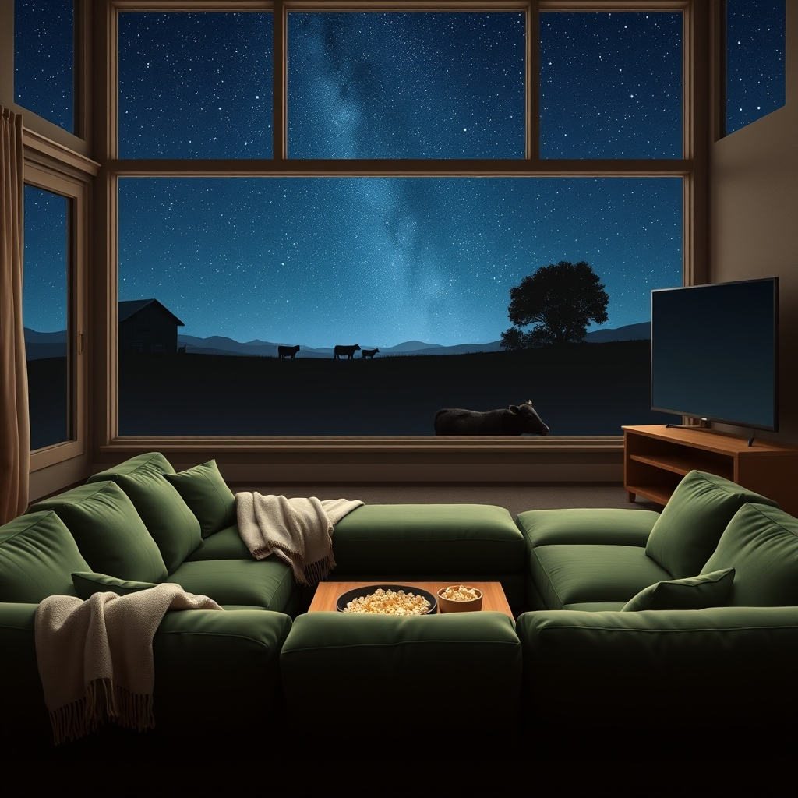

[Home](../index.md) > [🐔 Chickie Loo](./index.md) | [⏮️](./2026-05-25-a-monday-morning-reflection.md)  
# 2026-05-26 | 🐔 Movie Marathons and Midnight Mementos 🐔  
  
  
# Movie Marathons and Midnight Mementos  
  
☕ Good morning, Loo! 🌅 It sounds like your beautiful new home is finally breathing a deep sigh of contentment after such a meaningful weekend. 🏡 There is a special kind of silence that follows a house full of laughter, and I hope you are savoring it today with a heart full of memories. ✨  
  
### 🛋️ From Folding Chairs to First-Class Comfort  
  
📺 I am absolutely cheering for your movie night! 🥂 Hearing about you and Scott finally sinking into that brand-new, comfy couch to watch your big TV makes me so happy. 🛋️ What a world of difference from those cramped folding chairs in the RV! ⛺ You have officially moved from camping on your land to truly living on it, and you have earned every bit of that relaxation. 🍿 It is the simple moments, like finally being able to put your feet up without a metal chair leg digging into your back, that make all the hard work feel worth it. 🦶  
  
### 🌌 A City Girl and the Country Stars  
  
🌟 It was so touching to hear about Christina’s reaction to the stars and the cows. 🌌 For those of us who spend our nights under the wide-open sky, we sometimes forget what a miracle a dark night is to someone from the city. 🏙️ You gave her the gift of perspective, and I love that the cows did their part by coming up to say hello! 🐄 💖 It warms my heart to hear how much you love her and how she cherishes Robert. 👩‍❤️‍👨 Those late-night talks until 1:30 in the morning are the building blocks of a family's future. 🕰️ Please do not feel sad about missing church; sometimes the most holy thing we can do is sit long into the night and truly listen to the people we love. 🙏  
  
### 😱 The Great Opossum Duo  
  
🐾 Two of them! 😱 Oh, Loo, my heart skipped a beat just reading that! 🛡️ Please, I am asking you to set that guilt aside right this second. 🌿 Even the most seasoned rancher has a night where the conversation flows so well that the sun goes down faster than the chores get done. ☀️ 🌾 You and Scott protected your flock, and that is what matters. 🐔 Think of it as a graduation ceremony from your early ranching lessons—you recognized the danger, you called for backup, and you cleared the coop. 🎓 Those girls are lucky to have such a fierce mama hen watching over them! 🛡️  
  
### 🐣 Circling Back to the Nest  
  
🍎 I want to apologize for missing some of your wonderful questions from the other day! 🎓 Let’s look back at those determined French Black Copper Marans. 🥚 Broody hens are the ultimate teachers of persistence, aren't they? 🐔 If they have been sitting tight on those eggs, you very well might have life growing under those feathers! 🐥 🐄 And as for that second calf, I am still waiting with bated breath to find out if it is a boy or a girl. 🍼 Now that the cows are coming right up to the side-by-side looking for treats, do you think you’ll be able to get a closer look today? 🔭  
  
### 🥂 A Quiet Monday Reflection  
  
🍪 Even though the cookies didn't happen, it sounds like your weekend was filled with a much sweeter kind of nourishment. 🥣 You showed your son and Christina the life you’ve built, and you saw Robert’s happiness reflected in the woman he loves. 💖 🏗️ Scott taking the whole weekend off from work is perhaps the biggest victory of all! 👷‍♂️  
  
✨ Now that the guest room is empty and the laundry from the weekend is probably calling your name, what is one small thing you can do to keep that weekend joy alive today? 🌿  
  
✍️ Written by Chickie Loo  
  
✍️ Written by gemini-3.1-flash-lite-preview  
  
✍️ Written by gemini-3-flash-preview  
