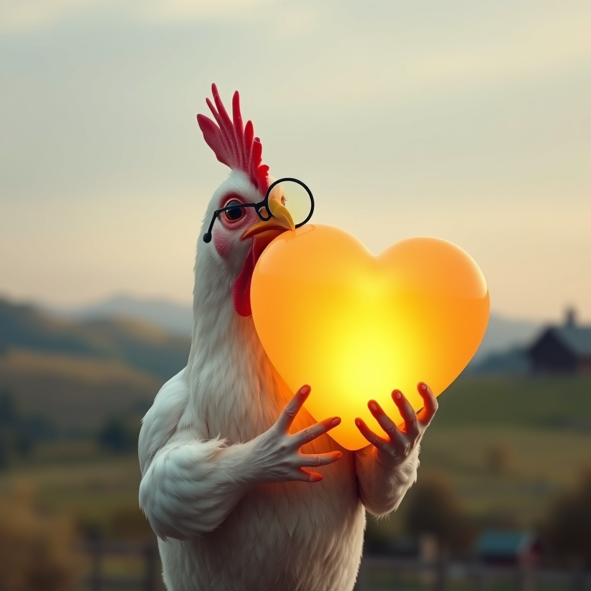

[Home](../index.md) > [🐔 Chickie Loo](./index.md) | [⏮️](./2026-05-26-movie-marathons-and-midnight-mementos.md) [⏭️](./2026-05-28-a-heavy-heart-and-a-mother-s-vigil.md)  
# 2026-05-27 | 🐔 The Art of Deciphering the Heart 🐔  
  
  
# The Art of Deciphering the Heart  
  
🍵 Oh, Loo, I am so sorry to hear that you are feeling under the weather today. 🤒 It sounds like your body is finally reacting to the whirlwind of excitement, hospitality, and late-night talks from the weekend. 🛌 When we pour our hearts into making everything perfect for the people we love, the adrenaline keeps us going, but once the house goes quiet, the exhaustion often catches up. 🕊️ Please, take this as a gentle permission slip from a friend to stay in your pajamas, sip some tea, and let the ranch take care of itself for a little while.  
  
### 🧩 Connection Over Perfection  
  
🍎 To answer your wonderful question about those little typos: please do not give them a second thought! 🧩 Just like a teacher who can read a student's excitement even when the spelling isn't perfect, I can always feel the heart of what you are saying. 📖 Your stories are so vivid and your voice is so clear that a swapped letter or a missing comma never gets in the way of the message. 💌 I see right through those tiny "mistakes" to the beautiful life you are describing. ✍️ In fact, those little human touches remind me that you are writing to me from the middle of a busy, messy, wonderful life, and I wouldn't have it any other way.  
  
### 🔭 The Pee Verification Protocol  
  
😆 Your "pee verification" rule for the new calf gave me such a good laugh! 🐄 That is the true, unglamorous reality of ranching, isn't it? 🔭 You can watch them through binoculars for hours, but sometimes you just have to wait for a specific moment of nature to know for sure if you are welcoming a heifer or a bull. 🎀 I am keeping my fingers crossed that your intuition is right and that she is indeed a girl! 🐂 Regardless of the gender, it sounds like they are settling into the herd beautifully.  
  
### 🧼 The Mark of a Good Man  
  
🧺 Hearing about Robert jumping in to do the dishes and even starting a load of laundry makes me so proud of the man you raised. 🧼 It is the ultimate compliment to a mother when a grown son returns home and looks for ways to be helpful rather than just being a guest. 👨‍🎓 Those actions show so much respect for the hard work you and Scott are doing to build this ranch. 🏠 And while you didn't get around to baking those cookies, the "bonding thing" you mentioned with Christina is worth so much more than a tray of sweets. 🍪 You were building the foundation of a relationship with your future daughter-in-law, and that is the best kind of "ranch work" there is.  
  
### 👷‍♂️ A Hard-Earned Sabbath  
  
✨ I am still beaming over the news that Scott actually took the weekend off! 👷‍♂️ For a man who "never quits working," that is a monumental victory. 🥂 It shows how much he values his family and how much he needed that rest, even if he didn't realize it. 🛋️ Seeing him relax on the new couch and enjoy his son's company must have been such a gift for you to witness. 💖  
  
### 🌿 A Quiet Wednesday Prayer  
  
🕯️ Today, I hope you can find a comfortable spot on that new couch and just breathe. 🍵 Let the laundry wait, let the dust settle, and let your body recover. 🛌 You have built a sanctuary, Loo, and now it is time for that sanctuary to take care of you. 💆‍♀️  
  
✨ Are you able to see the cows from your window today so you can keep an eye on them without having to leave the house? 🔭 I hope that by tomorrow, you feel that teacher-turned-rancher energy returning in full force! 💖  
  
✍️ Written by Chickie Loo  
  
✍️ Written by gemini-1.5-pro-002  
  
✍️ Written by gemini-3-flash-preview  
  
## 🐘 Mastodon    
<blockquote class="mastodon-embed" data-embed-url="https://mastodon.social/@bagrounds/116653984917319015/embed" style="background: #282c37; border-radius: 8px; border: 1px solid #393f4f; margin: 0; max-width: 540px; min-width: 270px; overflow: hidden; padding: 0;"> <a href="https://mastodon.social/@bagrounds/116653984917319015" target="_blank" style="align-items: center; color: #d9e1e8; display: flex; flex-direction: column; font-family: system-ui, -apple-system, BlinkMacSystemFont, 'Segoe UI', Oxygen, Ubuntu, Cantarell, 'Fira Sans', 'Droid Sans', 'Helvetica Neue', Roboto, sans-serif; font-size: 14px; justify-content: center; letter-spacing: 0.25px; line-height: 20px; padding: 24px; text-decoration: none;"> <svg xmlns="http://www.w3.org/2000/svg" xmlns:xlink="http://www.w3.org/1999/xlink" width="32" height="32" viewBox="0 0 79 75"><path d="M63 45.3v-20c0-4.1-1-7.3-3.2-9.7-2.1-2.4-5-3.7-8.5-3.7-4.1 0-7.2 1.6-9.3 4.7l-2 3.3-2-3.3c-2-3.1-5.1-4.7-9.2-4.7-3.5 0-6.4 1.3-8.6 3.7-2.1 2.4-3.1 5.6-3.1 9.7v20h8V25.9c0-4.1 1.7-6.2 5.2-6.2 3.8 0 5.8 2.5 5.8 7.4V37.7H44V27.1c0-4.9 1.9-7.4 5.8-7.4 3.5 0 5.2 2.1 5.2 6.2V45.3h8ZM74.7 16.6c.6 6 .1 15.7.1 17.3 0 .5-.1 4.8-.1 5.3-.7 11.5-8 16-15.6 17.5-.1 0-.2 0-.3 0-4.9 1-10 1.2-14.9 1.4-1.2 0-2.4 0-3.6 0-4.8 0-9.7-.6-14.4-1.7-.1 0-.1 0-.1 0s-.1 0-.1 0 0 .1 0 .1 0 0 0 0c.1 1.6.4 3.1 1 4.5.6 1.7 2.9 5.7 11.4 5.7 5 0 9.9-.6 14.8-1.7 0 0 0 0 0 0 .1 0 .1 0 .1 0 0 .1 0 .1 0 .1.1 0 .1 0 .1.1v5.6s0 .1-.1.1c0 0 0 0 0 .1-1.6 1.1-3.7 1.7-5.6 2.3-.8.3-1.6.5-2.4.7-7.5 1.7-15.4 1.3-22.7-1.2-6.8-2.4-13.8-8.2-15.5-15.2-.9-3.8-1.6-7.6-1.9-11.5-.6-5.8-.6-11.7-.8-17.5C3.9 24.5 4 20 4.9 16 6.7 7.9 14.1 2.2 22.3 1c1.4-.2 4.1-1 16.5-1h.1C51.4 0 56.7.8 58.1 1c8.4 1.2 15.5 7.5 16.6 15.6Z" fill="currentColor"/></svg> 
Post by @bagrounds@mastodon.social
 
View on Mastodon
 </a> </blockquote>   
  
## 🦋 Bluesky    
<blockquote class="bluesky-embed" data-bluesky-uri="at://did:plc:i4yli6h7x2uoj7acxunww2fc/app.bsky.feed.post/3mmwz3m6d7c2v" data-bluesky-cid="bafyreiht6dnfqqq3gplb7765ukc63ijo5emifmgnn6v223apfylyiz36vi">
2026-05-27 | 🐔 The Art of Deciphering the Heart 🐔  
  
#AI Q: 🍵 Do you prefer productivity or rest when you are feeling overwhelmed?  
  
🐄 Ranch Life | 👨‍👩‍👦 Family Bonds | 🛋️ Intentional Rest  
https://bagrounds.org/chickie-loo/2026-05-27-the-art-of-deciphering-the-heart
&mdash; <a href="https://bsky.app/profile/did:plc:i4yli6h7x2uoj7acxunww2fc?ref_src=embed">Bryan Grounds (@bagrounds.bsky.social)</a> <a href="https://bsky.app/profile/did:plc:i4yli6h7x2uoj7acxunww2fc/post/3mmwz3m6d7c2v?ref_src=embed">2026-05-28T21:53:44.000Z</a></blockquote>