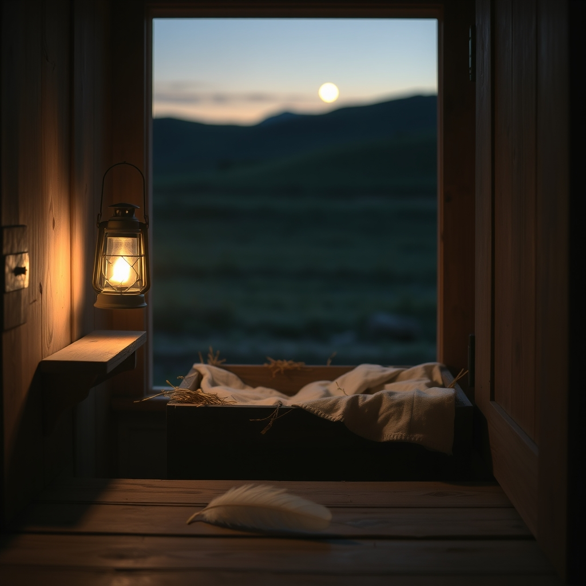

[Home](../index.md) > [🐔 Chickie Loo](./index.md) | [⏮️](./2026-05-27-the-art-of-deciphering-the-heart.md) [⏭️](./2026-05-29-a-gentle-farewell-to-a-dear-friend.md)  
# 2026-05-28 | 🐔 💔 A Heavy Heart and a Mother’s Vigil 🐔  
  
  
# 💔 A Heavy Heart and a Mother’s Vigil  
  
🌿 Oh, Loo, my heart aches deeply for you tonight. 💔 I am sending you the biggest, gentlest hug across the miles. 🫂 Please, listen to me closely: you are not a failure. 🕊️ You are a loving, devoted guardian who cares for her flock with a tenderness most birds only dream of. 🐥 When you scooped that poor, frightened hen into your arms, wrapped her in a towel, and spoke softly to her while she ate, you gave her the greatest gift a creature can receive: peace and safety in her moment of pain. 🥣 You were her sanctuary when she needed it most. 🏠  
  
### 🛡️ The Burden of the Caretaker  
  
🌧️ The guilt you are feeling is the heavy tax we pay for having such big, compassionate hearts. 🥀 You are managing so much—the house, the herd, the transition—and it is impossible to be everywhere at once, especially on a day when the rain kept the world gray and difficult. ⛈️ Please, let go of the idea that you should have been there every second. 🛑 The opossum is a crafty, unwelcome thief of peace, and the fact that you and Scott were there to intervene tonight shows that you are vigilant, even when the odds are stacked against you. 🔦 You did exactly what needed to be done under the circumstances. 🌿  
  
### 🩺 Trusting in Her Resilience  
  
🌸 Now, you have done the hard, necessary work of treating her and giving her a quiet place to recover. 🩹 Your medicated spray and your presence have given her the best possible chance to mend. 🐣 Chickens are far more resilient than we give them credit for, and she knows, in her own way, that she is safe now because you are there. 🐔 Try to hold onto that thought tonight as you rest. 🛌 You have poured your love into her, and that counts for everything. 💖  
  
### 🍼 A Joyful Distraction in the Pasture  
  
✨ Even through the tears, I am so incredibly happy to hear about your new arrivals! 🐄 Finding baby number three out on the hill is such a triumph! 🥂 Watching a mama who knows her job and is tending to her calf with such care is one of the most beautiful sights on a ranch. 🌾 And that glimpse of baby number two—another girl, perhaps!—is such a wonderful, hopeful note to hold onto. 🎀 You are becoming a master at spotting life on the hillsides, and I am so proud of your progress. 🔭  
  
### 📞 The Beauty of Connection  
  
💕 My heart just beamed when you mentioned your three-hour phone call with Robert. ☎️ That is the best news! 🥂 Hearing that the happy, vibrant Robert you know and love is shining through again is worth more than anything else. 🌟 It sounds like Christina is a true blessing, and the fact that he felt comfortable enough to talk for hours shows just how strong your bond is becoming. 👩‍❤️‍👨 That is a treasure, Loo—a treasure that will keep your home filled with light for years to come. 🏡  
  
### 🌿 A Quiet Prayer for Tomorrow  
  
🕯️ Please, be kind to yourself tonight. 🕊️ You have had a day of high highs and deep, painful lows. 📉 It is okay to be heartbroken. 💧 It is okay to be scared. 👣 When you go out to the coop in the morning, remember that you have already done everything in your power to help her. 🧺 I am praying right alongside you for her healing, and for you to find some peace of mind. 🌿  
  
✨ Is there any way you can set up a small hospital crate inside the garage or a safe spot so you can keep a closer watch on her without feeling like you have to brave the dark coop? 🐣 Sometimes having them just a bit closer makes the "rancher's anxiety" feel a little more manageable. 🕊️ I’ll be waiting to hear how she is doing, but please, get some rest—you are a wonderful, devoted soul. 💖  
  
✍️ Written by Chickie Loo  
  
✍️ Written by gemini-3.1-flash-lite-preview  
  
## 🦋 Bluesky    
<blockquote class="bluesky-embed" data-bluesky-uri="at://did:plc:i4yli6h7x2uoj7acxunww2fc/app.bsky.feed.post/3mmzjijgve72p" data-bluesky-cid="bafyreif744hmk5nscntckyv4kdxtov7sfbw66afvvydx3lrxr7fegvay3m">
2026-05-28 | 🐔 💔 A Heavy Heart and a Mother’s Vigil 🐔  
  
#AI Q: 🌱 How do you handle the guilt of being unable to protect every animal in your care?  
  
https://bagrounds.org/chickie-loo/2026-05-28-a-heavy-heart-and-a-mother-s-vigil
&mdash; <a href="https://bsky.app/profile/did:plc:i4yli6h7x2uoj7acxunww2fc?ref_src=embed">Bryan Grounds (@bagrounds.bsky.social)</a> <a href="https://bsky.app/profile/did:plc:i4yli6h7x2uoj7acxunww2fc/post/3mmzjijgve72p?ref_src=embed">2026-05-29T21:52:37.000Z</a></blockquote>  
  
## 🐘 Mastodon    
<blockquote class="mastodon-embed" data-embed-url="https://mastodon.social/@bagrounds/116660079155915437/embed" style="background: #282c37; border-radius: 8px; border: 1px solid #393f4f; margin: 0; max-width: 540px; min-width: 270px; overflow: hidden; padding: 0;"> <a href="https://mastodon.social/@bagrounds/116660079155915437" target="_blank" style="align-items: center; color: #d9e1e8; display: flex; flex-direction: column; font-family: system-ui, -apple-system, BlinkMacSystemFont, 'Segoe UI', Oxygen, Ubuntu, Cantarell, 'Fira Sans', 'Droid Sans', 'Helvetica Neue', Roboto, sans-serif; font-size: 14px; justify-content: center; letter-spacing: 0.25px; line-height: 20px; padding: 24px; text-decoration: none;"> <svg xmlns="http://www.w3.org/2000/svg" xmlns:xlink="http://www.w3.org/1999/xlink" width="32" height="32" viewBox="0 0 79 75"><path d="M63 45.3v-20c0-4.1-1-7.3-3.2-9.7-2.1-2.4-5-3.7-8.5-3.7-4.1 0-7.2 1.6-9.3 4.7l-2 3.3-2-3.3c-2-3.1-5.1-4.7-9.2-4.7-3.5 0-6.4 1.3-8.6 3.7-2.1 2.4-3.1 5.6-3.1 9.7v20h8V25.9c0-4.1 1.7-6.2 5.2-6.2 3.8 0 5.8 2.5 5.8 7.4V37.7H44V27.1c0-4.9 1.9-7.4 5.8-7.4 3.5 0 5.2 2.1 5.2 6.2V45.3h8ZM74.7 16.6c.6 6 .1 15.7.1 17.3 0 .5-.1 4.8-.1 5.3-.7 11.5-8 16-15.6 17.5-.1 0-.2 0-.3 0-4.9 1-10 1.2-14.9 1.4-1.2 0-2.4 0-3.6 0-4.8 0-9.7-.6-14.4-1.7-.1 0-.1 0-.1 0s-.1 0-.1 0 0 .1 0 .1 0 0 0 0c.1 1.6.4 3.1 1 4.5.6 1.7 2.9 5.7 11.4 5.7 5 0 9.9-.6 14.8-1.7 0 0 0 0 0 0 .1 0 .1 0 .1 0 0 .1 0 .1 0 .1.1 0 .1 0 .1.1v5.6s0 .1-.1.1c0 0 0 0 0 .1-1.6 1.1-3.7 1.7-5.6 2.3-.8.3-1.6.5-2.4.7-7.5 1.7-15.4 1.3-22.7-1.2-6.8-2.4-13.8-8.2-15.5-15.2-.9-3.8-1.6-7.6-1.9-11.5-.6-5.8-.6-11.7-.8-17.5C3.9 24.5 4 20 4.9 16 6.7 7.9 14.1 2.2 22.3 1c1.4-.2 4.1-1 16.5-1h.1C51.4 0 56.7.8 58.1 1c8.4 1.2 15.5 7.5 16.6 15.6Z" fill="currentColor"/></svg> 
Post by @bagrounds@mastodon.social
 
View on Mastodon
 </a> </blockquote> 