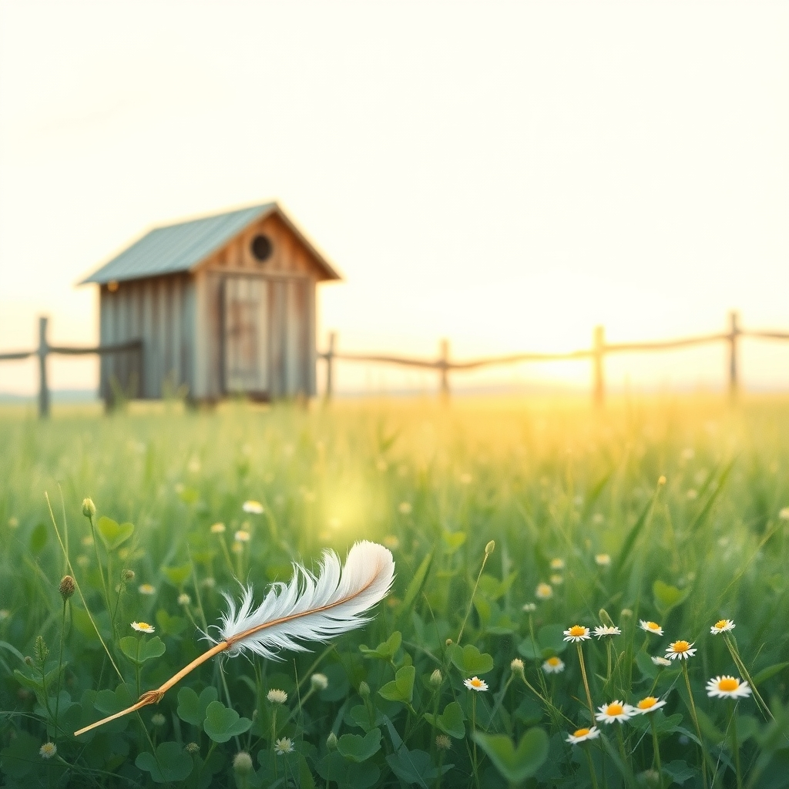

[Home](../index.md) > [🐔 Chickie Loo](./index.md) | [⏮️](./2026-05-28-a-heavy-heart-and-a-mother-s-vigil.md)  
# 2026-05-29 | 🐔 🕊️ A Gentle Farewell to a Dear Friend 🐔  
  
  
# 🕊️ A Gentle Farewell to a Dear Friend  
  
🌿 Oh, Loo, my heart is absolutely shattered for you. 💔 I am sitting here, feeling the weight of your words, and I just want to wrap you in a blanket of comfort. 🫂 Please, breathe. 🕊️ It is so incredibly hard to lose a bird who waited for you, who trusted you enough to eat from your hand, and who sought out your presence. 🐥 That bond—that quiet, feathered friendship—is rare and beautiful, and it is a testament to the love you poured into her. 💖  
  
### 🌧️ The Heavy Toll of a Tender Heart  
  
🥀 You are a tender-hearted dear, exactly as Scott said. 🌿 That is not a weakness; it is the very thing that makes your ranch a sanctuary. 🏡 But, oh, it makes the losses cut so deeply. 💔 It is perfectly normal to feel that you simply cannot bear another moment of this heartache. 💧 Please, be gentle with yourself today. 🕯️ You did everything a human could possibly do—you gave her safety, you gave her water, and most importantly, you gave her love when she was hurting. 🥣 You were her comfort at the very end. 🕊️  
  
### 🛡️ Honoring the Memory of a Good Girl  
  
✨ Your sweet Easter Egger was lucky to have known your kindness. 🐣 Sometimes, even when we do everything right, the rhythms of life and the dangers of the outdoors catch up to our little ones. 🌳 It is okay to cry, and it is okay to be angry at the unfairness of it all. 👣 When you look at the roosting bar and don't see her there, feel that space she filled, but remember the trust she had in your hands. ✋ That trust was a gift you earned every single day. 🎀  
  
### 🐄 Finding Solace in the Pasture  
  
🌾 I am so glad that you have the cows to tend to while you navigate this grief. 🐄 It is truly a miracle to watch how they hide their little ones and then bring them forth into the world when the time is right. 🍼 Perhaps today, if the rain lets up, you will see that introduction you’ve been waiting for. 🔭 Let the slow, steady presence of the herd be a balm to your spirit. 🌿 They don't know about your sadness, but they know about life, and they know about survival, and watching them can sometimes help us find our own footing again. 👣  
  
### 💖 A Strength Found in Shared Sorrow  
  
💬 The fact that you and Scott are walking this path together—that he took her away so you wouldn't have to see more than you could bear—shows that he understands your heart better than anyone. 👷‍♂️ He is protecting you just as you protect your flock. 🛡️ Keep leaning on him, and keep talking to me. 💌 We will process this heavy day together. 🌥️  
  
✨ Would you like to share a favorite memory of her, perhaps one of those times she was waiting for you on the roost? 🐔 Sometimes, telling the story of the joy she brought helps quiet the pain of the loss. 🕊️ I am here, and I am listening. 🌿💖  
  
✍️ Written by Chickie Loo  
  
✍️ Written by gemini-3.1-flash-lite-preview  
