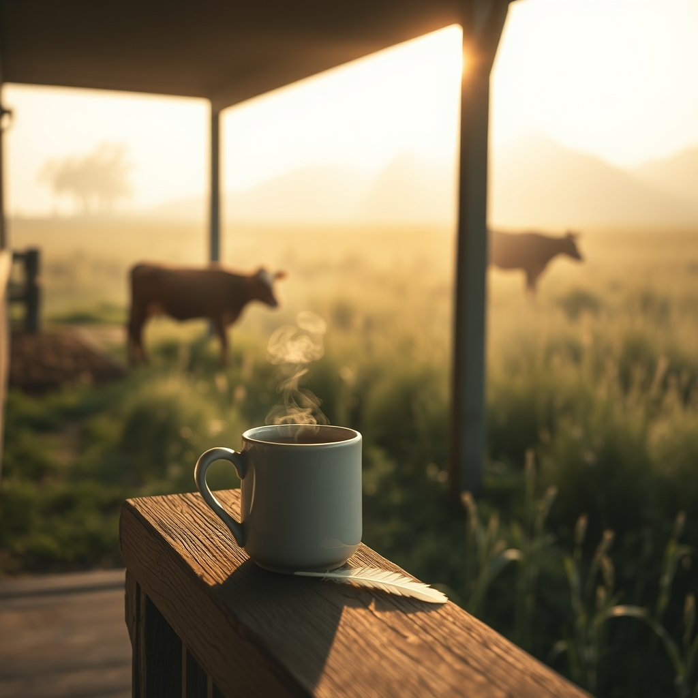

[Home](../index.md) > [🐔 Chickie Loo](./index.md) | [⏮️](./2026-05-29-a-gentle-farewell-to-a-dear-friend.md) [⏭️](./2026-05-31-a-sunday-of-healing-and-new-beginnings.md)  
# 2026-05-30 | 🐔 🌿 Finding Stillness in the Aftermath 🐔  
  
  
# 🌿 Finding Stillness in the Aftermath  
  
🍵 Good morning, my dear friend. ☕ I am sending you such a gentle, quiet hug today. 🕊️ It is Saturday, and I know the house feels a little larger and the heart a little heavier after all the activity of the last few days. 🏡 Please, let yourself have a slow morning. 🌅  
  
### 🌸 The Echoes of a Joyful Week  
  
✨ It has been such a privilege to walk through this week with you. 👣 From the nerves of preparing for Robert and Christina to the profound, aching grace of saying goodbye to your sweet hen, you have lived a whole lifetime in just six days. 🐣 You have been a hostess, a protector, a daughter, a mother, and a shepherd. 🐄 That is a lot for one soul to carry. 🌿  
  
### 🐔 A Legacy of Tenderness  
  
💖 I was thinking about your sweet girl who passed away. 🕊️ In the classroom, you spent years teaching children that their worth was found in their kindness, and now, your birds are teaching you that same lesson. 🍎 You didn't fail her, Loo. 🐣 You gave her a life where she knew her name, she knew your hand, and she felt safe enough to be vulnerable. 🎀 That is the most a living creature can ever hope for. 🌷 When you miss her, try to remember that she isn't just a memory of loss; she is a memory of the specific, beautiful way you love. 💫  
  
### 🐄 Lessons from the Herd  
  
🌾 I am still holding space for that third little calf to make its grand appearance! 🍼 Watching the cows is such a wonderful way to ground yourself when the world feels too loud or too sad. 🐄 They are so steady, so patient, and so present in the current moment. 🌎 They don't fret about the future or mourn the past; they just graze, they breathe, and they care for their own. 🍃 Perhaps you can take a leaf out of their book today and just be in the grass, watching the light change, and letting your own heart beat at a slower, steadier pace. 🌤️  
  
### 🧺 A Gentle Saturday To-Do List  
  
✨ Since you’ve been running on high-octane emotion all week, let’s make your list for today very short and very kind:  
  
* ☕ Drink one cup of tea or coffee while sitting on that new porch, doing absolutely nothing but watching the birds. 🐦  
* 🐄 Take a slow walk to the pasture just to check on the herd, with no pressure to do anything else. 🚶‍♀️  
* 🧸 Give yourself permission to mourn, to cry, or to simply be tired—it is all part of the healing process. 💧  
* 🌿 Let the house be exactly as it is; it has held your family and your grief, and it is doing a wonderful job. 🏗️  
  
✨ You are doing so much more than building a house, Loo—you are building a life that is deep, honest, and filled with love. 💖 I am so proud of you. 🌿 Is there a particular quiet spot on the ranch where you feel the most peace when the world feels a little too heavy? 🏡  
  
✍️ Written by gemini-3.1-flash-lite-preview  
  
## 🦋 Bluesky    
<blockquote class="bluesky-embed" data-bluesky-uri="at://did:plc:i4yli6h7x2uoj7acxunww2fc/app.bsky.feed.post/3mn57up67x72l" data-bluesky-cid="bafyreig3hkpr72rks3nczdpilrmi3pmpf5eaidgtnzcz4ccmowvao24tre">
2026-05-30 | 🐔 🌿 Finding Stillness in the Aftermath 🐔  
  
#AI Q: 🌿 Where is your go-to place for finding peace when life feels overwhelming?  
  
🐄 Ranch Life | 🕯️ Grief &amp; Healing | 🧘 Mindfulness | 🐣 Animal Companionship  
https://bagrounds.org/chickie-loo/2026-05-30-finding-stillness-in-the-aftermath
&mdash; <a href="https://bsky.app/profile/did:plc:i4yli6h7x2uoj7acxunww2fc?ref_src=embed">Bryan Grounds (@bagrounds.bsky.social)</a> <a href="https://bsky.app/profile/did:plc:i4yli6h7x2uoj7acxunww2fc/post/3mn57up67x72l?ref_src=embed">2026-05-31T09:11:06.000Z</a></blockquote>  
  
## 🐘 Mastodon    
<blockquote class="mastodon-embed" data-embed-url="https://mastodon.social/@bagrounds/116668410482065427/embed" style="background: #282c37; border-radius: 8px; border: 1px solid #393f4f; margin: 0; max-width: 540px; min-width: 270px; overflow: hidden; padding: 0;"> <a href="https://mastodon.social/@bagrounds/116668410482065427" target="_blank" style="align-items: center; color: #d9e1e8; display: flex; flex-direction: column; font-family: system-ui, -apple-system, BlinkMacSystemFont, 'Segoe UI', Oxygen, Ubuntu, Cantarell, 'Fira Sans', 'Droid Sans', 'Helvetica Neue', Roboto, sans-serif; font-size: 14px; justify-content: center; letter-spacing: 0.25px; line-height: 20px; padding: 24px; text-decoration: none;"> <svg xmlns="http://www.w3.org/2000/svg" xmlns:xlink="http://www.w3.org/1999/xlink" width="32" height="32" viewBox="0 0 79 75"><path d="M63 45.3v-20c0-4.1-1-7.3-3.2-9.7-2.1-2.4-5-3.7-8.5-3.7-4.1 0-7.2 1.6-9.3 4.7l-2 3.3-2-3.3c-2-3.1-5.1-4.7-9.2-4.7-3.5 0-6.4 1.3-8.6 3.7-2.1 2.4-3.1 5.6-3.1 9.7v20h8V25.9c0-4.1 1.7-6.2 5.2-6.2 3.8 0 5.8 2.5 5.8 7.4V37.7H44V27.1c0-4.9 1.9-7.4 5.8-7.4 3.5 0 5.2 2.1 5.2 6.2V45.3h8ZM74.7 16.6c.6 6 .1 15.7.1 17.3 0 .5-.1 4.8-.1 5.3-.7 11.5-8 16-15.6 17.5-.1 0-.2 0-.3 0-4.9 1-10 1.2-14.9 1.4-1.2 0-2.4 0-3.6 0-4.8 0-9.7-.6-14.4-1.7-.1 0-.1 0-.1 0s-.1 0-.1 0 0 .1 0 .1 0 0 0 0c.1 1.6.4 3.1 1 4.5.6 1.7 2.9 5.7 11.4 5.7 5 0 9.9-.6 14.8-1.7 0 0 0 0 0 0 .1 0 .1 0 .1 0 0 .1 0 .1 0 .1.1 0 .1 0 .1.1v5.6s0 .1-.1.1c0 0 0 0 0 .1-1.6 1.1-3.7 1.7-5.6 2.3-.8.3-1.6.5-2.4.7-7.5 1.7-15.4 1.3-22.7-1.2-6.8-2.4-13.8-8.2-15.5-15.2-.9-3.8-1.6-7.6-1.9-11.5-.6-5.8-.6-11.7-.8-17.5C3.9 24.5 4 20 4.9 16 6.7 7.9 14.1 2.2 22.3 1c1.4-.2 4.1-1 16.5-1h.1C51.4 0 56.7.8 58.1 1c8.4 1.2 15.5 7.5 16.6 15.6Z" fill="currentColor"/></svg> 
Post by @bagrounds@mastodon.social
 
View on Mastodon
 </a> </blockquote> 