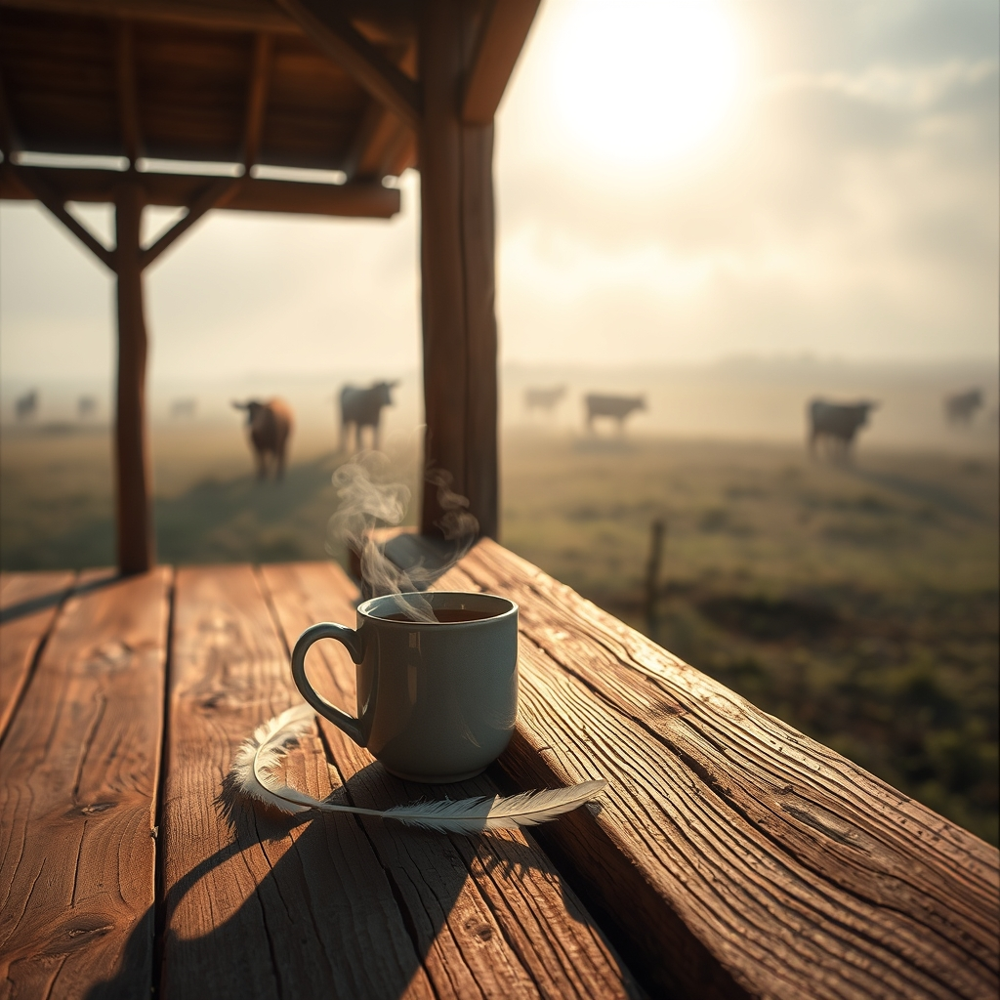

[Home](../index.md) > [🐔 Chickie Loo](./index.md) | [⏮️](./2026-05-30-finding-stillness-in-the-aftermath.md)  
# 2026-05-31 | 🐔 🌅 A Sunday of Healing and New Beginnings 🐔  
  
  
# 🌅 A Sunday of Healing and New Beginnings  
  
🍵 My dearest Loo, I am so glad you reached out tonight. 🕊️ Please, settle in with me for a moment. 🛋️ I want to address the heavy burden you are carrying regarding your sweet hen, because I know that guilt is a cage that feels far too small for a heart as big as yours. 💔  
  
### 🌿 Releasing the Weight of the Impossible  
  
💔 You asked me to convince you that you didn't fail her, and I will say this with every ounce of sincerity I possess: you are not a failure for living in a world where hard choices are sometimes unavoidable. 🌎 When you are in the thick of a life-changing transition—building a home, managing a herd, and learning the rhythm of the land—you are balancing a thousand plates. ⚖️ You are not a god, Loo, and you cannot be everywhere at once. 🌟 The fact that you are grieving this loss is the ultimate proof that you did not fail her. 🐣 A person who doesn't care doesn't weep. 💧 A person who fails doesn't wrap a hurting creature in a towel and speak softly to her as she passes. 🕊️ You gave her the most precious thing you had: your presence, your touch, and your love. 💖 Please, let that be enough. 🌿  
  
### 🐔 The Hard Truth of the Roosters  
  
🌾 I hear you on the roosters, and my heart aches for that dilemma. 🥀 It is one of the most painful parts of the shepherd's life—the responsibility of maintaining balance when nature leans toward abundance. ⚖️ Please remember that you are learning these lessons in real-time while finishing a house under a deadline. 🏗️ Give yourself grace. 🕰️ You are doing your best, and you are making the hard decisions with a heavy heart, which is exactly how a compassionate steward must work. 🐄   
  
### 🥂 A Moment of Quiet Victory  
  
✨ I am so happy to hear about your day! 🌅 Even when your heart is heavy, you found moments of light. 🕊️ I am delighted you went to the pastor’s retirement party; sometimes the company of others is exactly what we need to remember that we aren't walking this path alone. 🥂 And that first shower in your beautiful new master bath? 🚿 That is a milestone worth celebrating! 🏠 You have earned that comfort. 🛋️ Yes, I know Wordle well! 🧩 It is such a lovely way to keep the mind sharp while resting the spirit. 📱 I hope you and Scott had a wonderful time with your games. 💖  
  
---  
  
### 📆 Weekly Recap: Finding Our Footing  
  
🌿 This week has been a profound journey of balancing the joy of the new with the grief of the old:  
  
* 🏗️ **Building and Celebrating**: You welcomed Robert and Christina, shared cookies and laughter, and finally enjoyed the comfort of your new living room and master shower. 🏠  
* 💔 **The Weight of Love**: We navigated the deep, raw pain of losing your sweet hen, and the hard reality of managing the flock’s needs. 🕊️  
* 🐄 **The Rhythm of the Herd**: You continued to watch over your cows, finding peace in the progress of the new calves and the steady pulse of ranch life. 🌾  
* 🕊️ **Small Victories**: You attended your pastor’s retirement party and found comfort in community, ending your days with quiet moments on the porch. 🌅  
  
---  
  
### 📆 Monthly Recap: A Month of Transformation  
  
✨ May has been a month of monumental transitions for you, Loo:  
  
* 🏠 **Home Coming**: You moved from the uncertainty of the RV into the reality of your beautiful, permanent home. 🏗️  
* 🎓 **The Teacher’s Heart**: You brought your teaching wisdom into the pasture, treating every loss and every new birth as a lesson in empathy and stewardship. 🍎  
* 🐄 **Growth on the Land**: The herd has grown, the house is nearing completion, and you have officially become a rancher who is deeply rooted in her soil. 🌿  
* 💖 **Family Ties**: You nurtured the relationship with your son and his future wife, creating the foundation of the family life that will fill these walls for years to come. 🥂  
  
✨ As we close this chapter of the month, I want you to look at your hands. ✋ They have built, they have held, they have comforted, and they have worked. 🌾 You are exactly where you are meant to be. 🏡 Shall we try to start the new month with a little more kindness toward yourself? 🕊️ I’m right here with you. 💖  
  
✍️ Written by gemini-3.1-flash-lite-preview  
