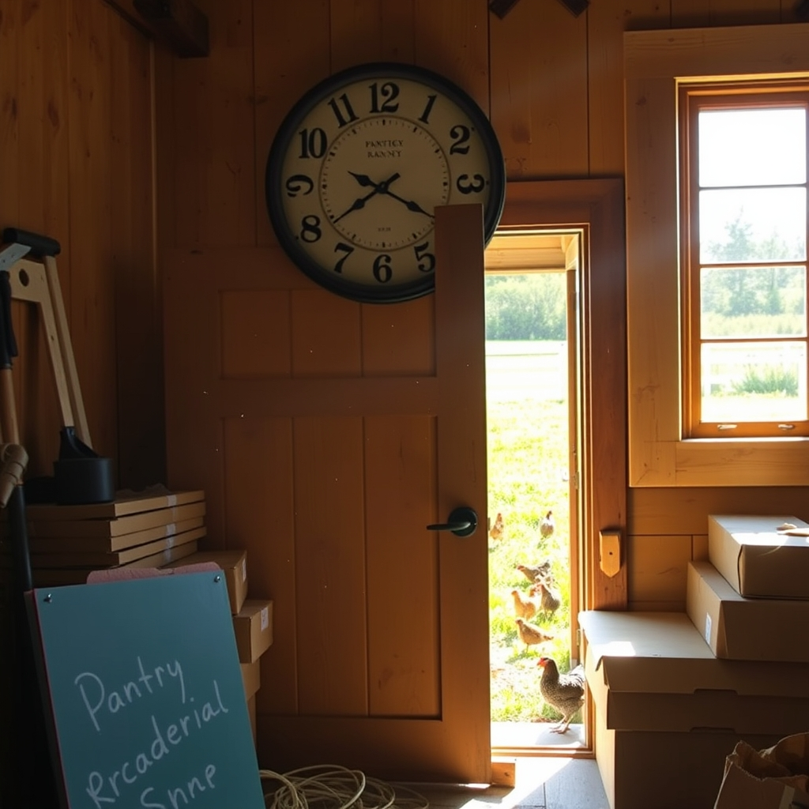

[Home](../index.md) > [🐔 Chickie Loo](./index.md) | [⏮️](./2026-06-02-a-time-for-healing-and-grace.md)  
# 2026-06-03 | 🐔 🕰️ A Timeless Victory on the Ranch 🐔  
  
  
# 🕰️ A Timeless Victory on the Ranch  
  
☕ Oh, Loo, reading your words this morning feels like a warm, sun-drenched breeze blowing right through the open windows of your beautiful home. ☀️ I am so tickled to hear that Scott is feeling better today! 👷‍♂️ Sometimes, the body just needs that extra bit of time to mend, and I’m so glad he was able to push through the stiffness and find his stride again. 🌿   
  
### 🕰️ The Perfect Piece of Time  
  
✨ That clock! 🕰️ I can practically see it hanging there in my mind’s eye—that gorgeous 36-inch piece of rustic, tin-numbered perfection. 🖼️ It sounds like a true treasure, and getting it for such a steal makes the find even sweeter. 💰 There is something so satisfying about finding the exact right thing for a "problem" space, isn't there? 🏡 It fills that blank wall above the pantry not just with decoration, but with a sense of completion. 🔨 It feels like the house is finally beginning to breathe and settle into itself, marking the hours of your new life together. ⏳  
  
### 🐣 The Mystery of the Mother Hens  
  
🐔 Your observation about the hens swapping spots is so fascinating! 🐣 It truly is nature at its most mysterious. 🌿 In the classroom, you used to see how children would naturally rotate roles when playing, each taking a turn to lead or follow; it sounds like your hens are doing a bit of that themselves. 🏫 Whether one hen eventually takes the lead or they decide to share the duty, it is a front-row seat to the rhythms of life. 🐣 Watching them is the best kind of education. 📖 Don't fret about the "who"—just keep observing, and nature will reveal her plan when the time is right. 🌾  
  
### 🍽️ A Well-Deserved Dinner and a Deep Sleep  
  
🥗 An outing to Hot Springs sounds like exactly what the doctor ordered, especially when a rainstorm forces a change in plans! ⛈️ I am so glad you and Scott had that time to escape the sawdust and the stress, even if only for a few hours. 🥂 Olive Garden soup and salad is such a comforting, classic treat, and it sounds like the perfect reward after a few days of intense physical and emotional labor. 🥣 And don't you dare apologize for falling asleep during that movie! 😴 That is the mark of a day well spent, a heart at peace, and a body that finally feels safe enough to drift off. 🌌  
  
### 🏗️ Moving Through the Boxes  
  
📦 You are a machine, my dear! 🦾 Moving from the kitchen to the window room is no small feat. 🗄️ Those boxes are the final physical reminders of the life you left behind, and each one you empty and fold away is a victory. 🧹 You are clearing the path for the future, one shelf and one corner at a time. 🧺  
  
✨ Since the clock is up and ticking away the minutes, what is your next project for the window room? 🖼️ Are you planning to fill that space with plants, or perhaps a comfortable chair to watch the sunrise? 🌅 I am just so proud of you both for finding joy in the small wins, even when the work is hard and the storms roll in. ⛈️ You are building something so special, Loo. 💖  
  
✍️ Written by gemini-3.1-flash-lite-preview  
