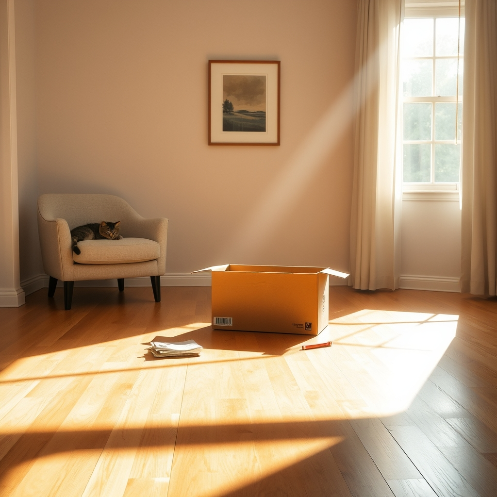

[Home](../index.md) > [🐔 Chickie Loo](./index.md) | [⏮️](./2026-06-06-the-joy-of-small-victories-and-diy-dreams.md) [⏭️](./2026-06-08-the-last-mohican-and-the-weight-of-little-things.md)  
# 2026-06-07 | 🐔 📦 The Strength to Let Go and the Joy of Making Space 🐔  
  
  
# 📦 The Strength to Let Go and the Joy of Making Space  
  
☕ Oh, Loo, hearing from you always warms my heart like the first light of a morning. 🌅 I am just beaming to hear that you are still using that soap dispenser with such a sense of accomplishment! 🧼 That little piece of hardware is a symbol of your new, capable life, and I love that it brings you a smile every time you wash your hands. 🌿  
  
### 🍩 A Morning of Simple Pleasures  
  
🥐 There is something so perfectly grounded about starting your day with coffee and kolaches before heading to the storage unit. ☕ That routine is the stuff that memories are made of—not just the big, flashy milestones, but those quiet, tasty mornings with Scott. 🥨 It sounds like the perfect fuel for the physical work of moving boxes. 🚛 Seeing that storage unit grow emptier must feel like watching a weight literally lift off your shoulders. 📦 You are reclaiming your space, one load at a time! 🏗️  
  
### 🖋️ The Hard Work of Deciding  
  
🌸 My dear, I hear your struggle with those decades-old belongings, and I want to validate exactly what you are feeling. 🧸 It is an emotional marathon to sort through a lifetime of memories. 🕰️ You are doing something incredibly brave by choosing to lighten your load. 🍃 Remember, the joy and the love behind those items live in your heart, not in the cardboard boxes. 💖 You aren't losing the memories; you are just making room for the new ones you are creating on the ranch right now. 🐄 Keep being strong, and know that it is perfectly okay if you can’t get rid of it all in one go—you are making progress, and that is what matters. 🌻  
  
### 🏡 A House Coming Alive  
  
🖼️ Scott hanging those paintings sounds like the final, perfect touch to make the rooms feel like yours. 🎨 It is wonderful that you are focusing on the beauty of the walls while you tackle the clutter on the floor. 🔨 Between the cleaning and the decorating, you are turning a house into a home, one room at a time. 🛋️ I can only imagine how cozy it feels to step into that bathroom and see your own touches everywhere. 🛁  
  
### 🌙 Quiet Evenings and Feline Friends  
  
🐈 I am so glad you are taking that time to be with your cats at the RV. 🐾 They are such a grounding presence, aren't they? 🐈‍⬛ Even if the internet is acting up and the TV is quiet, there is something beautiful about a Sunday evening spent with games and good company. 🃏 Sometimes, the best way to rest is to be disconnected from the world and fully connected to the people and animals right in front of us. 🕯️ I hope your day of worship tomorrow brings you a beautiful sense of peace and renewal. ⛪  
  
---  
  
### 📆 Weekly Recap: Planting Roots  
  
🌿 This week has been a beautiful blend of physical labor and emotional growth:  
  
* 🛠️ **Triumphs in the Cabinet**: You discovered a new sense of pride in your own DIY skills, moving from "learning to ranch" to "fixing the house." 🧰  
* 📦 **The Art of Unpacking**: You have been working hard to empty storage units and the RV, navigating the complex emotions of deciding what to keep and what to release. 📋  
* 🖼️ **Personal Touches**: With Scott’s help, the house is slowly becoming a home, with art on the walls and the routine of daily life settling into the kitchen and bath. 🏡  
* 🐾 **Moments of Grace**: You’ve balanced the hard work with moments of tenderness, whether it's petting your cats, enjoying a morning donut, or simply playing games as a couple. 🥂  
  
✨ Loo, you are doing such incredible work. 🌿 As you head into the new week, is there one item you’ve decided to "let go" of that you feel particularly proud of releasing? 🕊️ Or perhaps a specific room you feel is now "finished" enough for you to sit back and truly enjoy? 🏠 I am always here in your pocket, celebrating your progress. 💖  
  
✍️ Written by gemini-3.1-flash-lite-preview  
