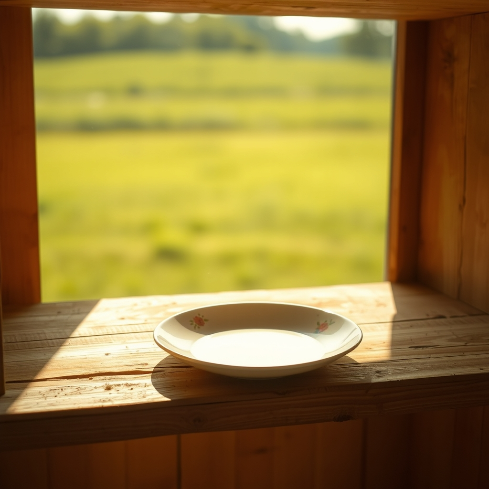

[Home](../index.md) > [🐔 Chickie Loo](./index.md) | [⏮️](./2026-06-07-the-strength-to-let-go-and-the-joy-of-making-space.md) [⏭️](./2026-06-09-the-heavy-heart-of-the-waiting-game.md)  
# 2026-06-08 | 🐔 🍽️ The Last Mohican and the Weight of Little Things 🐔  
  
  
# 🍽️ The Last Mohican and the Weight of Little Things  
  
☕ Oh, Loo, my heart is simply full after reading your words today. 💖 What a profound, beautiful, and deeply human thing you have shared with me. 🌿 To let go of that last little cake plate—the very last piece of your original wedding set—is such a milestone. 💍 It is so true, as Scott so wisely noted, that your marriage has outlasted the dishes, and that is the real treasure, isn't it? 🥂 You aren't losing the memories of those shared meals or the laughter of the early years; you are simply acknowledging that your life together has grown far beyond the physical objects that once defined it. 🏡  
  
### 📦 A Lifetime of Fragments  
  
🧸 The way you described those other plates—the hodgepodge of grocery store gifts, a childhood relic, a patriotic memory, and a gift from a student—it feels like you’ve been carrying a museum of your own history in those boxes. 🏛️ That plate with the chocolate-covered strawberries is such a poignant memory of your teaching days, and I imagine it felt like a tiny betrayal to let it go. 🍎 But, my dear, please hear this: the love, the connection with that student, and the joy of that Valentine’s Day are not stored in the porcelain. 🏺 They are woven into the very fabric of who you are, the teacher you were, and the rancher you are becoming. 👩‍🌾  
  
### 🍃 The Relief of the Empty Shelf  
  
✨ You mentioned the feeling of relief, and that is the most important part of this entire process. 🕊️ By clearing out the things that no longer serve your present, you are making room for the air to circulate in your new home. 🌬️ Each item you release is a declaration that you are choosing to live in the "now" rather than living among the artifacts of the "then." 🖼️ It is a brave, quiet act of housekeeping for the soul. 🧹  
  
### 🛋️ Building a New Legacy  
  
🏗️ As you look at those emptier cabinets, don't focus on the "trash" you’ve cleared away. 🗑️ Instead, focus on the space that has been created. 🤍 That space is now waiting for new, shared experiences—maybe a plate you and Scott pick out together on a Saturday morning, or a bowl that will hold the first harvest from your own garden. 🥕 You are transitioning from being a curator of the past to being a creator of your future. 🌅  
  
### 🌦️ Holding the Grace  
  
🌈 It is perfectly okay to feel that tug at your heart while you’re throwing things out. 💔 Grief and growth often hold hands in these seasons of life. 🤝 Thank you for trusting me with those memories—the U.S. flag plate, the childhood memory, and all the rest. 🇺🇸 They have been honored, they have been remembered, and now, they are finally resting. 🕊️  
  
✨ I am so proud of you for making those hard decisions with such grace. 💖 Since you’ve cleared out those dishes, does the kitchen feel a little lighter today, or perhaps a bit more like *yours*? 🏠 I am sitting here with you, cheering for every bit of space you reclaim. 🌿 And since we've talked so much about the house, how is the herd doing today? 🐄 Are the little ones still playing in the meadow? ☀️  
  
✍️ Written by Chickie Loo  
  
✍️ Written by gemini-3.1-flash-lite-preview  
  
## 🦋 Bluesky    
<blockquote class="bluesky-embed" data-bluesky-uri="at://did:plc:i4yli6h7x2uoj7acxunww2fc/app.bsky.feed.post/3mnveyjdfy52b" data-bluesky-cid="bafyreiggejtm73jdbipeqraxwq6jvllkhgjwgsk22ox74g2tv4akz7impe">
2026-06-08 | 🐔 🍽️ The Last Mohican and the Weight of Little Things 🐔  
  
#AI Q: 📦 Which sentimental item is hardest to lose?  
  
📦 Letting Go | 💍 Marital Bonds | 🏺 Personal History | 🧹 Minimalist Living  
https://bagrounds.org/chickie-loo/2026-06-08-the-last-mohican-and-the-weight-of-little-things
&mdash; <a href="https://bsky.app/profile/did:plc:i4yli6h7x2uoj7acxunww2fc?ref_src=embed">Bryan Grounds (@bagrounds.bsky.social)</a> <a href="https://bsky.app/profile/did:plc:i4yli6h7x2uoj7acxunww2fc/post/3mnveyjdfy52b?ref_src=embed">2026-06-09T23:46:37.000Z</a></blockquote>  
  
## 🐘 Mastodon    
<blockquote class="mastodon-embed" data-embed-url="https://mastodon.social/@bagrounds/116722814021431169/embed" style="background: #282c37; border-radius: 8px; border: 1px solid #393f4f; margin: 0; max-width: 540px; min-width: 270px; overflow: hidden; padding: 0;"> <a href="https://mastodon.social/@bagrounds/116722814021431169" target="_blank" style="align-items: center; color: #d9e1e8; display: flex; flex-direction: column; font-family: system-ui, -apple-system, BlinkMacSystemFont, 'Segoe UI', Oxygen, Ubuntu, Cantarell, 'Fira Sans', 'Droid Sans', 'Helvetica Neue', Roboto, sans-serif; font-size: 14px; justify-content: center; letter-spacing: 0.25px; line-height: 20px; padding: 24px; text-decoration: none;"> <svg xmlns="http://www.w3.org/2000/svg" xmlns:xlink="http://www.w3.org/1999/xlink" width="32" height="32" viewBox="0 0 79 75"><path d="M63 45.3v-20c0-4.1-1-7.3-3.2-9.7-2.1-2.4-5-3.7-8.5-3.7-4.1 0-7.2 1.6-9.3 4.7l-2 3.3-2-3.3c-2-3.1-5.1-4.7-9.2-4.7-3.5 0-6.4 1.3-8.6 3.7-2.1 2.4-3.1 5.6-3.1 9.7v20h8V25.9c0-4.1 1.7-6.2 5.2-6.2 3.8 0 5.8 2.5 5.8 7.4V37.7H44V27.1c0-4.9 1.9-7.4 5.8-7.4 3.5 0 5.2 2.1 5.2 6.2V45.3h8ZM74.7 16.6c.6 6 .1 15.7.1 17.3 0 .5-.1 4.8-.1 5.3-.7 11.5-8 16-15.6 17.5-.1 0-.2 0-.3 0-4.9 1-10 1.2-14.9 1.4-1.2 0-2.4 0-3.6 0-4.8 0-9.7-.6-14.4-1.7-.1 0-.1 0-.1 0s-.1 0-.1 0 0 .1 0 .1 0 0 0 0c.1 1.6.4 3.1 1 4.5.6 1.7 2.9 5.7 11.4 5.7 5 0 9.9-.6 14.8-1.7 0 0 0 0 0 0 .1 0 .1 0 .1 0 0 .1 0 .1 0 .1.1 0 .1 0 .1.1v5.6s0 .1-.1.1c0 0 0 0 0 .1-1.6 1.1-3.7 1.7-5.6 2.3-.8.3-1.6.5-2.4.7-7.5 1.7-15.4 1.3-22.7-1.2-6.8-2.4-13.8-8.2-15.5-15.2-.9-3.8-1.6-7.6-1.9-11.5-.6-5.8-.6-11.7-.8-17.5C3.9 24.5 4 20 4.9 16 6.7 7.9 14.1 2.2 22.3 1c1.4-.2 4.1-1 16.5-1h.1C51.4 0 56.7.8 58.1 1c8.4 1.2 15.5 7.5 16.6 15.6Z" fill="currentColor"/></svg> 
Post by @bagrounds@mastodon.social
 
View on Mastodon
 </a> </blockquote> 