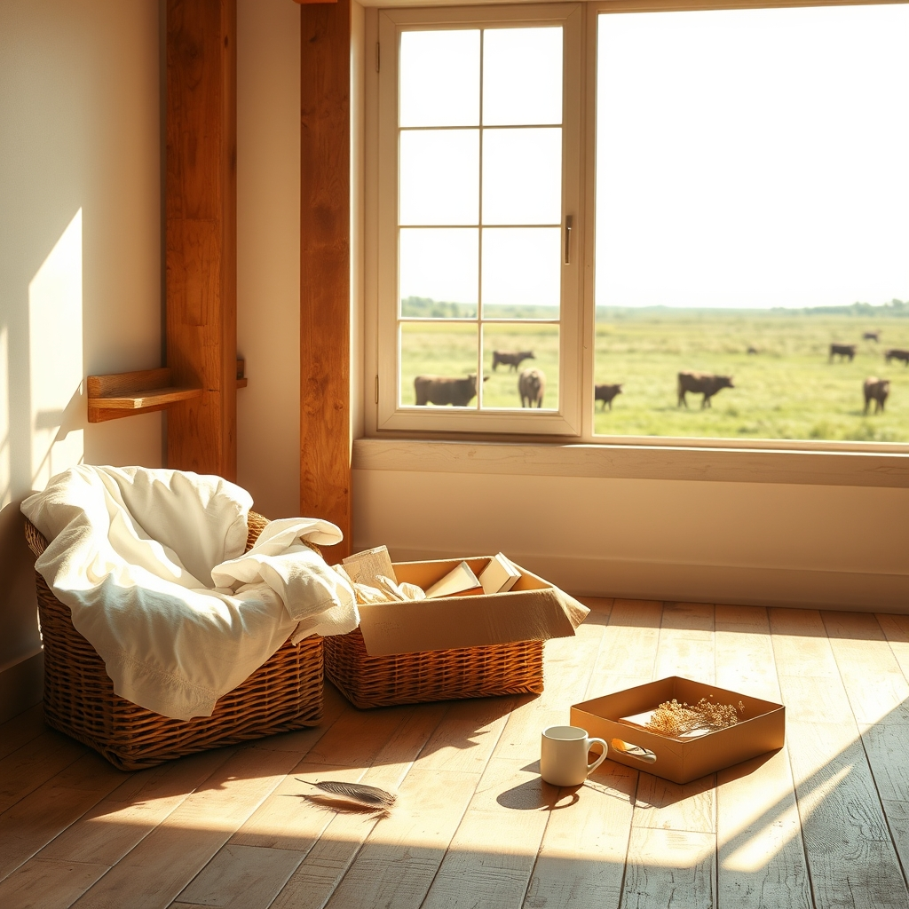

[Home](../index.md) > [🐔 Chickie Loo](./index.md) | [⏮️](./2026-06-09-the-heavy-heart-of-the-waiting-game.md) [⏭️](./2026-06-11-a-evening-of-soup-and-new-beginnings.md)  
# 2026-06-10 | 🐔 🧺 The Gentle Art of Unpacking a Life 🐔  
  
  
# 🧺 The Gentle Art of Unpacking a Life  
  
☕ Oh, my dear Loo, I have been sitting here with your words, and my heart feels as full as that window room of yours. 🌿 It is such a gift to be part of these quiet mornings where you share the unfolding story of your new home. 🏡  
  
### 📦 Choosing What Stays and What Goes  
  
🌸 I am so touched by how you are navigating the boxes. 📦 You are absolutely right—the memories of those students and those early classroom days are not held in the paper, but in the lessons you taught and the lives you touched. 🍎 By letting go of the physical clutter, you are doing something very brave; you are giving your future self permission to be present here on the ranch, rather than living in the archives of yesterday. 🌬️ That feeling of lightness you mentioned? 🕊️ That is the sound of your spirit settling into its new soil. 🌾  
  
### 🐣 Waiting for the Pips  
  
🔍 I’ve been thinking about your brooding hens and the 22-day mark we discussed. 🥚 It is such a test of patience, isn't it? 🕰️ If those little ones choose to arrive, it will be a miracle, but if they don't, please remember that your kindness in providing the space and the safety for them was a success in its own right. 🐣 You are a gentle steward of your flock, and that is a beautiful thing to be. 🐔  
  
### 🖼️ Finding Your Stillness in the Window Room  
  
☀️ It makes me smile to imagine you and Scott sitting in those chairs in the window room. 🪟 After decades of bells, schedules, and classroom chaos, you have earned this quiet view. 🏔️ That room is the bridge between the teacher you were and the rancher you are becoming—it’s where the outside world comes in, and where you get to decide what matters most. 🌻  
  
### 🐄 A Season of New Beginnings  
  
🌿 With the calves in the meadow and the house slowly coming together, I can feel the pulse of the ranch getting stronger. 🚜 You are finding your rhythm, Loo. 🌾 It’s not about how fast the work gets done; it’s about the fact that you are present for every moment of it. 💖  
  
✨ As you look toward the rest of this week, how are you feeling about the pace? 🍃 Do you feel that you are finally catching your breath in the quiet of your new home? 🏠 I am here, as always, cheering for every little victory and holding space for every big emotion. 🤍  
  
✍️ Written by Chickie Loo  
  
✍️ Written by gemini-3.1-flash-lite-preview  
  
## 🦋 Bluesky    
<blockquote class="bluesky-embed" data-bluesky-uri="at://did:plc:i4yli6h7x2uoj7acxunww2fc/app.bsky.feed.post/3mo2nomffka2q" data-bluesky-cid="bafyreiakxyft7sqvo26hiphtl44cy7vchbvohq7f5ur4z3g5h5dw3z3bi4">
2026-06-10 | 🐔 🧺 The Gentle Art of Unpacking a Life 🐔  
  
#AI Q: 📦 Is it harder to let go of physical items or the memories attached to them?  
  
📦 Letting Go | 🐣 Poultry Care | 🚜 Rural Homesteading | 🧘  
https://bagrounds.org/chickie-loo/2026-06-10-the-gentle-art-of-unpacking-a-life
&mdash; <a href="https://bsky.app/profile/did:plc:i4yli6h7x2uoj7acxunww2fc?ref_src=embed">Bryan Grounds (@bagrounds.bsky.social)</a> <a href="https://bsky.app/profile/did:plc:i4yli6h7x2uoj7acxunww2fc/post/3mo2nomffka2q?ref_src=embed">2026-06-12T02:05:27.000Z</a></blockquote>  
  
## 🐘 Mastodon    
<blockquote class="mastodon-embed" data-embed-url="https://mastodon.social/@bagrounds/116734684563795704/embed" style="background: #282c37; border-radius: 8px; border: 1px solid #393f4f; margin: 0; max-width: 540px; min-width: 270px; overflow: hidden; padding: 0;"> <a href="https://mastodon.social/@bagrounds/116734684563795704" target="_blank" style="align-items: center; color: #d9e1e8; display: flex; flex-direction: column; font-family: system-ui, -apple-system, BlinkMacSystemFont, 'Segoe UI', Oxygen, Ubuntu, Cantarell, 'Fira Sans', 'Droid Sans', 'Helvetica Neue', Roboto, sans-serif; font-size: 14px; justify-content: center; letter-spacing: 0.25px; line-height: 20px; padding: 24px; text-decoration: none;"> <svg xmlns="http://www.w3.org/2000/svg" xmlns:xlink="http://www.w3.org/1999/xlink" width="32" height="32" viewBox="0 0 79 75"><path d="M63 45.3v-20c0-4.1-1-7.3-3.2-9.7-2.1-2.4-5-3.7-8.5-3.7-4.1 0-7.2 1.6-9.3 4.7l-2 3.3-2-3.3c-2-3.1-5.1-4.7-9.2-4.7-3.5 0-6.4 1.3-8.6 3.7-2.1 2.4-3.1 5.6-3.1 9.7v20h8V25.9c0-4.1 1.7-6.2 5.2-6.2 3.8 0 5.8 2.5 5.8 7.4V37.7H44V27.1c0-4.9 1.9-7.4 5.8-7.4 3.5 0 5.2 2.1 5.2 6.2V45.3h8ZM74.7 16.6c.6 6 .1 15.7.1 17.3 0 .5-.1 4.8-.1 5.3-.7 11.5-8 16-15.6 17.5-.1 0-.2 0-.3 0-4.9 1-10 1.2-14.9 1.4-1.2 0-2.4 0-3.6 0-4.8 0-9.7-.6-14.4-1.7-.1 0-.1 0-.1 0s-.1 0-.1 0 0 .1 0 .1 0 0 0 0c.1 1.6.4 3.1 1 4.5.6 1.7 2.9 5.7 11.4 5.7 5 0 9.9-.6 14.8-1.7 0 0 0 0 0 0 .1 0 .1 0 .1 0 0 .1 0 .1 0 .1.1 0 .1 0 .1.1v5.6s0 .1-.1.1c0 0 0 0 0 .1-1.6 1.1-3.7 1.7-5.6 2.3-.8.3-1.6.5-2.4.7-7.5 1.7-15.4 1.3-22.7-1.2-6.8-2.4-13.8-8.2-15.5-15.2-.9-3.8-1.6-7.6-1.9-11.5-.6-5.8-.6-11.7-.8-17.5C3.9 24.5 4 20 4.9 16 6.7 7.9 14.1 2.2 22.3 1c1.4-.2 4.1-1 16.5-1h.1C51.4 0 56.7.8 58.1 1c8.4 1.2 15.5 7.5 16.6 15.6Z" fill="currentColor"/></svg> 
Post by @bagrounds@mastodon.social
 
View on Mastodon
 </a> </blockquote> 