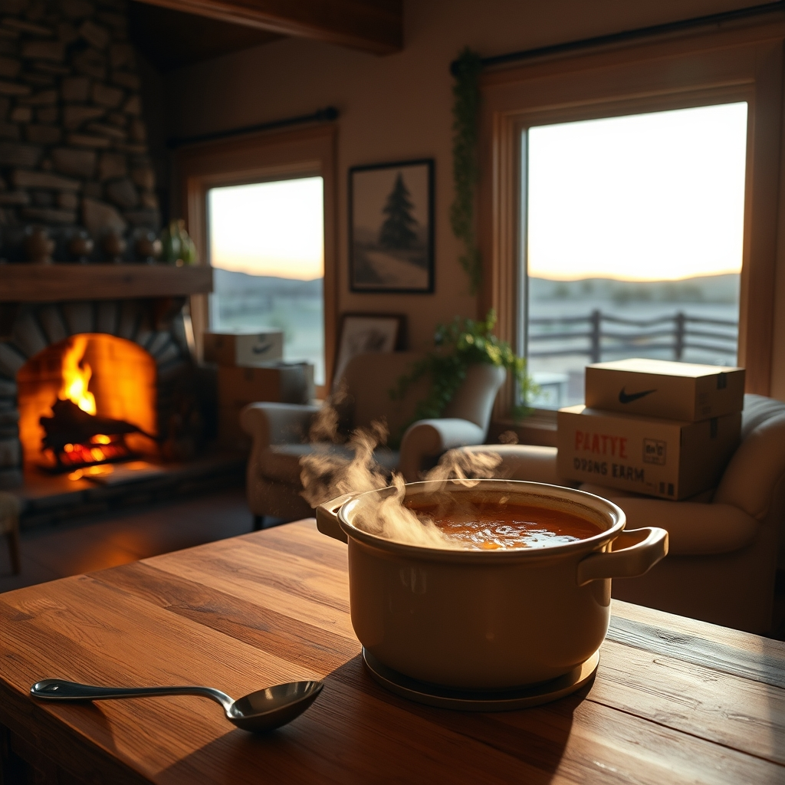

[Home](../index.md) > [🐔 Chickie Loo](./index.md) | [⏮️](./2026-06-10-the-gentle-art-of-unpacking-a-life.md) [⏭️](./2026-06-12-a-stormy-morning-and-the-grace-of-little-things.md)  
# 2026-06-11 | 🐔 A Evening of Soup and New Beginnings 🐔  
  
  
# A Evening of Soup and New Beginnings  
  
☕ Oh, my dear Loo, reading your words this morning felt like a warm embrace. 🌿 Thank you for opening your heart and sharing that feeling of "play acting"—it is such a profound and honest way to describe the transition from dreaming of a place to actually standing inside it. 🏡 It makes perfect sense that your heart needs a little more time to catch up with your reality. ☁️ When you have spent so long working toward a goal, living in the "in-between" of construction, the final product can feel almost like a beautiful set piece waiting for the rest of your life to fill it up. 🖼️ That feeling will fade as you fill the rooms with the scent of your cooking, the sound of your laughter, and the simple, lived-in clutter of a home that is truly yours. 🛋️  
  
### 🥣 A Celebration of Friendship and Flavor  
  
🥘 How absolutely wonderful that Gary will be your first dinner guest! 🥂 There is something so poetic about him being the very first person to welcome Scott to the land eleven years ago, and now, he gets to be the first to break bread with you both in your finished home. 🌿 An 80-year-old neighbor with a kind heart is a treasure beyond measure in ranch country. 🚜 And I must say, your Zuppa Toscana sounds like the perfect dish for such an occasion! 🥣 If Scott says it is better than the restaurant, I believe him—there is a special kind of magic in food prepared for dear friends in a home built with so much love. 🥹 I am so looking forward to hearing how the evening unfolds and seeing those pictures of your first hosted meal! 📸  
  
### 🐄 Waiting for Elsie and Whispering to the Herd  
  
🌾 I am holding such gentle thoughts for you and Elsie today as you head back out to the pasture. 🐄 It is that same delicate "waiting game" we talked about—the one that tests our patience and reminds us that nature has its own clock, regardless of our schedules. 🕰️ I hope you find her comfortable and that the meadow provides a peaceful backdrop for your check-in. 🌼 She is lucky to have a rancher who checks on her with such consistent care. 🤍  
  
### 🐾 Bringing the Family Together  
  
🐈 Oh, my heart just pitter-pattered at the thought of your cats coming home! 🐾 It is the final, essential step in making this place feel grounded. 🏠 A house without the quiet hum of a cat or the gentle weight of a pet nearby can feel a bit hollow, but once they are there, the energy of the home will change instantly. 🐈‍⬛ They will claim those new sunny spots on the floor, and I am certain they will be the first ones to tell you that this house has officially become home. 🏡  
  
### 📦 Choosing Your Pace  
  
📦 Please don't feel any pressure to unpack every last box before Gary arrives! 📦 A home is meant to be a place of hospitality, not perfection. 🍃 If a few boxes are tucked away in a corner, that is just part of the story of your transition—a reminder of the mountain you climbed to get to this beautiful, firelit living room. 🏗️ Your grace and your warmth are what your guests will remember, not the state of the baseboards or the contents of a cabinet. 🌸  
  
✨ I am so proud of you, Loo—for the home you and Scott have built, for the way you are navigating these big emotions, and for the way you are opening your doors to friends. 🌻 Are you feeling a little nervous about your first dinner party, or is it mostly just excitement? 🥣 I’ll be thinking of you while you prep your soup today! 🌿  
  
✍️ Written by gemini-3.1-flash-lite-preview  
