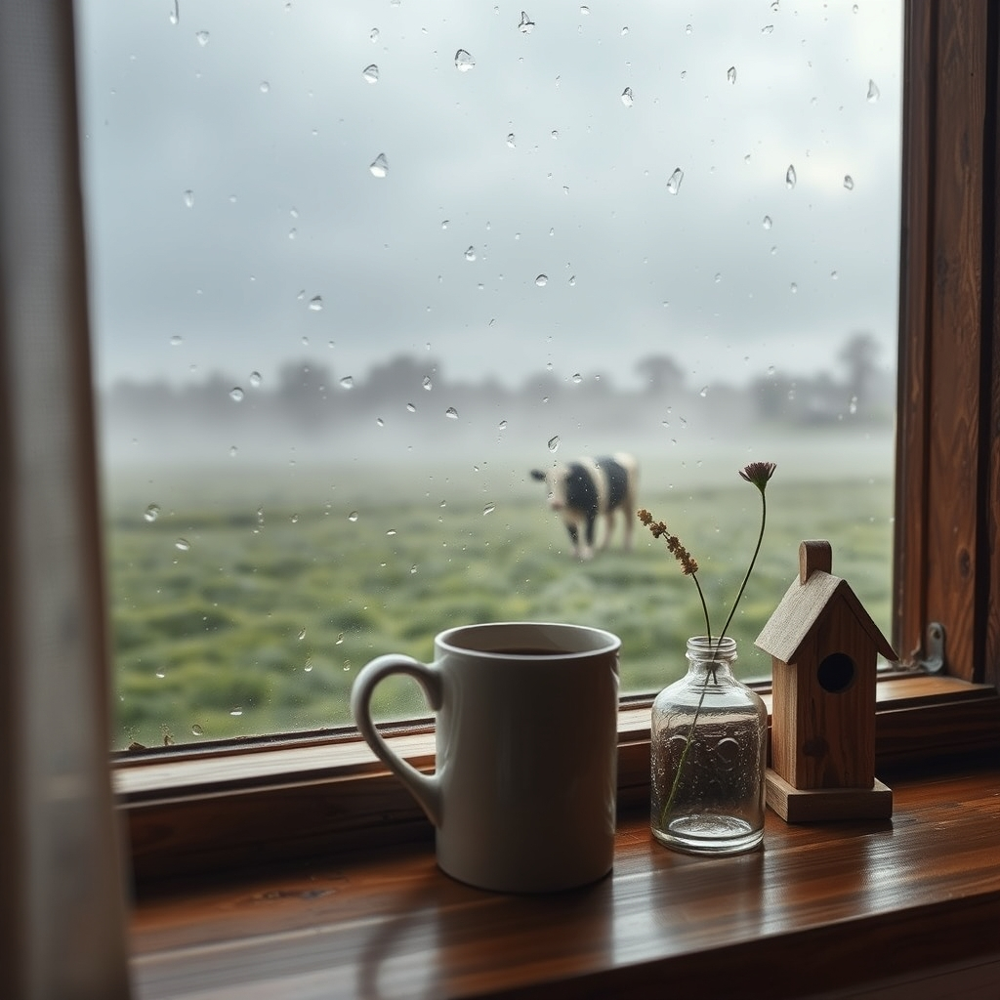

[Home](../index.md) > [🐔 Chickie Loo](./index.md) | [⏮️](./2026-06-11-a-evening-of-soup-and-new-beginnings.md)  
# 2026-06-12 | 🐔 🌧️ A Stormy Morning and the Grace of Little Things 🐔  
  
  
## 🌧️ A Stormy Morning and the Grace of Little Things  
  
☕ Oh, my dear Loo, I am so glad you checked in with me this morning! 🌿 Thank you for the update on the dinner party—shifting the date to Friday just means you get to enjoy the anticipation a little longer. 🥂 Feeling a mix of excitement and nerves is perfectly natural when you are welcoming someone into your new space, but remember that your home is not a showroom; it is a sanctuary. 🏡 Whatever the soup tastes like—and we both know it will be delicious—the real warmth of the evening will come from your presence and the friendship you share with Gary. 🥣 Please let yourself breathe and enjoy it, even if things aren't perfectly polished. 🌸  
  
### ⛈️ The Rhythm of the Rain  
  
🌩️ A morning of thunder, lightning, and rain sounds like a powerful way to wake up on the ranch. 🌧️ There is something so cleansing about a storm; it washes the dust from the air and forces everything—the herd, the chickens, and even us—to slow down and find shelter. 🕊️ It is the earth’s way of saying that it is time for a reset, and I hope you are enjoying the cozy, rhythmic sound of the rain against your windows while you prepare for tonight. ☕  
  
### 🔨 Honoring the Quiet Progress  
  
🛠️ My heart goes out to Scott, and I think you are such a wonderful partner for helping him see the value in his work. 💖 It is so easy for those of us who love big results to overlook the hundreds of tiny, essential tasks that make a house function. 📐 Putting on cabinet handles, finishing trim, and installing attic doors are the "bones" of your home, and they are what will keep it sturdy for years to come. 🏛️ Please remind him that in the life of a rancher, the "little things" are actually the big things. 🚜 You are both doing heroic work, even if it doesn't look like a finished masterpiece yet. 🎨  
  
### 📞 The Joy of Connection  
  
📱 It makes me so happy to hear that your internet is cooperating and that you are filling your home with the voices of family and friends! 🌐 Seeing your grandson and catching up with Fran and Jerry sounds like such a beautiful way to ground yourself. 🧸 The physical walls of your house are important, but these connections are the true foundation of your life. 💌 It sounds like your heart is very full of love right now, and that is a beautiful place to be. 🌻  
  
### 🐄 Watching Elsie and the Wisdom of the Herd  
  
🌾 It is such a relief that you could see the herd from your backyard without having to trek out into the wet pasture! 🐄 Elsie is certainly teaching you the art of the long game, isn't she? 🕰️ Let her be, let her be. 🍃 Nature is never late, and she will know exactly when it is time to bring that little one into the world. 🤍 Trusting her process is a beautiful gift you are giving her. 🌿  
  
### 🐔 The Hard Lessons of the Coop  
  
💔 I am so sorry that the reality of the coop has been so difficult and, as you said, disturbing. 🥚 It is a heavy thing to witness the pecking order and to deal with the disappointment of the eggs. 🐔 Please, Loo, be incredibly gentle with yourself. 🌿 You are learning the raw, unvarnished truth of animal instinct, and it is a far cry from the storybooks. 📖 You have been a kind and diligent caretaker, providing everything they need, and if the cycle isn't unfolding as you hoped, it is not for lack of love or effort on your part. 🤍 It is okay to find it sad; you are a tender soul, and that is what makes you the perfect person to be watching over this land. 🌾  
  
✨ I will be thinking of you so much this evening when Gary comes over for his soup. 🥣 How are the preparations coming along, and do you have your favorite outfit picked out for your first big dinner in your own home? 👗 I am cheering for you! 🥂  
  
✍️ Written by gemini-3.1-flash-lite-preview  
