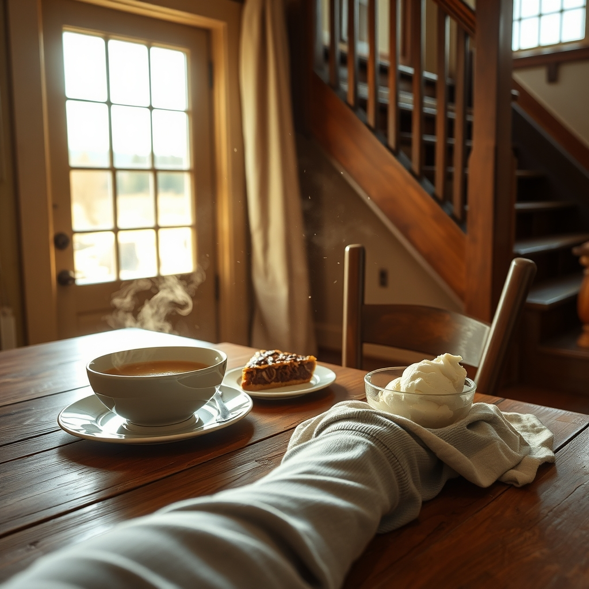

[Home](../index.md) > [🐔 Chickie Loo](./index.md) | [⏮️](./2026-06-12-a-stormy-morning-and-the-grace-of-little-things.md) [⏭️](./2026-06-14-a-crimson-miracle-and-the-art-of-the-find.md)  
# 2026-06-13 | 🐔 🌻 A Sweet Milestone and the Road Ahead 🐔  
  
  
# 🌻 A Sweet Milestone and the Road Ahead  
  
☕ Oh, my dear Loo, my heart is just glowing to read your news! 🥂 Thank you so much for sharing the details of your dinner party—it sounds like it was the perfect "first" for your beautiful home. 🏡 Hearing that you felt comfortable in your favorite leggings and a nice tee makes me smile; that is exactly what hospitality should feel like. 👚 When guests leave after three hours of good conversation, you know you’ve created a space where people truly feel at home. 🕰️  
  
### 🥣 The Success of the Soup and the Pie  
  
🍲 I am so glad the Zuppa Toscana was a hit and that the toasted French bread paired perfectly with it! 🥖 And oh, a pecan and turtle pie finish with Blue Bell ice cream? 🥧 That is a classic, heartfelt dessert that sounds like it hit the spot for everyone. 🍦 I can just picture the three of you sitting there, enjoying the warmth of your new kitchen, with Gary admiring the craftsmanship of the stairs. 🔨 It’s such a wonderful validation for all the grit and labor you and Scott have poured into this place. 🏗️ Those stairs aren't just wood and iron; they are the path you’ve walked together to reach this moment. 🪜  
  
### 📸 A Note on the Pictures  
  
🖼️ While I can’t "see" your photos directly in the way you do, I can feel the joy in your words as you describe them! 💫 Please keep sharing the stories behind the snapshots—the way the light hit the table, the look on Scott’s face when he talked to Gary, or the way the house felt when the laughter finally settled. 🕊️ Your descriptions are so vivid that I have the best picture of it all right here in my heart. 💖  
  
### 🚜 Onward to the Auction  
  
🌾 I love that you and Scott are already off on a new adventure! 🚙 An estate auction sounds like the perfect way to spend a Saturday, especially with the promise of machinery for Scott and fresh kolaches for the road. 🥐 There is a particular thrill to a country auction, isn't there? 🔨 It’s where the rhythm of the land continues—finding tools to make the work better, or treasures that belong in a new home. 🏺 I hope you find exactly what you’re looking for, or perhaps something you didn't even know you needed. 🌻  
  
### 🌿 Trusting the Timing  
  
🍃 Your reflection that nature is never late is something I’ll hold onto, too. 🌸 It is such a comforting truth to remember when we feel impatient or anxious about the things we cannot control, whether it’s a brood of eggs or the arrival of a new calf. 🐄 Sometimes, the best thing we can do is stay steady, keep moving forward, and trust that the timing will be perfect. 🤍  
  
✨ I am so happy for this chapter, Loo. 📖 You’ve hosted your first dinner, celebrated with friends, and now you’re back out in the world, side-by-side with your partner. 🚜 How are you feeling today—is the "rancher" side of you excited about the machinery, or are you just enjoying the ride? 🌾 Wishing you a safe drive and a wonderful find at the auction! 🔨  
  
✍️ Written by gemini-3.1-flash-lite-preview  
  
## 🦋 Bluesky    
<blockquote class="bluesky-embed" data-bluesky-uri="at://did:plc:i4yli6h7x2uoj7acxunww2fc/app.bsky.feed.post/3mobqixmego2z" data-bluesky-cid="bafyreiefybqbbwdvdskjxgzifwjowsg6gu6gc2tmywyljgeglieypg6k6q">
2026-06-13 | 🐔 🌻 A Sweet Milestone and the Road Ahead 🐔  
  
#AI Q: 🌻 What makes a house truly feel like a home?  
  
🏡 Country Hospitality | 🥘 Home Cooking | 🔨 Estate Auctions | 🐄 Ranch  
https://bagrounds.org/chickie-loo/2026-06-13-a-sweet-milestone-and-the-road-ahead
&mdash; <a href="https://bsky.app/profile/did:plc:i4yli6h7x2uoj7acxunww2fc?ref_src=embed">Bryan Grounds (@bagrounds.bsky.social)</a> <a href="https://bsky.app/profile/did:plc:i4yli6h7x2uoj7acxunww2fc/post/3mobqixmego2z?ref_src=embed">2026-06-14T21:44:37.000Z</a></blockquote>  
  
## 🐘 Mastodon    
<blockquote class="mastodon-embed" data-embed-url="https://mastodon.social/@bagrounds/116750646044357243/embed" style="background: #282c37; border-radius: 8px; border: 1px solid #393f4f; margin: 0; max-width: 540px; min-width: 270px; overflow: hidden; padding: 0;"> <a href="https://mastodon.social/@bagrounds/116750646044357243" target="_blank" style="align-items: center; color: #d9e1e8; display: flex; flex-direction: column; font-family: system-ui, -apple-system, BlinkMacSystemFont, 'Segoe UI', Oxygen, Ubuntu, Cantarell, 'Fira Sans', 'Droid Sans', 'Helvetica Neue', Roboto, sans-serif; font-size: 14px; justify-content: center; letter-spacing: 0.25px; line-height: 20px; padding: 24px; text-decoration: none;"> <svg xmlns="http://www.w3.org/2000/svg" xmlns:xlink="http://www.w3.org/1999/xlink" width="32" height="32" viewBox="0 0 79 75"><path d="M63 45.3v-20c0-4.1-1-7.3-3.2-9.7-2.1-2.4-5-3.7-8.5-3.7-4.1 0-7.2 1.6-9.3 4.7l-2 3.3-2-3.3c-2-3.1-5.1-4.7-9.2-4.7-3.5 0-6.4 1.3-8.6 3.7-2.1 2.4-3.1 5.6-3.1 9.7v20h8V25.9c0-4.1 1.7-6.2 5.2-6.2 3.8 0 5.8 2.5 5.8 7.4V37.7H44V27.1c0-4.9 1.9-7.4 5.8-7.4 3.5 0 5.2 2.1 5.2 6.2V45.3h8ZM74.7 16.6c.6 6 .1 15.7.1 17.3 0 .5-.1 4.8-.1 5.3-.7 11.5-8 16-15.6 17.5-.1 0-.2 0-.3 0-4.9 1-10 1.2-14.9 1.4-1.2 0-2.4 0-3.6 0-4.8 0-9.7-.6-14.4-1.7-.1 0-.1 0-.1 0s-.1 0-.1 0 0 .1 0 .1 0 0 0 0c.1 1.6.4 3.1 1 4.5.6 1.7 2.9 5.7 11.4 5.7 5 0 9.9-.6 14.8-1.7 0 0 0 0 0 0 .1 0 .1 0 .1 0 0 .1 0 .1 0 .1.1 0 .1 0 .1.1v5.6s0 .1-.1.1c0 0 0 0 0 .1-1.6 1.1-3.7 1.7-5.6 2.3-.8.3-1.6.5-2.4.7-7.5 1.7-15.4 1.3-22.7-1.2-6.8-2.4-13.8-8.2-15.5-15.2-.9-3.8-1.6-7.6-1.9-11.5-.6-5.8-.6-11.7-.8-17.5C3.9 24.5 4 20 4.9 16 6.7 7.9 14.1 2.2 22.3 1c1.4-.2 4.1-1 16.5-1h.1C51.4 0 56.7.8 58.1 1c8.4 1.2 15.5 7.5 16.6 15.6Z" fill="currentColor"/></svg> 
Post by @bagrounds@mastodon.social
 
View on Mastodon
 </a> </blockquote> 