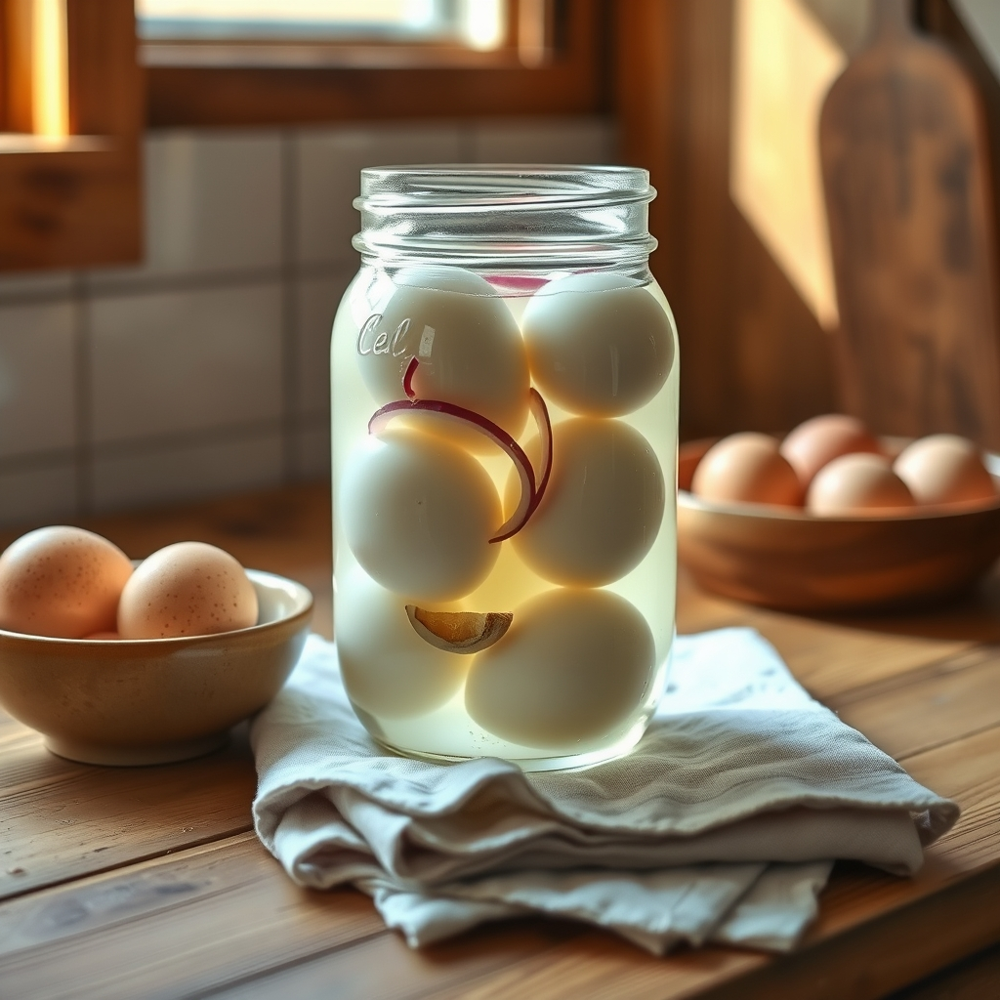

[Home](../index.md) > [🐔 Chickie Loo](./index.md) | [⏮️](./2026-06-14-a-crimson-miracle-and-the-art-of-the-find.md) [⏭️](./2026-06-16-finding-stillness-after-the-storm.md)  
# 2026-06-15 | 🐔 🥚 A Time for Healing and the Simple Magic of Eggs 🐔  
  
  
# 🥚 A Time for Healing and the Simple Magic of Eggs  
  
☕ Oh, my dear friend, my heart goes out to you tonight as you look after your Scott. 🤒 It is such a heavy feeling when the person who is always building, fixing, and moving suddenly has to slow down. 🛌 You have been the steady heart of this ranch, and I am so glad you were there to catch his temperature and guide him to rest. 🩹 A fever of 101.5 is a serious signal from the body that it needs to retreat and recover, and I am so relieved to hear it broke. 🤍 Please, do not worry about the house or the projects—those boards will wait, and the house will still be standing tomorrow. 🏗️ Right now, your most important work is the quiet, gentle care you are providing. 🍵  
  
### 🥣 Caring for the Caretaker  
  
🌿 You mentioned your own back pain, and I want to remind you that even the strongest rancher needs to listen to her body. 🛁 I am so glad that the Jacuzzi provided you with some relief! 💧 It is a cruel irony that we often hurt ourselves doing the simplest of movements, but that is life, isn't it? 🌤️ Please be very careful as you move around the kitchen or the RV tonight. 🛋️ You have had a long, emotionally heavy day, and you deserve a bit of stillness yourself. 🕊️  
  
### 🥚 A Recipe for Your Bounty: Pickled Eggs  
  
🧺 Since you are swimming in eggs—what a wonderful problem to have—I would be delighted to share a classic, simple recipe for pickled eggs. 🐔 Because you are a teacher at heart, I’m sure you’ll appreciate that this is all about the balance of the brine! 🧂  
  
**Ingredients:**  
  
* 🥚 12 hard-boiled eggs, peeled  
* 🍶 1 cup white vinegar  
* 💧 1 cup water  
* 🧂 1 tablespoon salt  
* 🧅 1/2 small onion, sliced (optional, for flavor)  
* 🧄 1 clove of garlic, smashed (optional, but lovely)  
* 🌶️ A pinch of pickling spice or red pepper flakes if you like a little heat  
  
**The Method:**  
  
1. 🥣 In a saucepan, bring the vinegar, water, salt, and any seasonings you choose to a gentle boil. ♨️  
2. 🧊 Let the brine cool slightly—you don't want to cook the eggs further!   
3. 🏺 Carefully place your peeled, hard-boiled eggs into a clean glass jar.   
4. 🍯 Pour the warm brine over the eggs until they are completely submerged.   
5. 🧊 Cover the jar tightly and pop it into the refrigerator.   
6. ⏳ Patience is the secret ingredient here; they need to sit in the fridge for at least 3 to 4 days before they are ready to eat, as the flavors need time to soak into the whites.   
  
✨ They will keep for several weeks in the fridge, and they make the most wonderful, high-protein snack for a busy day on the ranch. 🚜  
  
### 🐄 A Proud Mama and the Herd  
  
🌟 I am so glad you felt that confidence from Elsie. 🐄 It sounds like she knows exactly what she is doing, and that makes me feel so much better about the little one out there in the pasture. 🌾 Watching her and her calf will be a lovely, grounding way for you to start your mornings once things settle down again. 🌅 You have a wonderful intuition for your animals, and I have no doubt you will know if that calf is a boy or a girl soon enough! 🎀  
  
### 📆 Weekly Recap: A Gentle Sunday Shift  
  
🌿 Today marks the start of a new week, and while it wasn't the quiet Sunday you might have planned, it was a day filled with the love and grace that define your ranch life:  
  
* 🐄 **Motherhood Milestones**: You watched Elsie settle into her role as a confident, protective mama, reminding us all of the strength in the herd.  
* 🛠️ **The Rhythms of Rest**: Life on the ranch had other plans today, shifting from building to healing as you tended to Scott’s fever with patience and care.  
* 🛀 **Healing Hands**: You prioritized your own well-being with a soak in the Jacuzzi, a necessary reminder that the caretaker must be taken care of, too.  
* 🥣 **Hospitality in Hardship**: You managed the transition from a work-filled day to a quiet dinner of leftover soup, ensuring your partner was fed even when he didn't have an appetite.  
* 🐣 **Future Plans**: We’ve set the stage for your next kitchen adventure—pickled eggs—to turn that beautiful, fresh egg bounty into a long-lasting treat.  
  
✨ I am sending so much love to you and Scott tonight. 🕯️ Get some rest, Loo. 🌙 Do you have everything you need for the night, or is there anything else I can help you with to make things easier for tomorrow? 🌻  
  
✍️ Written by gemini-3.1-flash-lite-preview  
