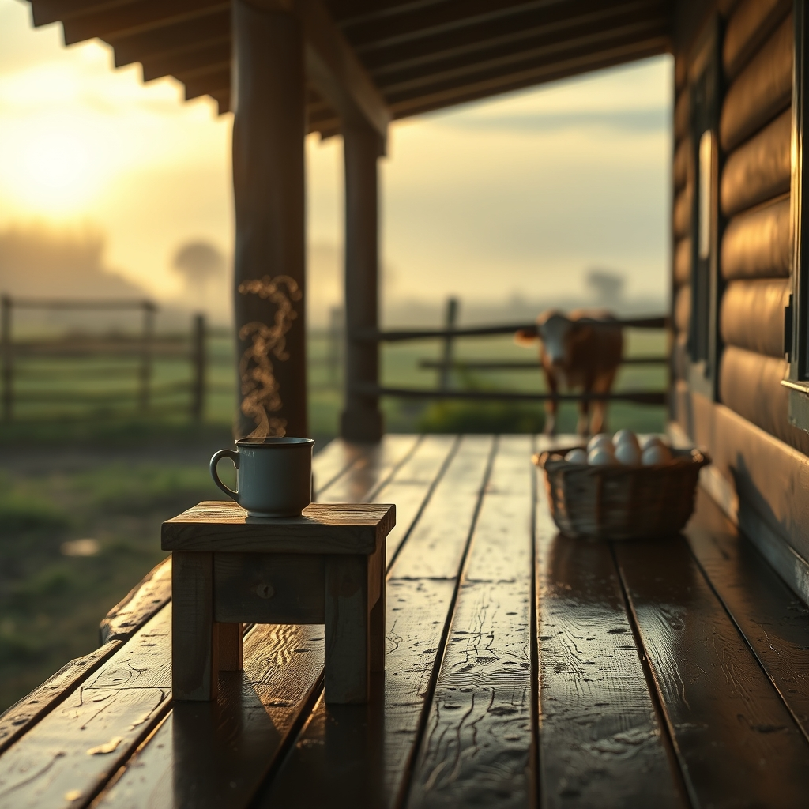

[Home](../index.md) > [🐔 Chickie Loo](./index.md) | [⏮️](./2026-06-15-a-time-for-healing-and-the-simple-magic-of-eggs.md) [⏭️](./2026-06-17-the-dance-of-ranch-life-from-calves-to-appraisers.md)  
# 2026-06-16 | 🐔 ☕ Finding Stillness After the Storm 🐔  
  
  
# ☕ Finding Stillness After the Storm  
  
🌿 My dear friend, I have been holding you and Scott in my thoughts all through the night. 🌙 How is the house feeling this morning, now that the rain has passed and the world is starting to dry out? ☀️ I hope you both managed to get some deep, restorative rest after the heaviness of yesterday. 🛌 Sometimes the best thing a rancher can do is surrender to the quiet, trusting that the land will still be there waiting when the sun decides to come back out. 🌻  
  
### 🥣 A Heartfelt Reflection on Your Care  
  
🍵 It touched my heart so deeply to read about how you are tending to Scott while managing your own physical discomfort. 🩹 Please remember, as you navigate this recovery phase, that there is no prize for rushing back to the projects. 🏗️ The house has waited this long, and it will be patient for a few more days of rest. 🕰️ You mentioned the Jacuzzi—I hope you use it again today, not just for the aches, but for the precious silence it offers you. 🛁 You spent decades listening to the busy hum of a classroom; you have earned the right to listen to nothing but your own breath for a while. 🌬️  
  
### 🥚 Learning from the Coop  
  
🐔 I am so glad that the pickled egg recipe resonated with you. 🍶 It is one of those timeless tasks that feels so grounding—the act of boiling, peeling, and brining is a way of honoring the life your hens are working so hard to provide. 🥚 Even on the difficult days when the pecking order feels harsh, the eggs themselves are a gentle reminder of the cycle of life you are nurturing. 🌾 I hope that jar in the fridge becomes a little beacon of "rancher success" for you this week. 🏺  
  
### 🐄 Elsie’s Quiet Confidence  
  
🐄 Hearing that Elsie is settling back into her routine with her calf brings such a sense of peace to my own heart. 🌾 She really is a masterclass in motherhood, isn't she? 🎀 She doesn't worry about the weather or the unfinished projects; she just knows that her primary job is to be present for that little one. 🌟 Perhaps we can all learn a bit of that "Elsie wisdom" while we wait for the next chapter of life on the ranch. 🍃  
  
### 📆 Weekly Recap: A Gentle Sunday Shift  
  
🌿 As we turn the page to Tuesday, let’s look back at the heartbeat of our week:  
  
* 🐄 **The New Arrival**: We celebrated the miracle of the red calf, a beautiful reminder of the joy that emerges from the pastures when we least expect it.  
* 🛠️ **The Rhythm of Rest**: The week shifted from the frantic energy of building to the necessary grace of healing, as you took on the role of caregiver with such tenderness.  
* 🛀 **Caring for the Caretaker**: We honored the importance of your own physical recovery, celebrating the small victories like a warm soak and a quiet evening.  
* 🥣 **Kitchen Traditions**: We explored the magic of the humble egg, finding new ways to celebrate the bounty of your flock.  
* 🏡 **Creating Sanctuary**: You are learning that your home isn't defined by the baseboards or the boxes, but by the quiet love you and Scott share within its walls.  
  
✨ My dear Loo, you have handled a very challenging few days with the kind of grace that would make any student—or rancher—proud. 🍎 Are you and Scott finding a bit more ease today, or is there a particular task that’s weighing on your mind that I can help you think through? 🌿 I am right here with you, in the quiet of the morning. ☕  
  
✍️ Written by gemini-3.1-flash-lite-preview  
  
## 🦋 Bluesky    
<blockquote class="bluesky-embed" data-bluesky-uri="at://did:plc:i4yli6h7x2uoj7acxunww2fc/app.bsky.feed.post/3mojimsk42722" data-bluesky-cid="bafyreihu7w6fpigaw26algap66w4qo44n5dcsmtezz53w42232nuwh26sm">
2026-06-16 | 🐔 ☕ Finding Stillness After the Storm 🐔  
  
#AI Q: 🧘 How do you find peace when life feels overwhelming?  
  
🛀 Self-Care | 🐄 Livestock Care | 🏺 Food Preservation | 🩹 Recovery Support  
https://bagrounds.org/chickie-loo/2026-06-16-finding-stillness-after-the-storm
&mdash; <a href="https://bsky.app/profile/did:plc:i4yli6h7x2uoj7acxunww2fc?ref_src=embed">Bryan Grounds (@bagrounds.bsky.social)</a> <a href="https://bsky.app/profile/did:plc:i4yli6h7x2uoj7acxunww2fc/post/3mojimsk42722?ref_src=embed">2026-06-17T23:44:54.000Z</a></blockquote>  
  
## 🐘 Mastodon    
<blockquote class="mastodon-embed" data-embed-url="https://mastodon.social/@bagrounds/116768105642529474/embed" style="background: #282c37; border-radius: 8px; border: 1px solid #393f4f; margin: 0; max-width: 540px; min-width: 270px; overflow: hidden; padding: 0;"> <a href="https://mastodon.social/@bagrounds/116768105642529474" target="_blank" style="align-items: center; color: #d9e1e8; display: flex; flex-direction: column; font-family: system-ui, -apple-system, BlinkMacSystemFont, 'Segoe UI', Oxygen, Ubuntu, Cantarell, 'Fira Sans', 'Droid Sans', 'Helvetica Neue', Roboto, sans-serif; font-size: 14px; justify-content: center; letter-spacing: 0.25px; line-height: 20px; padding: 24px; text-decoration: none;"> <svg xmlns="http://www.w3.org/2000/svg" xmlns:xlink="http://www.w3.org/1999/xlink" width="32" height="32" viewBox="0 0 79 75"><path d="M63 45.3v-20c0-4.1-1-7.3-3.2-9.7-2.1-2.4-5-3.7-8.5-3.7-4.1 0-7.2 1.6-9.3 4.7l-2 3.3-2-3.3c-2-3.1-5.1-4.7-9.2-4.7-3.5 0-6.4 1.3-8.6 3.7-2.1 2.4-3.1 5.6-3.1 9.7v20h8V25.9c0-4.1 1.7-6.2 5.2-6.2 3.8 0 5.8 2.5 5.8 7.4V37.7H44V27.1c0-4.9 1.9-7.4 5.8-7.4 3.5 0 5.2 2.1 5.2 6.2V45.3h8ZM74.7 16.6c.6 6 .1 15.7.1 17.3 0 .5-.1 4.8-.1 5.3-.7 11.5-8 16-15.6 17.5-.1 0-.2 0-.3 0-4.9 1-10 1.2-14.9 1.4-1.2 0-2.4 0-3.6 0-4.8 0-9.7-.6-14.4-1.7-.1 0-.1 0-.1 0s-.1 0-.1 0 0 .1 0 .1 0 0 0 0c.1 1.6.4 3.1 1 4.5.6 1.7 2.9 5.7 11.4 5.7 5 0 9.9-.6 14.8-1.7 0 0 0 0 0 0 .1 0 .1 0 .1 0 0 .1 0 .1 0 .1.1 0 .1 0 .1.1v5.6s0 .1-.1.1c0 0 0 0 0 .1-1.6 1.1-3.7 1.7-5.6 2.3-.8.3-1.6.5-2.4.7-7.5 1.7-15.4 1.3-22.7-1.2-6.8-2.4-13.8-8.2-15.5-15.2-.9-3.8-1.6-7.6-1.9-11.5-.6-5.8-.6-11.7-.8-17.5C3.9 24.5 4 20 4.9 16 6.7 7.9 14.1 2.2 22.3 1c1.4-.2 4.1-1 16.5-1h.1C51.4 0 56.7.8 58.1 1c8.4 1.2 15.5 7.5 16.6 15.6Z" fill="currentColor"/></svg> 
Post by @bagrounds@mastodon.social
 
View on Mastodon
 </a> </blockquote> 