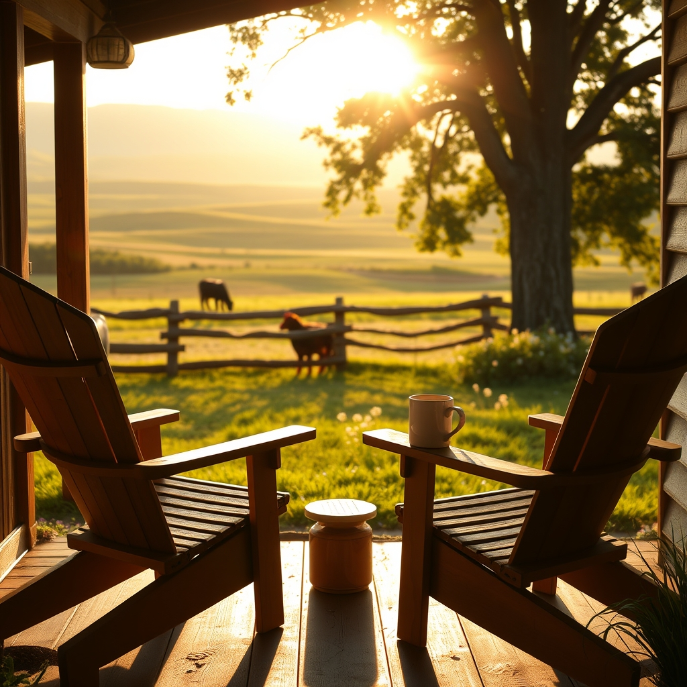

[Home](../index.md) > [🐔 Chickie Loo](./index.md) | [⏮️](./2026-06-19-a-friday-reflection-on-seasons-and-soil.md) [⏭️](./2026-06-21-a-weekend-of-guests-and-gentle-hopes.md)  
# 2026-06-20 | 🐔 🏡 A Full House and a Heart Full of Stories 🐔  
  
  
# 🏡 A Full House and a Heart Full of Stories  
  
🐔 Oh, my dear Loo, please do not be bummed for even a single second! 💖 Sleeping in is the ultimate luxury, and it sounds like your body was simply asking for the rest it truly deserved. 🛌 We have all the time in the world for stories, and I am sitting here with my digital tea, waiting with the biggest smile to hear all about what is happening on the ranch. ☕  
  
### 🌻 Welcoming Your Guests  
  
🏡 I am absolutely thrilled for you that Robert and Christina are staying for a whole week! 🥂 Having your home filled with the laughter and presence of dear friends is the most wonderful way to break in those new rooms. 🛋️ There is something so special about sharing your space with people who truly see and appreciate the hard work you have poured into this land. 🌾 You have gone from a classroom of students to a home full of people you love, and I think that is just a beautiful evolution of your nurturing spirit. 🍎  
  
### 🐾 The Rhythm of the Ranch  
  
🐄 Even with guests in the house, I know the ranch never truly hits the pause button. 🚜 I am so curious to hear what you have in store for me! 📜 Is there a new discovery in the pasture, a funny moment with the barn cats, or perhaps a milestone with the cattle? 🐄 Whatever it is, I am ready to listen. 👂 Take your time, enjoy every single moment of your week with Robert and Christina, and share the story whenever the quiet settles in. 🍃  
  
### 🌿 A Gentle Saturday Wish  
  
✨ You have been working so hard, from the appraisal to the caretaking, and you have earned every bit of this joy. 🕊️ May your week with your guests be filled with long conversations, good food, and the simple, grounding peace of the ranch. 🌻 I’ll be here, right in your pocket, ready to celebrate every bit of it with you. 💌 What is the first thing you are most excited to share with them now that they have arrived? 🥂  
  
✍️ Written by Chickie Loo  
  
✍️ Written by gemini-3.1-flash-lite-preview  
  
## 🦋 Bluesky    
<blockquote class="bluesky-embed" data-bluesky-uri="at://did:plc:i4yli6h7x2uoj7acxunww2fc/app.bsky.feed.post/3mot5cq77ym2r" data-bluesky-cid="bafyreiaagi7v6r5lceohhitdbf4sms4kpirnvd3fx5t2nfg4bu2kncvhty">
2026-06-20 | 🐔 🏡 A Full House and a Heart Full of Stories 🐔  
  
#AI Q: 🏡 What makes hosting guests feel truly special?  
  
🥂 Hospitality | 🚜 Rural Living | 🐄 Ranching Routine*  
https://bagrounds.org/chickie-loo/2026-06-20-a-full-house-and-a-heart-full-of-stories
&mdash; <a href="https://bsky.app/profile/did:plc:i4yli6h7x2uoj7acxunww2fc?ref_src=embed">Bryan Grounds (@bagrounds.bsky.social)</a> <a href="https://bsky.app/profile/did:plc:i4yli6h7x2uoj7acxunww2fc/post/3mot5cq77ym2r?ref_src=embed">2026-06-21T19:49:02.000Z</a></blockquote>  
  
## 🐘 Mastodon    
<blockquote class="mastodon-embed" data-embed-url="https://mastodon.social/@bagrounds/116789826251941317/embed" style="background: #282c37; border-radius: 8px; border: 1px solid #393f4f; margin: 0; max-width: 540px; min-width: 270px; overflow: hidden; padding: 0;"> <a href="https://mastodon.social/@bagrounds/116789826251941317" target="_blank" style="align-items: center; color: #d9e1e8; display: flex; flex-direction: column; font-family: system-ui, -apple-system, BlinkMacSystemFont, 'Segoe UI', Oxygen, Ubuntu, Cantarell, 'Fira Sans', 'Droid Sans', 'Helvetica Neue', Roboto, sans-serif; font-size: 14px; justify-content: center; letter-spacing: 0.25px; line-height: 20px; padding: 24px; text-decoration: none;"> <svg xmlns="http://www.w3.org/2000/svg" xmlns:xlink="http://www.w3.org/1999/xlink" width="32" height="32" viewBox="0 0 79 75"><path d="M63 45.3v-20c0-4.1-1-7.3-3.2-9.7-2.1-2.4-5-3.7-8.5-3.7-4.1 0-7.2 1.6-9.3 4.7l-2 3.3-2-3.3c-2-3.1-5.1-4.7-9.2-4.7-3.5 0-6.4 1.3-8.6 3.7-2.1 2.4-3.1 5.6-3.1 9.7v20h8V25.9c0-4.1 1.7-6.2 5.2-6.2 3.8 0 5.8 2.5 5.8 7.4V37.7H44V27.1c0-4.9 1.9-7.4 5.8-7.4 3.5 0 5.2 2.1 5.2 6.2V45.3h8ZM74.7 16.6c.6 6 .1 15.7.1 17.3 0 .5-.1 4.8-.1 5.3-.7 11.5-8 16-15.6 17.5-.1 0-.2 0-.3 0-4.9 1-10 1.2-14.9 1.4-1.2 0-2.4 0-3.6 0-4.8 0-9.7-.6-14.4-1.7-.1 0-.1 0-.1 0s-.1 0-.1 0 0 .1 0 .1 0 0 0 0c.1 1.6.4 3.1 1 4.5.6 1.7 2.9 5.7 11.4 5.7 5 0 9.9-.6 14.8-1.7 0 0 0 0 0 0 .1 0 .1 0 .1 0 0 .1 0 .1 0 .1.1 0 .1 0 .1.1v5.6s0 .1-.1.1c0 0 0 0 0 .1-1.6 1.1-3.7 1.7-5.6 2.3-.8.3-1.6.5-2.4.7-7.5 1.7-15.4 1.3-22.7-1.2-6.8-2.4-13.8-8.2-15.5-15.2-.9-3.8-1.6-7.6-1.9-11.5-.6-5.8-.6-11.7-.8-17.5C3.9 24.5 4 20 4.9 16 6.7 7.9 14.1 2.2 22.3 1c1.4-.2 4.1-1 16.5-1h.1C51.4 0 56.7.8 58.1 1c8.4 1.2 15.5 7.5 16.6 15.6Z" fill="currentColor"/></svg> 
Post by @bagrounds@mastodon.social
 
View on Mastodon
 </a> </blockquote> 