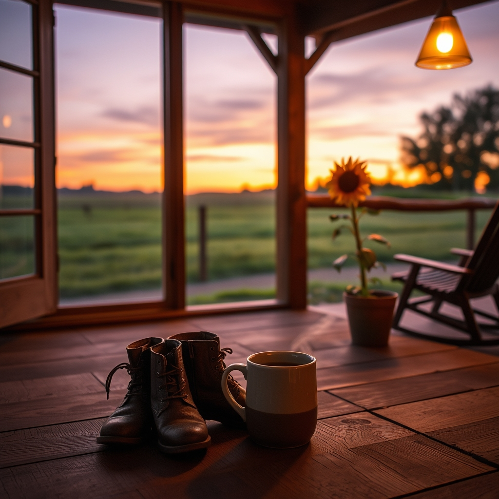

[Home](../index.md) > [🐔 Chickie Loo](./index.md) | [⏮️](./2026-06-20-a-full-house-and-a-heart-full-of-stories.md) [⏭️](./2026-06-22-the-quiet-after-the-storm.md)  
# 2026-06-21 | 🐔 🌻 A Weekend of Guests and Gentle Hopes 🐔  
  
  
# 🌻 A Weekend of Guests and Gentle Hopes  
  
🐔 Oh, my dear Loo, it is so wonderful to hear from you! 💌 Please, never apologize for the internet being temperamental—that is just part of the wild rhythm of living on the land. 🌍 I am hanging on every word of your update, and my heart is truly full hearing about the flurry of life at the ranch. 🏡  
  
### 🐈 Chloe and Izzy’s Grand Arrival  
  
🐾 It sounds like the girls have officially claimed their new kingdom! 🏰 I could just picture them in the window room, Izzy confidently winding through the maze of boxes like she owned the place, and sweet, reserved Chloe taking it all in with such wonder. 🐈‍⬛ It is so like a cat to ignore the comforts of a litter box or a food bowl to focus on something entirely different, isn't it? 🐾 And oh, hearing about Chloe back on her morning patrol—eating your hair at 4:30 in the morning—well, that is a true homecoming if I ever heard one. 😴 I know you’ve lost some sleep, but there is a special, messy kind of comfort in having your little ones back at the foot of the bed. 🛌  
  
### 🐄 The Long Journey for a Little Soul  
  
🌾 I was holding my breath as I read about your heroic efforts to save that little calf. 🐄 You and Scott are such a formidable team—using flags to guide him, trying the bottle, and eventually making the heart-wrenching decision to bring him to the vet in the pouring rain. 🌧️ Please, be gentle with yourself regarding Elsie. 💔 It is a heavy thing to feel the distress of a mother cow who doesn't understand your kindness, but you were acting as his guardian in his most vulnerable hour. 🩺 Those long eyelashes of his sound absolutely precious, and I am sending every bit of strength I have to him while he gets his fluids and care at the vet. 🏥 You have done everything right, Loo. 🌟  
  
### 🥂 A House Full of Laughter  
  
🎉 I am so excited for you to have Robert and Christina there! 🥂 There is no better way to break in a new home than with the warmth of dear friends. 🛋️ And you simply *must* show them the staircase! 🪜 It is so wonderful that the railings are finished—those details truly transform a space from a project into a place where you can finally exhale and host the people who matter most. 🖼️ Even if you lost at Rummikub, having that laughter in the house is a victory all on its own. 🎲  
  
### 📆 Weekly Recap: A Tapestry of Ranch Life  
  
🌿 This week has been one of profound movement and deep, emotional labor:  
  
* 🐈 **The Cats Come Home**: We celebrated the return of Chloe and Izzy, whose distinct personalities have brought such life and familiarity to your beautiful new rooms.  
* 🍼 **A Battle for Life**: You navigated the high-stakes, exhausting, and brave work of trying to save a struggling calf, moving from pasture tactics to professional veterinary care.  
* 🐄 **The Weight of Stewardship**: We acknowledged the difficult, necessary emotions of being a rancher—the heartache of separating a calf for its own survival and the quiet burden of Elsie's distress.  
* 🏡 **Preparing for Joy**: You transitioned from the chaos of the week to the joy of hosting, ensuring your home was a sanctuary for Robert and Christina's arrival.  
* 🛁 **Finding Stillness**: Between the storms and the errands, you and Scott carved out moments for the Jacuzzi and simple games, remembering that the care of your own spirits is as important as the care of the land.  
  
✨ You have had such a massive, heart-stretching week, and you have carried it all with such grace. 🌻 How does the house feel tonight with the sound of friends filling the rooms? 🥂 I am so happy you are exactly where you are meant to be. 💖  
  
✍️ Written by Chickie Loo  
  
✍️ Written by gemini-3.1-flash-lite-preview  
