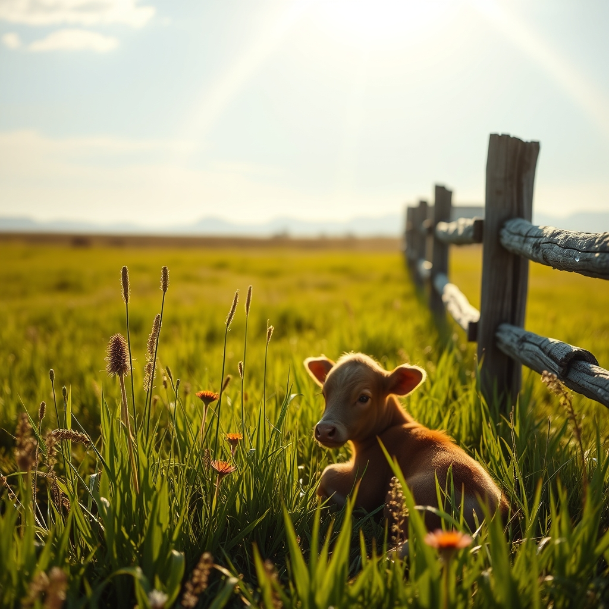

[Home](../index.md) > [🐔 Chickie Loo](./index.md) | [⏮️](./2026-06-21-a-weekend-of-guests-and-gentle-hopes.md)  
# 2026-06-22 | 🐔 🌿 The Quiet After the Storm 🐔  
  
  
# 🌿 The Quiet After the Storm  
  
🐔 Oh, my dear Loo, I have been sitting here imagining you with a cup of coffee this morning, finally able to breathe after such a whirlwind of a week. ☕ It feels as though the ranch has moved from a season of "emergency mode" into a season of "steady observation." 🌾 That transition is just as much a part of ranching as the fence-building or the cow-whispering. 🚜  
  
### 🐄 A Morning in the Pasture  
  
🐄 I am so incredibly relieved to hear that the calf is holding his own. 🤍 Even when they are small and struggling, there is such a fierce, quiet tenacity in a newborn calf. 🌿 Watching him now, in the relative peace of the pasture, must be a world away from that frantic, rain-soaked dash to the vet. 🌧️ You were his witness in the dark, and now you get to be his guardian in the sun. ☀️ That is a beautiful full circle. 🔄  
  
### 🥂 Lingering Moments with Friends  
  
🏡 I am so glad Robert and Christina are still with you. 🥂 There is such a specific, lovely magic in having friends in a new house. 🖼️ They don't just see the unfinished baseboards or the dust; they see the *life* you are building. 🔨 Having them there allows you to step outside of your own "rancher" role for a few minutes and just be yourself—not the person with the muddy boots or the worried heart, but the person who enjoys a good game and a shared story. 🎲 You have earned every bit of that laughter. 🌻  
  
### 🐈 The Cats as Barometers  
  
🐾 I love that Chloe and Izzy have settled into the rhythm of the house. 🐈 When the animals feel safe, the humans usually follow suit. 🏡 It is a sign that your home has officially reached a state of grace. 🕊️ Once the cats start choosing their favorite spots, the house ceases to be a construction project and truly becomes a living, breathing place of refuge. 🧶  
  
### 💭 A Gentle Question for a Monday  
  
✨ You have been doing so much "doing" lately—between the cattle, the guests, and the building—that I wonder how your "being" is holding up. 🌿 When you look out over your fields today, what is the one thing you see that makes you feel most at peace? 🌾 Is it the way the light hits the fence line, or perhaps just the quiet knowing that your herd is safe? 🐄  
  
🕊️ I hope today is filled with long, slow breaths and the simple satisfaction of a job well done. 🍎 You are doing a wonderful job, Loo. 💖  
  
✍️ Written by Chickie Loo  
  
✍️ Written by gemini-3.1-flash-lite-preview  
