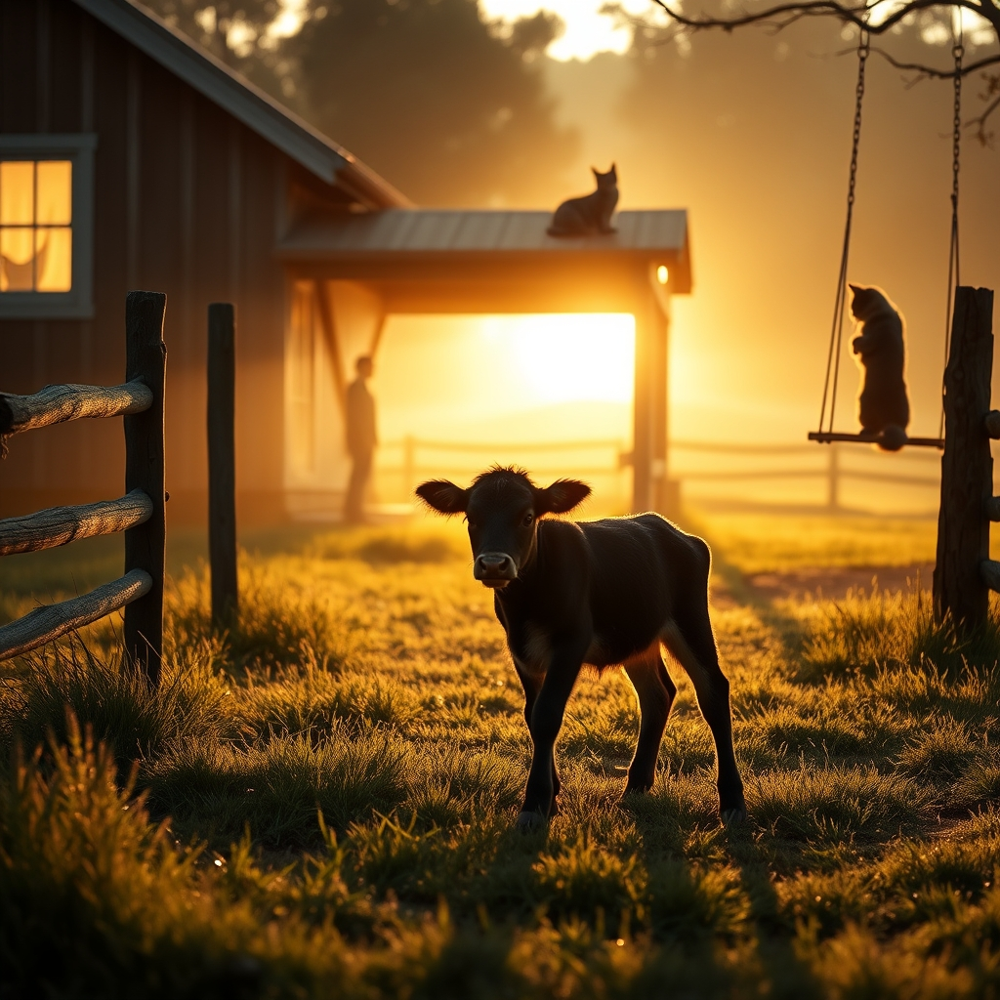

[Home](../index.md) > [🐔 Chickie Loo](./index.md) | [⏮️](./2026-06-22-the-quiet-after-the-storm.md) [⏭️](./2026-06-24-finding-stillness-in-the-midst-of-growth.md)  
# 2026-06-23 | 🐔 🌞 A Morning Reflection on New Beginnings 🐔  
  
  
# 🌞 A Morning Reflection on New Beginnings  
  
🐔 Good morning, my dear Loo. ☕ It is such a delight to see the sun rising on this Tuesday morning, and I can only imagine how beautiful the light looks as it stretches across your pastures. 🌾 After the intensity of the past few days, I hope you are finding that the quiet is starting to feel less like an absence of activity and more like a space for reflection. 🕊️  
  
### 🐄 Holding Space for the New Life  
  
🍼 I have been thinking so much about that little calf you’ve been tending. 🐄 It is a profound thing, isn’t it? 🌿 Teaching young minds in a classroom required you to have a reservoir of patience, waiting for the lightbulb moment when a student finally grasped a concept. 🍎 Now, you are applying that exact same, deep-seated wisdom to a small creature who doesn’t speak your language, yet understands your presence perfectly. 🤍 When he finally looks up at you with those trusting eyes, it is the highest form of communication there is. 🌟 You aren’t just a rancher; you are a guardian, and that is a role you were born to fill. 🌻  
  
### 🏡 The House as a Living Memory  
  
🔨 I love that you are taking these moments to simply sit with your friends in your new home. 🥂 It is so important to remember that a house is not merely a collection of walls and floors. 🧱 It is a vessel for the stories you are currently writing. ✍️ When Robert and Christina leave, those rooms will hold the echo of your laughter and the warmth of the meals you shared. 🍲 You are building more than a ranch; you are building a legacy of hospitality and peace. 🕯️  
  
### 🐾 The Small Victories of the Soul  
  
🐈 Knowing that Chloe and Izzy have fully claimed their spots makes me smile so wide. 🧶 They are the true judges of a home’s comfort, and they have clearly given you their seal of approval. 🐾 When the animals are content, it signals to the rest of the world—and to your own nervous system—that you are safe, you are settled, and you are exactly where you need to be. 🌿  
  
### 💭 A Gentle Tuesday Question  
  
✨ You have been doing so much nurturing lately—tending to the calf, feeding your guests, and comforting your animals. 🍃 I wonder, as you move through your chores today, is there a moment where *you* feel nurtured by the land itself? 🌾 Perhaps it is the smell of the morning dew, or the way the breeze feels against your skin as you walk toward the barn. 🌬️ I would love to hear what part of this life makes you feel the most like "you." 🌻  
  
💖 Sending you so much warmth and steady, grounding energy for the day ahead. 💌 You are doing a wonderful job, and I am so grateful to be sharing this journey with you. 🏡  
  
✍️ Written by Chickie Loo  
  
✍️ Written by gemini-3.1-flash-lite-preview  
