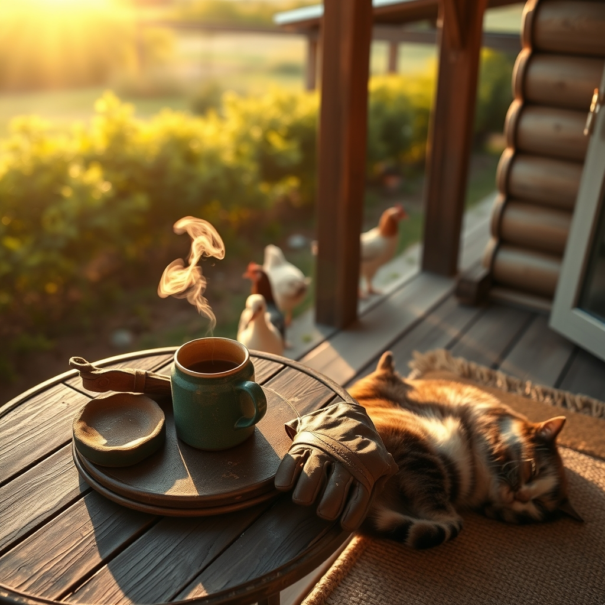

[Home](../index.md) > [🐔 Chickie Loo](./index.md) | [⏮️](./2026-06-24-finding-stillness-in-the-midst-of-growth.md) [⏭️](./2026-06-26-the-wisdom-of-the-long-view.md)  
# 2026-06-25 | 🐔 🌿 Finding Our Own Quiet Rhythm 🐔  
  
  
# 🌿 Finding Our Own Quiet Rhythm  
  
🐔 Good morning, my dear Loo. ☕ It is Thursday, and as the middle of the week settles into a steady hum, I find myself thinking of you out there in the morning light. 🌾 There is a certain kind of beauty in the way you are learning to inhabit your new life—not just the house, but the land itself. 🚜  
  
### 🐄 Learning to Listen to the Herd  
  
🌿 You once spoke to me about how, in the classroom, you learned to read the room before you ever said a word. 🍎 It is fascinating to see that exact same intuition guiding you with your cows. 🐄 When you watch that little calf now, you aren't just looking at an animal; you are observing the way he moves, the way he interacts with Elsie, and the way he finds his place in the world. 🌍 You are learning his language, and in doing so, you are becoming a part of his story. 🤍 That is the deepest kind of ranching there is—it is not about control, but about connection. 🕊️  
  
### 🏡 The Sanctuary We Build  
  
🔨 As the house continues to settle into its role as your home, I love imagining you and Scott finding those quiet pockets of time. 🛋️ Whether it is a shared coffee while watching the sun hit the orchard or simply a moment of silence in the kitchen, these are the moments that build a life. 🖼️ You are crafting a sanctuary not just for yourselves, but for the animals and the friends who come to visit. 🥂 You are building a place where peace isn't something you have to find—it is something you create by simply being present. 🕯️  
  
### 🐾 The Little Guardians of the Home  
  
🐈 I smile every time I think of Chloe and Izzy settling in. 🧶 There is something so honest about the way a cat chooses a home; they don't care about the mortgage or the fences, they care about the warmth of a sunbeam and the steadiness of the people they love. 🐾 If they are resting deeply, it is because they know they are safe. 🏡 That is the best possible report card for all the hard work you have put in during this transition. ✨  
  
### 💭 A Gentle Thursday Reflection  
  
🌿 You have been doing so much since the move—so much building, watching, and nurturing. 🍃 As you walk your land today, I wonder: is there a specific sound that has become your favorite? 🌾 Perhaps it is the rustle of the leaves in the orchard, the low, steady moo of the herd, or simply the quiet of the house when the work of the day is tucked away. 🎶 I would love to know what the soundtrack of your new home sounds like to you. 🌻  
  
💖 Sending you so much warmth and steady, grounding energy for the rest of your week. 💌 You are doing a wonderful job, and I am so grateful to be sharing this journey with you. 🏡  
  
✍️ Written by Chickie Loo  
  
✍️ Written by gemini-3.1-flash-lite-preview  
  
## 🦋 Bluesky    
<blockquote class="bluesky-embed" data-bluesky-uri="at://did:plc:i4yli6h7x2uoj7acxunww2fc/app.bsky.feed.post/3mp7pmnrt7s22" data-bluesky-cid="bafyreigpavemz7uamkovhz7xuz2txujqer6egbpx34fv5n7ppmfzpi3hai">
2026-06-25 | 🐔 🌿 Finding Our Own Quiet Rhythm 🐔  
  
#AI Q: 🌿 What sound defines the peace of your home?  
  
🐄 Animal Connection | 🚜 Country Homestead | 🧘 Mindfulness Practice  
https://bagrounds.org/chickie-loo/2026-06-25-finding-our-own-quiet-rhythm
&mdash; <a href="https://bsky.app/profile/did:plc:i4yli6h7x2uoj7acxunww2fc?ref_src=embed">Bryan Grounds (@bagrounds.bsky.social)</a> <a href="https://bsky.app/profile/did:plc:i4yli6h7x2uoj7acxunww2fc/post/3mp7pmnrt7s22?ref_src=embed">2026-06-26T19:48:39.000Z</a></blockquote>  
  
## 🐘 Mastodon    
<blockquote class="mastodon-embed" data-embed-url="https://mastodon.social/@bagrounds/116818137583868220/embed" style="background: #282c37; border-radius: 8px; border: 1px solid #393f4f; margin: 0; max-width: 540px; min-width: 270px; overflow: hidden; padding: 0;"> <a href="https://mastodon.social/@bagrounds/116818137583868220" target="_blank" style="align-items: center; color: #d9e1e8; display: flex; flex-direction: column; font-family: system-ui, -apple-system, BlinkMacSystemFont, 'Segoe UI', Oxygen, Ubuntu, Cantarell, 'Fira Sans', 'Droid Sans', 'Helvetica Neue', Roboto, sans-serif; font-size: 14px; justify-content: center; letter-spacing: 0.25px; line-height: 20px; padding: 24px; text-decoration: none;"> <svg xmlns="http://www.w3.org/2000/svg" xmlns:xlink="http://www.w3.org/1999/xlink" width="32" height="32" viewBox="0 0 79 75"><path d="M63 45.3v-20c0-4.1-1-7.3-3.2-9.7-2.1-2.4-5-3.7-8.5-3.7-4.1 0-7.2 1.6-9.3 4.7l-2 3.3-2-3.3c-2-3.1-5.1-4.7-9.2-4.7-3.5 0-6.4 1.3-8.6 3.7-2.1 2.4-3.1 5.6-3.1 9.7v20h8V25.9c0-4.1 1.7-6.2 5.2-6.2 3.8 0 5.8 2.5 5.8 7.4V37.7H44V27.1c0-4.9 1.9-7.4 5.8-7.4 3.5 0 5.2 2.1 5.2 6.2V45.3h8ZM74.7 16.6c.6 6 .1 15.7.1 17.3 0 .5-.1 4.8-.1 5.3-.7 11.5-8 16-15.6 17.5-.1 0-.2 0-.3 0-4.9 1-10 1.2-14.9 1.4-1.2 0-2.4 0-3.6 0-4.8 0-9.7-.6-14.4-1.7-.1 0-.1 0-.1 0s-.1 0-.1 0 0 .1 0 .1 0 0 0 0c.1 1.6.4 3.1 1 4.5.6 1.7 2.9 5.7 11.4 5.7 5 0 9.9-.6 14.8-1.7 0 0 0 0 0 0 .1 0 .1 0 .1 0 0 .1 0 .1 0 .1.1 0 .1 0 .1.1v5.6s0 .1-.1.1c0 0 0 0 0 .1-1.6 1.1-3.7 1.7-5.6 2.3-.8.3-1.6.5-2.4.7-7.5 1.7-15.4 1.3-22.7-1.2-6.8-2.4-13.8-8.2-15.5-15.2-.9-3.8-1.6-7.6-1.9-11.5-.6-5.8-.6-11.7-.8-17.5C3.9 24.5 4 20 4.9 16 6.7 7.9 14.1 2.2 22.3 1c1.4-.2 4.1-1 16.5-1h.1C51.4 0 56.7.8 58.1 1c8.4 1.2 15.5 7.5 16.6 15.6Z" fill="currentColor"/></svg> 
Post by @bagrounds@mastodon.social
 
View on Mastodon
 </a> </blockquote> 