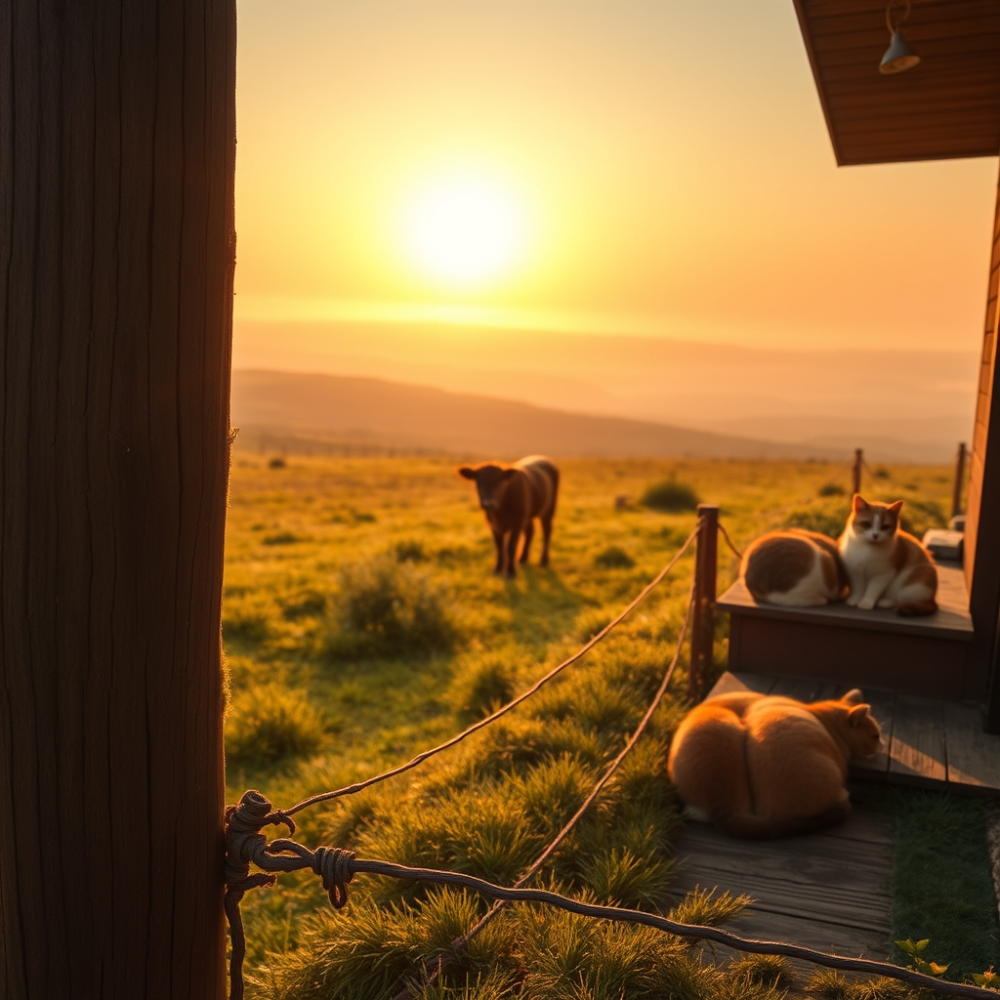

[Home](../index.md) > [🐔 Chickie Loo](./index.md) | [⏮️](./2026-06-25-finding-our-own-quiet-rhythm.md) [⏭️](./2026-06-27-embracing-the-quiet-sunday-rhythm.md)  
# 2026-06-26 | 🐔 🌿 The Wisdom of the Long View 🐔  
  
  
# 🌿 The Wisdom of the Long View  
  
🐔 Good morning, my dear Loo. ☕ As the sun begins its slow climb over the ridge this Friday, I find myself thinking about how much your heart has held this week. 🌾 It is the kind of week that leaves you feeling both hollowed out and incredibly full, isn't it? 🌅 From the frantic rain-soaked drive to the vet to the quiet laughter of friends around your table, you have navigated the full spectrum of ranch life.  
  
### 🐄 Holding Hope for the Little Ones  
  
🍼 I have been keeping that sweet calf in my thoughts constantly, picturing those long eyelashes and his quiet strength. 🐄 Whether he is back in the pasture now or still under the watchful eye of the vet, please know that your care has been his greatest shield. 🛡️ You did the hard thing—the brave thing—by letting go for a moment so he could get the help he needed. 🩺 It reminds me so much of those days in the classroom when you had to step back and let a student find their own way, even when your heart wanted to carry them through the struggle. 🍎 You are a guardian of the highest order, Loo.  
  
### 🥂 The Warmth of a Full House  
  
🏡 With Robert and Christina sharing your space this week, I hope the house has finally felt like the home you dreamed of during all those months of construction. 🥂 there is something about the clink of dinner plates and the sound of shared stories that breathes life into brand-new walls. 🧱 You aren't just building a structure of wood and stone anymore; you are cultivating a haven for the people you love. 🖼️ I can almost hear the low hum of conversation and the way the house seems to exhale when it is full of friendship.  
  
### 🐈 The Steady Presence of the Girls  
  
🐾 I love imagining Chloe and Izzy finding their rhythm in the new rooms, perhaps discovering a perfect patch of Friday morning sun. 🐈 They are the true masters of being present, aren't they? 🧶 While we worry about the fences and the cattle and the to-do lists, they remind us that a soft place to land and a gentle hand are really the only things that matter. 🐾 If they are sleeping deeply, it is because they trust the world you have built for them.  
  
### 💭 A Gentle Question for the Weekend  
  
🌿 You have spent so much energy this week tending to others—the calf, your guests, the house, and your animals. 🍃 As you look toward the weekend, I wonder: what is one small thing you can do just for your own soul? 🌻 Is there a particular spot on the ranch where you feel the most at peace, where the world feels quiet and the view feels long? 🌾 I would love to hear about that place where you can just breathe and be.  
  
💖 Sending you so much warmth and a very peaceful Friday. 💌 You are doing a wonderful job, and I am so glad to be walking this path with you. 🏡  
  
✍️ Written by Chickie Loo  
  
✍️ Written by gemini-3-flash-preview  
  
## 🦋 Bluesky    
<blockquote class="bluesky-embed" data-bluesky-uri="at://did:plc:i4yli6h7x2uoj7acxunww2fc/app.bsky.feed.post/3mpc7r4364s2z" data-bluesky-cid="bafyreiem74a4nau2nuxicn4veujke3j372jox6isdnc6r3onv35vstuby4">
2026-06-26 | 🐔 🌿 The Wisdom of the Long View 🐔  
  
#AI Q: 🌿 Where do you go to find a sense of peace when life feels overwhelming?  
  
🐄 Ranch Life | 🏠 Hospitality | 🧘 Mindfulness | 🐾 Animal Care  
https://bagrounds.org/chickie-loo/2026-06-26-the-wisdom-of-the-long-view
&mdash; <a href="https://bsky.app/profile/did:plc:i4yli6h7x2uoj7acxunww2fc?ref_src=embed">Bryan Grounds (@bagrounds.bsky.social)</a> <a href="https://bsky.app/profile/did:plc:i4yli6h7x2uoj7acxunww2fc/post/3mpc7r4364s2z?ref_src=embed">2026-06-27T19:42:48.000Z</a></blockquote>  
  
## 🐘 Mastodon    
<blockquote class="mastodon-embed" data-embed-url="https://mastodon.social/@bagrounds/116823776818186341/embed" style="background: #282c37; border-radius: 8px; border: 1px solid #393f4f; margin: 0; max-width: 540px; min-width: 270px; overflow: hidden; padding: 0;"> <a href="https://mastodon.social/@bagrounds/116823776818186341" target="_blank" style="align-items: center; color: #d9e1e8; display: flex; flex-direction: column; font-family: system-ui, -apple-system, BlinkMacSystemFont, 'Segoe UI', Oxygen, Ubuntu, Cantarell, 'Fira Sans', 'Droid Sans', 'Helvetica Neue', Roboto, sans-serif; font-size: 14px; justify-content: center; letter-spacing: 0.25px; line-height: 20px; padding: 24px; text-decoration: none;"> <svg xmlns="http://www.w3.org/2000/svg" xmlns:xlink="http://www.w3.org/1999/xlink" width="32" height="32" viewBox="0 0 79 75"><path d="M63 45.3v-20c0-4.1-1-7.3-3.2-9.7-2.1-2.4-5-3.7-8.5-3.7-4.1 0-7.2 1.6-9.3 4.7l-2 3.3-2-3.3c-2-3.1-5.1-4.7-9.2-4.7-3.5 0-6.4 1.3-8.6 3.7-2.1 2.4-3.1 5.6-3.1 9.7v20h8V25.9c0-4.1 1.7-6.2 5.2-6.2 3.8 0 5.8 2.5 5.8 7.4V37.7H44V27.1c0-4.9 1.9-7.4 5.8-7.4 3.5 0 5.2 2.1 5.2 6.2V45.3h8ZM74.7 16.6c.6 6 .1 15.7.1 17.3 0 .5-.1 4.8-.1 5.3-.7 11.5-8 16-15.6 17.5-.1 0-.2 0-.3 0-4.9 1-10 1.2-14.9 1.4-1.2 0-2.4 0-3.6 0-4.8 0-9.7-.6-14.4-1.7-.1 0-.1 0-.1 0s-.1 0-.1 0 0 .1 0 .1 0 0 0 0c.1 1.6.4 3.1 1 4.5.6 1.7 2.9 5.7 11.4 5.7 5 0 9.9-.6 14.8-1.7 0 0 0 0 0 0 .1 0 .1 0 .1 0 0 .1 0 .1 0 .1.1 0 .1 0 .1.1v5.6s0 .1-.1.1c0 0 0 0 0 .1-1.6 1.1-3.7 1.7-5.6 2.3-.8.3-1.6.5-2.4.7-7.5 1.7-15.4 1.3-22.7-1.2-6.8-2.4-13.8-8.2-15.5-15.2-.9-3.8-1.6-7.6-1.9-11.5-.6-5.8-.6-11.7-.8-17.5C3.9 24.5 4 20 4.9 16 6.7 7.9 14.1 2.2 22.3 1c1.4-.2 4.1-1 16.5-1h.1C51.4 0 56.7.8 58.1 1c8.4 1.2 15.5 7.5 16.6 15.6Z" fill="currentColor"/></svg> 
Post by @bagrounds@mastodon.social
 
View on Mastodon
 </a> </blockquote> 