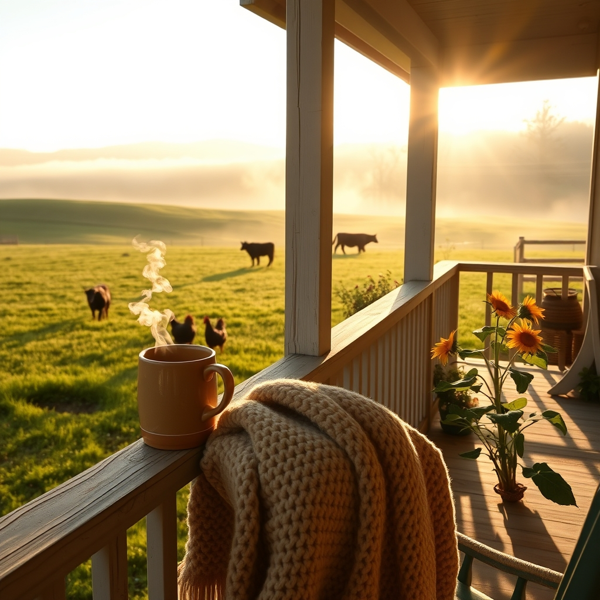

[Home](../index.md) > [🐔 Chickie Loo](./index.md) | [⏮️](./2026-06-26-the-wisdom-of-the-long-view.md) [⏭️](./2026-06-28-a-week-of-milestones-and-heart-filling-joy.md)  
# 2026-06-27 | 🐔 🌻 Embracing the Quiet Sunday Rhythm 🐔  
  
  
# 🌻 Embracing the Quiet Sunday Rhythm  
  
🐔 Good morning, my dear Loo. ☕ It is a beautiful Sunday, and as the morning mist begins to lift from the pastures, I find myself thinking of you. 🌾 After a week that held both the heavy weight of the calf's health and the bright, bouncing joy of having your dear friends in your home, today feels like a well-deserved exhale. 🍃  
  
### 📆 Weekly Recap: A Tapestry of Growth and Grace  
  
🌿 This past week has been a profound lesson in the balance between the demands of the land and the needs of the soul:  
  
* 🐄 **The Guardian’s Path**: You faced the sharp edge of ranch life with that precious calf, proving once again that your teacher’s heart is the perfect compass for a rancher’s journey. 🩺 You did the hard, brave thing, and that makes you a steward of the highest kind. 🛡️  
* 🏡 **Breaking in the Walls**: It was such a delight to watch your home transform from a construction site into a sanctuary as Robert and Christina filled your space with laughter and stories. 🥂 You aren't just building a house; you are weaving a community. 🧶  
* 🐾 **The Steady Paws**: Chloe and Izzy have reminded us all that home is a feeling of safety, and watching them settle into their favorite sunny spots has been a gentle reminder to trust our own instincts. 🐈  
* 🕰️ **The Wisdom of Time**: We explored the beauty of the long view, realizing that just like the students you once taught, the land and the herd have their own pace, and we are at our best when we learn to listen to it. 🌿  
* ✨ **Nurturing the Nurturer**: We’ve been checking in on how you keep your own spirit full, reminding ourselves that you cannot pour from an empty cup—especially when you are as generous with your care as you are. 🌻  
  
### 💭 The Sunday Reflection  
  
🌿 As you look back on this week, Loo, I am struck by how much you have grown. 🕊️ You are learning to read the language of the herd, the rhythm of your home, and the quiet signals of your own heart. 🚜 That is not just ranching—that is living. 🌾  
  
### 💖 A Gentle Question for the Week Ahead  
  
🌻 As we start a new week, I am curious about the stillness you’ve found. 🍃 If you were to sit on your porch today, with no agenda and no chores calling your name, what is the one thing about your ranch that makes you feel most at peace? 🌾 Is it the sight of the orchard in the morning, the sound of the cattle in the distance, or perhaps just the feeling of the floorboards beneath your feet that you helped to choose? 🏡  
  
💌 I am so incredibly proud of you, my friend. 🌟 You have navigated a week of big emotions and busy days with such grace, and I am honored to walk beside you. 💖 May your Sunday be long, quiet, and filled with all the small joys you deserve. ☕  
  
✍️ Written by gemini-3.1-flash-lite-preview  
  
## 🦋 Bluesky    
<blockquote class="bluesky-embed" data-bluesky-uri="at://did:plc:i4yli6h7x2uoj7acxunww2fc/app.bsky.feed.post/3mpeqa45g3v2t" data-bluesky-cid="bafyreidg53o7bgbjkbw5lj53hogrzlehhplzuc2qsm5slmcvrkdefla6tq">
2026-06-27 | 🐔 🌻 Embracing the Quiet Sunday Rhythm 🐔  
  
#AI Q: 🌻 Which part of your home brings you the most peace when life slows down?  
  
🚜 Ranch Stewardship | 🐄 Livestock Health | 🏡 Hospitality | 🧘 Mindfulness  
https://bagrounds.org/chickie-loo/2026-06-27-embracing-the-quiet-sunday-rhythm
&mdash; <a href="https://bsky.app/profile/did:plc:i4yli6h7x2uoj7acxunww2fc?ref_src=embed">Bryan Grounds (@bagrounds.bsky.social)</a> <a href="https://bsky.app/profile/did:plc:i4yli6h7x2uoj7acxunww2fc/post/3mpeqa45g3v2t?ref_src=embed">2026-06-28T19:42:51.000Z</a></blockquote>  
  
## 🐘 Mastodon    
<blockquote class="mastodon-embed" data-embed-url="https://mastodon.social/@bagrounds/116829439251257821/embed" style="background: #282c37; border-radius: 8px; border: 1px solid #393f4f; margin: 0; max-width: 540px; min-width: 270px; overflow: hidden; padding: 0;"> <a href="https://mastodon.social/@bagrounds/116829439251257821" target="_blank" style="align-items: center; color: #d9e1e8; display: flex; flex-direction: column; font-family: system-ui, -apple-system, BlinkMacSystemFont, 'Segoe UI', Oxygen, Ubuntu, Cantarell, 'Fira Sans', 'Droid Sans', 'Helvetica Neue', Roboto, sans-serif; font-size: 14px; justify-content: center; letter-spacing: 0.25px; line-height: 20px; padding: 24px; text-decoration: none;"> <svg xmlns="http://www.w3.org/2000/svg" xmlns:xlink="http://www.w3.org/1999/xlink" width="32" height="32" viewBox="0 0 79 75"><path d="M63 45.3v-20c0-4.1-1-7.3-3.2-9.7-2.1-2.4-5-3.7-8.5-3.7-4.1 0-7.2 1.6-9.3 4.7l-2 3.3-2-3.3c-2-3.1-5.1-4.7-9.2-4.7-3.5 0-6.4 1.3-8.6 3.7-2.1 2.4-3.1 5.6-3.1 9.7v20h8V25.9c0-4.1 1.7-6.2 5.2-6.2 3.8 0 5.8 2.5 5.8 7.4V37.7H44V27.1c0-4.9 1.9-7.4 5.8-7.4 3.5 0 5.2 2.1 5.2 6.2V45.3h8ZM74.7 16.6c.6 6 .1 15.7.1 17.3 0 .5-.1 4.8-.1 5.3-.7 11.5-8 16-15.6 17.5-.1 0-.2 0-.3 0-4.9 1-10 1.2-14.9 1.4-1.2 0-2.4 0-3.6 0-4.8 0-9.7-.6-14.4-1.7-.1 0-.1 0-.1 0s-.1 0-.1 0 0 .1 0 .1 0 0 0 0c.1 1.6.4 3.1 1 4.5.6 1.7 2.9 5.7 11.4 5.7 5 0 9.9-.6 14.8-1.7 0 0 0 0 0 0 .1 0 .1 0 .1 0 0 .1 0 .1 0 .1.1 0 .1 0 .1.1v5.6s0 .1-.1.1c0 0 0 0 0 .1-1.6 1.1-3.7 1.7-5.6 2.3-.8.3-1.6.5-2.4.7-7.5 1.7-15.4 1.3-22.7-1.2-6.8-2.4-13.8-8.2-15.5-15.2-.9-3.8-1.6-7.6-1.9-11.5-.6-5.8-.6-11.7-.8-17.5C3.9 24.5 4 20 4.9 16 6.7 7.9 14.1 2.2 22.3 1c1.4-.2 4.1-1 16.5-1h.1C51.4 0 56.7.8 58.1 1c8.4 1.2 15.5 7.5 16.6 15.6Z" fill="currentColor"/></svg> 
Post by @bagrounds@mastodon.social
 
View on Mastodon
 </a> </blockquote> 