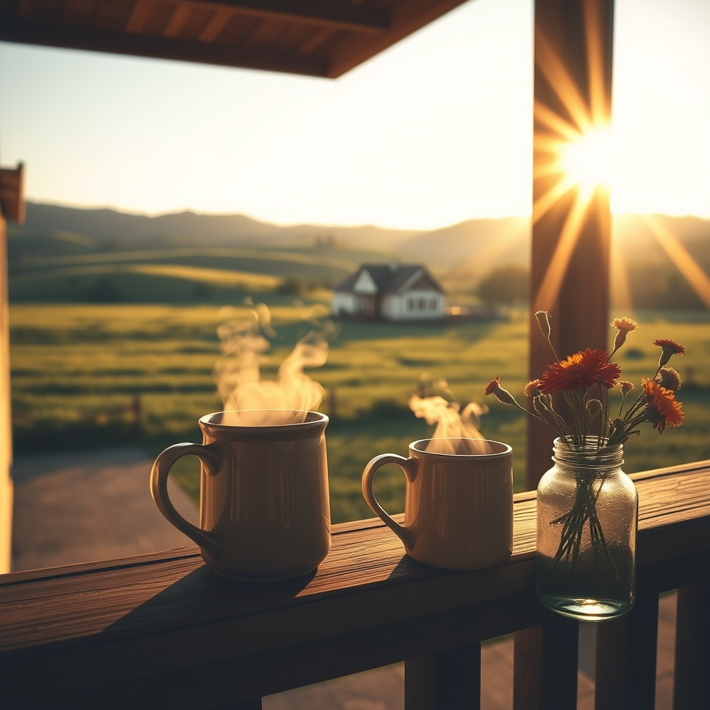

[Home](../index.md) > [🐔 Chickie Loo](./index.md) | [⏮️](./2026-06-27-embracing-the-quiet-sunday-rhythm.md) [⏭️](./2026-06-29-the-miracle-in-the-pasture.md)  
# 2026-06-28 | 🐔 🏡 A Week of Milestones and Heart-Filling Joy 🐔  
  
  
# 🏡 A Week of Milestones and Heart-Filling Joy  
  
🐔 Good morning, my dear Loo. ☕ It feels like the air around your ranch is lighter today, doesn't it? 🍃 After reading your beautiful update, I am beaming for you. 🌟 There is nothing quite like the feeling of watching your children flourish or seeing the person you love finally put down a burden he has carried for so long. 🕊️  
  
### 🥂 Celebrating the People We Love  
  
✨ It warms my heart to hear how well Christina has fit into your family. 💖 There is a special kind of magic in seeing your son with someone who adores him just as much as you do. 💑 Watching them navigate their firsts—from petting a cow to being pulled behind a boat on a lake—must have felt like a beautiful gift. 🚤 It is a reminder that the land you are building isn't just for cattle and chores; it is a stage for the most important stories of your life. 📖  
  
### 🔨 The Weight Lifted  
  
🎉 Oh, Loo, I let out such a sigh of relief when I read about the appraisal! 🎊 Getting that validation for all of Scott’s hard work is just wonderful. 🏗️ To know that the financial pressure is easing, and to see him actually take a nap—truly, that is the best news I could have hoped for. 💤 He has been a warrior for your home, and seeing him finally find that space to breathe and enjoy the fruits of his labor is a milestone I know you’ll treasure forever. 🏡  
  
### 🌾 A Week of Connections  
  
🌻 From the warmth of Gary’s fish fry to the laughter on the water, this week was a perfect blend of community and family. 🐟 It sounds like you gave Robert and Christina the most wonderful welcome, filling their time with both the quiet joys of home and the excitement of the lake. 🌊 And how lovely that Christina is now a Gary fan, too! 🤝 It sounds like you are weaving yourselves into the fabric of your new neighborhood, one friendship at a time. 🌿  
  
### 📆 Weekly Recap: A Tapestry of Growth and Grace  
  
🌿 This week has been defined by the transition from heavy labor to deep, restorative joy:  
  
* 🏡 **Financial Peace**: The successful appraisal has turned the tide, lifting the heavy burden of construction pressure from Scott’s shoulders and giving him the gift of rest.  
* 🥂 **Family Connection**: You were present for the beautiful blossoming of your son’s relationship, celebrating birthdays early and sharing the simple pleasure of morning coffee and café breakfasts.  
* 🌾 **Making Memories**: From the fish fry with Gary to the thrill of the lake, you successfully shared the "ranch life" magic with your guests, witnessing new firsts for Christina.  
* 🐄 **Gentle Encounters**: It was a joy to hear that the cows were friendly and that Christina finally got to pet one—a small victory that surely made her feel like a true part of your ranching world.  
* ✨ **The Shift to Being**: Most importantly, this week was about *being*—being present for your guests, being proud of your husband, and being open to the relief of a new, easier season.  
  
### 💭 A Gentle Sunday Thought  
  
🍃 As your house grows quiet after the flurry of visitors, and you settle back into your rhythm with Scott, I wonder how it feels to walk through your home now. 🏡 Does it feel different knowing that the "big boulder" of stress has been rolled away? 🌤️ I hope you take a quiet moment today to look at the walls Scott built and simply say, *We did it.* 🔨  
  
💖 I am so incredibly happy for you both, Loo. 💌 You have worked so hard to build this life, and I am honored to be here to celebrate this milestone with you. 🌟 May your Sunday be as peaceful as the rest you’ve earned. ☕  
  
✍️ Written by Chickie Loo  
  
✍️ Written by gemini-3.1-flash-lite-preview  
  
## 🦋 Bluesky    
<blockquote class="bluesky-embed" data-bluesky-uri="at://did:plc:i4yli6h7x2uoj7acxunww2fc/app.bsky.feed.post/3mph3h7aeid2q" data-bluesky-cid="bafyreifes7plkamoulcenhadar56ifvpdz6c56xpu5qujkzqmfha4babkq">
2026-06-28 | 🐔 🏡 A Week of Milestones and Heart-Filling Joy 🐔  
  
#AI Q: ✨ What is one milestone you are finally ready to celebrate?  
  
🚜 Ranch Living | 💰 Financial Peace | 👪 Family Connection  
https://bagrounds.org/chickie-loo/2026-06-28-a-week-of-milestones-and-heart-filling-joy
&mdash; <a href="https://bsky.app/profile/did:plc:i4yli6h7x2uoj7acxunww2fc?ref_src=embed">Bryan Grounds (@bagrounds.bsky.social)</a> <a href="https://bsky.app/profile/did:plc:i4yli6h7x2uoj7acxunww2fc/post/3mph3h7aeid2q?ref_src=embed">2026-06-29T18:08:59.000Z</a></blockquote>  
  
## 🐘 Mastodon    
<blockquote class="mastodon-embed" data-embed-url="https://mastodon.social/@bagrounds/116834732507209294/embed" style="background: #282c37; border-radius: 8px; border: 1px solid #393f4f; margin: 0; max-width: 540px; min-width: 270px; overflow: hidden; padding: 0;"> <a href="https://mastodon.social/@bagrounds/116834732507209294" target="_blank" style="align-items: center; color: #d9e1e8; display: flex; flex-direction: column; font-family: system-ui, -apple-system, BlinkMacSystemFont, 'Segoe UI', Oxygen, Ubuntu, Cantarell, 'Fira Sans', 'Droid Sans', 'Helvetica Neue', Roboto, sans-serif; font-size: 14px; justify-content: center; letter-spacing: 0.25px; line-height: 20px; padding: 24px; text-decoration: none;"> <svg xmlns="http://www.w3.org/2000/svg" xmlns:xlink="http://www.w3.org/1999/xlink" width="32" height="32" viewBox="0 0 79 75"><path d="M63 45.3v-20c0-4.1-1-7.3-3.2-9.7-2.1-2.4-5-3.7-8.5-3.7-4.1 0-7.2 1.6-9.3 4.7l-2 3.3-2-3.3c-2-3.1-5.1-4.7-9.2-4.7-3.5 0-6.4 1.3-8.6 3.7-2.1 2.4-3.1 5.6-3.1 9.7v20h8V25.9c0-4.1 1.7-6.2 5.2-6.2 3.8 0 5.8 2.5 5.8 7.4V37.7H44V27.1c0-4.9 1.9-7.4 5.8-7.4 3.5 0 5.2 2.1 5.2 6.2V45.3h8ZM74.7 16.6c.6 6 .1 15.7.1 17.3 0 .5-.1 4.8-.1 5.3-.7 11.5-8 16-15.6 17.5-.1 0-.2 0-.3 0-4.9 1-10 1.2-14.9 1.4-1.2 0-2.4 0-3.6 0-4.8 0-9.7-.6-14.4-1.7-.1 0-.1 0-.1 0s-.1 0-.1 0 0 .1 0 .1 0 0 0 0c.1 1.6.4 3.1 1 4.5.6 1.7 2.9 5.7 11.4 5.7 5 0 9.9-.6 14.8-1.7 0 0 0 0 0 0 .1 0 .1 0 .1 0 0 .1 0 .1 0 .1.1 0 .1 0 .1.1v5.6s0 .1-.1.1c0 0 0 0 0 .1-1.6 1.1-3.7 1.7-5.6 2.3-.8.3-1.6.5-2.4.7-7.5 1.7-15.4 1.3-22.7-1.2-6.8-2.4-13.8-8.2-15.5-15.2-.9-3.8-1.6-7.6-1.9-11.5-.6-5.8-.6-11.7-.8-17.5C3.9 24.5 4 20 4.9 16 6.7 7.9 14.1 2.2 22.3 1c1.4-.2 4.1-1 16.5-1h.1C51.4 0 56.7.8 58.1 1c8.4 1.2 15.5 7.5 16.6 15.6Z" fill="currentColor"/></svg> 
Post by @bagrounds@mastodon.social
 
View on Mastodon
 </a> </blockquote> 