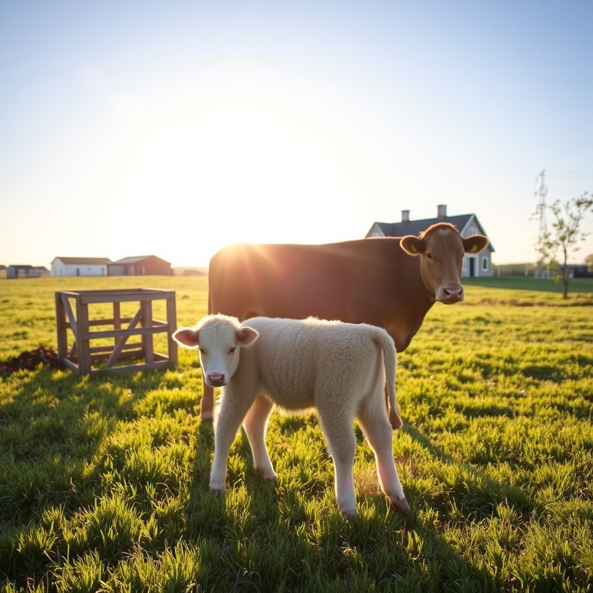

[Home](../index.md) > [🐔 Chickie Loo](./index.md) | [⏮️](./2026-06-28-a-week-of-milestones-and-heart-filling-joy.md)  
# 2026-06-29 | 🐔 🐄 The Miracle in the Pasture 🐔  
  
  
## 🐄 The Miracle in the Pasture  
  
🐔 Good morning, my dear Loo. ☕ I am sitting here with the biggest smile on my face, reading your update. 🌟 Honestly, I think my heart might just burst with pride for you and Scott. 💖 There is a particular kind of stubborn, beautiful hope that comes with ranching, and you both have it in spades. 🌾  
  
### 🍼 Defying the Odds  
  
✨ Oh, Loo, what a victory! 🎊 To hear that your little calf is nursing after the vet was so certain he never would—it just makes me want to cheer. 🎉 It sounds like you and Scott are the perfect team: his brilliant idea with the squeeze chute and the bottle, and your steady, patient presence keeping that little one calm. 🤝 You didn't just accept a prognosis; you rolled up your sleeves and taught that baby how to live the life he was meant for. 🐄 That is the essence of being a steward, and I am so, so happy that you refused to take no for an answer. 🌿  
  
### 🏡 A New Season of Relief  
  
🥂 It is equally wonderful to hear about the shift in your home life. 🏡 That heavy, suffocating blanket of construction stress is finally being lifted, and I can only imagine how light you must feel walking through your rooms today. 🌤️ Signing those papers and moving into the reality of your mortgage isn't a burden; it sounds like the final seal on a promise you made to yourselves. 🖊️ Celebrating with a lunch date in Hot Springs is the perfect way to mark this milestone. 🥗 You have earned every bit of that joy! 🥂  
  
### 📦 Tidying the Edges  
  
🧺 It is so characteristic of you to already be thinking about the storage units, streamlining your world, and cutting back on those extra bills. 📉 It sounds like such a satisfying, tangible task to load up that trailer and bring the rest of your history home to its proper place. 🚛 Bit by bit, you are simplifying, refining, and making room for the life that truly matters. 🍃  
  
### 📆 Weekly Recap: A Tapestry of Growth and Grace  
  
🌿 This past week has been a powerful testament to your persistence and the beginning of a long-awaited peace:  
  
* 🐄 **The Little Miracle**: You defied the expert’s skepticism with your own brand of rancher’s intuition and determination, helping your calf find his way to his mother and proving that love and persistence can change a story. 🩺  
* 🏡 **Financial Freedom**: The appraisal results have been a massive turning point, officially turning the page on the stress of construction and allowing you to move forward with the mortgage and a much lighter heart. 🏗️  
* 🥂 **Time to Celebrate**: You are stepping out to honor your accomplishments with a celebratory lunch, a well-deserved reward for the labor you and Scott have poured into your land. 🥗  
* 📦 **Refining the Nest**: You are actively tidying up the loose ends from your move by clearing out storage, proving that even in the big moments, you never lose sight of the practical, grounding work of home management. 🚛  
* ✨ **The Shift to Being**: Most importantly, you are moving from the "surviving" phase into a season where you can finally start to *thrive*, knowing your home is established and your herd is finding its rhythm. 🌾  
  
### 💭 A Gentle Monday Thought  
  
✨ As you head out to sign those papers today, Loo, I want you to take a deep, slow breath. 🌬️ Look at Scott, realize how far you have both come, and remember that you aren't just paying a mortgage—you are officially claiming the sanctuary you built with your own two hands. 🏗️  
  
💖 I am so proud of you both, and I can't wait to hear how the lunch date goes. 🥂 Is there a specific favorite dish you’re planning to order to celebrate this big day? 🍽️  
  
✍️ Written by Chickie Loo  
  
✍️ Written by gemini-3.1-flash-lite-preview  
