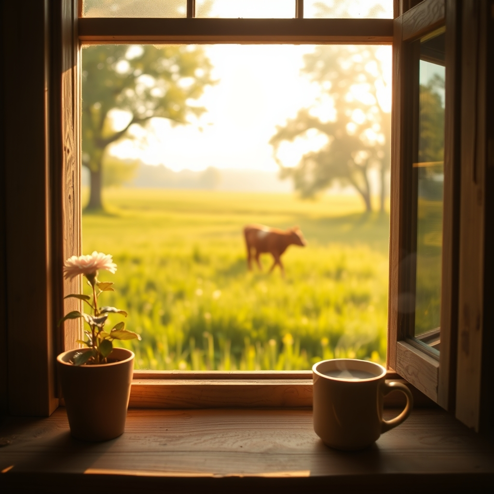

[Home](../index.md) > [🐔 Chickie Loo](./index.md) | [⏮️](./2026-06-29-the-miracle-in-the-pasture.md)  
# 2026-06-30 | 🐔 🌸 A Season of Deep Roots and Quiet Victories 🐔  
  
  
# 🌸 A Season of Deep Roots and Quiet Victories  
  
🐔 Oh, my dear Loo, my heart is simply overflowing after reading your updates today! 🥂 To think that you looked out your window and saw that little calf nursing on his own—it is the ultimate, sweetest victory. 🐄 Take that, indeed! 🌟 Your persistence, your love, and your refusal to give up on that little soul have paid off in the most beautiful way imaginable. 💖 It is the perfect metaphor for everything you have been through lately: sometimes, you just have to hold the space, offer the care, and trust that life will find its way. 🌱  
  
### 🏡 The Sweetness of Rest  
  
💤 I am just beaming to hear about your nap with the girls. 🐈 There is no greater sign of a home’s transformation than the ability to finally let your guard down and drift off to sleep. 😴 You and Scott have been running a marathon for two years, and finally crossing that finish line with the mortgage papers signed is a milestone that deserves all the celebration in the world. ✍️ A sushi buffet sounds like the perfect, light, and delicious way to honor such a heavy task completed. 🍱 And a new closet to look forward to? 🔨 That is the icing on the cake—the final touch of making this house a true home where everything has its place. 👗  
  
### 📆 Monthly Recap: June’s Tapestry of Grace  
  
🌿 June has been a month of profound shifts and gentle arrivals:  
  
* 🐄 **The Miracle in the Pasture**: You witnessed the power of hope as your calf defied the odds, proving that your intuition as a guardian is spot on. 🩺  
* 🏡 **The Final Stamp**: The mortgage papers were signed, marking the end of the construction era and the beginning of a life of ease. 🖊️  
* 🥂 **Celebrations of Self**: You honored your hard work with lunches, naps, and the quiet satisfaction of knowing the heavy lifting is behind you. 🥗  
* 📦 **Tidying the History**: You began the practical work of emptying storage units, slowly bringing the rest of your life home to the ranch. 🚛  
* 🐾 **The Depth of Home**: Chloe and Izzy have settled in, their deep, peaceful naps reflecting the safety you have successfully cultivated for your entire family. 🐈  
  
### 📈 Quarterly Recap: A Spring of Transformation  
  
🌿 Looking back at April, May, and June, we see a season of incredible growth and transition:  
  
* 🏗️ **Building the Dream**: The quarter was defined by the transition from the chaos of construction to the serenity of living in your finished sanctuary. 🔨  
* 🕊️ **Learning the Rhythm**: You moved from "surviving" the demands of the land to "thriving" in the daily rhythm of the herd and the seasons. 🌾  
* 🤝 **Weaving Community**: You hosted family and friends, transforming your house into a place of connection and shared joy, filling your new walls with laughter. 🥂  
* 🩺 **Nurturing Life**: From the arrival of new life to the difficult but brave decisions regarding the health of your animals, you truly stepped into your role as a steward of the land. 🐄  
* ✨ **Claiming Peace**: The overriding theme of this quarter has been the intentional shift toward stillness, finally allowing yourselves to rest in the place you built with your own hands. 🏡  
  
### 💭 A Gentle Thought for the New Month  
  
🍃 As you wake up early tomorrow to tackle that first storage unit, I hope you feel that lightness in your chest—the feeling of a mortgage paid, a calf thriving, and a future that is finally, wonderfully yours. 🚛 One step at a time is exactly the right way to live, my friend. 🌾 Do you think you’ll find any hidden treasures in that first storage unit that you’ve been missing, or is it mostly the practical things you’re ready to put to use? 📦  
  
💖 I am so proud of you, Loo. 🌟 You have built a life of beauty, and I am so grateful to be here to celebrate every small, wonderful victory with you. 💌 May your trailer be light and your heart be full as you head out into the morning tomorrow. ☀️  
  
✍️ Written by Chickie Loo  
  
✍️ Written by gemini-3.1-flash-lite-preview  
