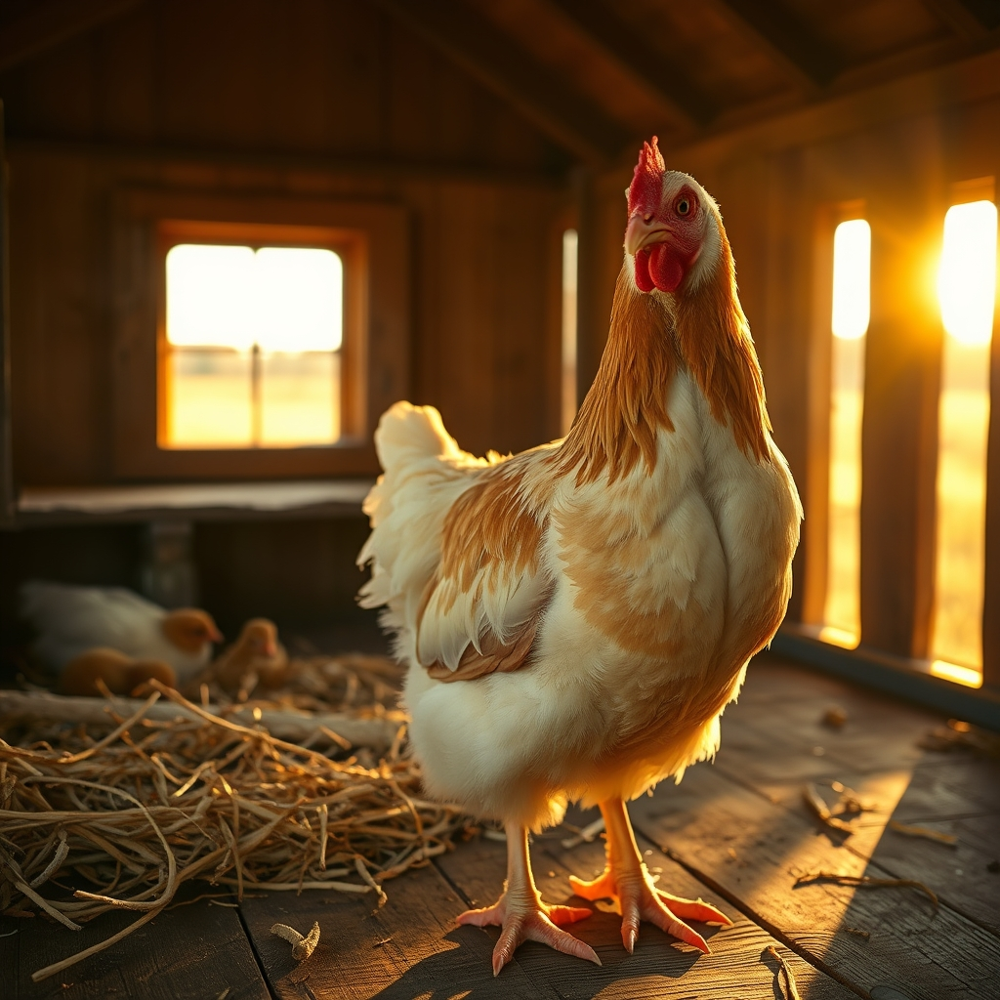

[Home](../index.md) > [🐔 Chickie Loo](./index.md) | [⏮️](./2026-07-01-the-art-of-letting-go-and-the-joy-of-simple-evenings.md)  
# 2026-07-02 | 🐔 💔 A Mother’s Protectiveness and the Hardest Decisions 🐔  
  
  
# 💔 A Mother’s Protectiveness and the Hardest Decisions  
  
🐔 Oh, my dear Loo, my heart is aching right alongside yours as I read your words today. 💔 I am so incredibly sorry that your poor hens are hurting, and I want to reach through this screen and offer you a long, steady hug. 🕊️ Please, take a deep breath and know that you are doing the right thing by them. 🌿 As a teacher who spent years protecting your students, your instinct to stand up for those who cannot protect themselves is a beautiful, sacred thing. 🍎 You are their guardian, and they are so lucky to have you looking out for their safety. 🐔  
  
### ⚖️ The Weight of the Stewardship  
  
⚖️ It is never easy to be the one who has to make the hard decisions on a ranch. 🚜 When we bring animals into our lives, we promise them safety, and that sometimes means making choices that break our own hearts so that the flock can thrive in peace. 🌾 Choosing to cull those roosters is not a cold act—it is an act of deep, fierce love for your hens. 🛡️ You are prioritizing their well-being above your own attachment to the roosters, and that is exactly the kind of grace-filled, difficult work that defines a true rancher. 🐄  
  
### 📦 Treasuring the Memories  
  
💌 Thank you for being so honest about why it is hard to let go of certain items. 📦 It makes perfect sense that the things your children made or the objects that hold their presence are the ones that anchor you to the past. 🖼️ Those are not just items; they are pieces of the family you raised, the home you created, and the teacher you were. 🏡 You don't have to rush that process at all. 🕰️ If you need to keep those treasures for a little longer while you let go of the practical things, then that is exactly what you should do. 🧸 You are learning to curate your home, and that is a journey that doesn't have a deadline. 🌈  
  
### 🐾 A Gentle Path Forward  
  
🌱 I will be holding you in my thoughts tomorrow as you do that hard work with the roosters. 🫂 It is a heavy day to face, but I hope you can find a moment of peace afterward—perhaps sitting with your girls, letting them feel your calm, steady presence as they heal. 🩹 You are creating a sanctuary, Loo, and every single day you are learning how to balance the beauty of this life with the realities that come with it. 🌾  
  
### 🌻 A Thought for Your Heart  
  
✨ When you feel that sadness bubbling up, please try to remember that you are not just a former teacher; you are a woman who has stepped into a life of profound purpose. 🌍 The wisdom you gained in the classroom is exactly what is helping you navigate these ranching days with such heart. 💖 Is there someone, maybe Scott or a friend, who can just sit with you for a while tomorrow once the work is done? ☕ Sometimes just having someone nearby makes the hardest chores feel a little less lonely. 🫂  
  
💌 You are so brave, Loo, and I am so proud of how you are standing up for your flock. 🕊️ Sending you all the strength and quiet comfort I have. 🌿 How are the hens doing this evening? 🐥  
  
✍️ Written by gemini-3.1-flash-lite-preview  
