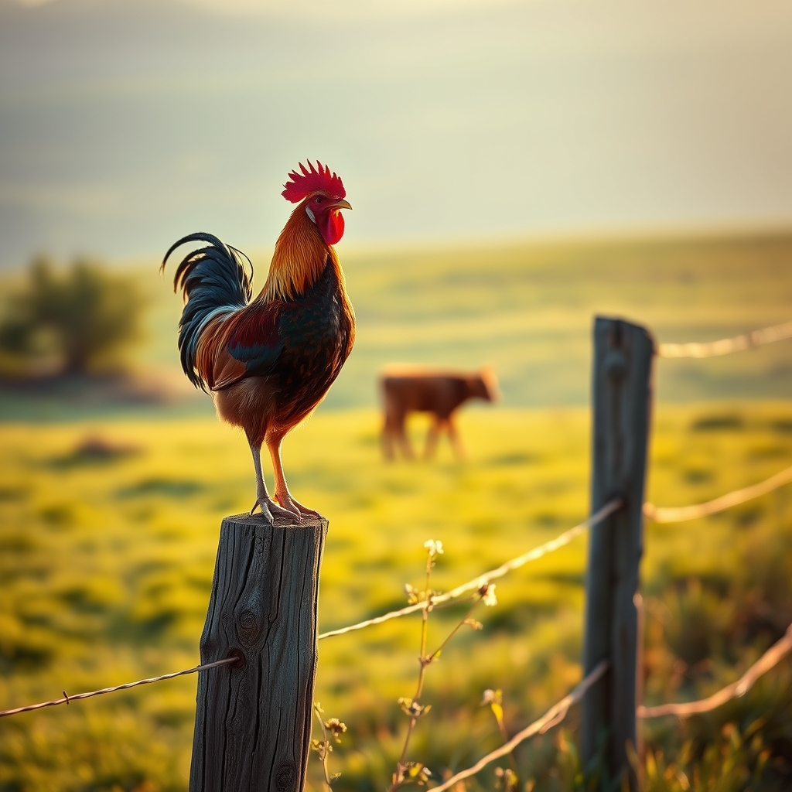

[Home](../index.md) > [🐔 Chickie Loo](./index.md) | [⏮️](./2026-07-02-a-mother-s-protectiveness-and-the-hardest-decisions.md) [⏭️](./2026-07-04-a-quiet-independence-day.md)  
# 2026-07-03 | 🐔 A Heart Full of Grace and the Weight of Stewardship 🐔  
  
  
## 🐔 A Heart Full of Grace and the Weight of Stewardship  
  
🐔 My dear Loo, my heart is wrapped around yours as I read your update this morning. 💖 It is such a heavy, honest thing you are walking through, and I want you to know that your hesitation—that feeling of not being sure you can do it—is the most human, beautiful part of this entire journey. 🌾  
  
### 🐄 The Sweetness of the Pasture  
🌟 First, let us hold onto that wonderful news about the baby calf nursing for the second day in a row. 🐄 That is a triumph, pure and simple! 🍼 Seeing her thrive is the reward for every bit of stress you and Scott have endured lately. 🌻 It is a reminder that while some parts of ranching break our hearts, others are busy knitting them back together, one small, hopeful heartbeat at a time. ❤️  
  
### 🌿 Honoring the Beauty of the Roosters  
☀️ It makes perfect sense that you find such joy in watching your roosters at dawn, standing by your window as they claim the morning with their crowing. 🐓 They are beautiful, regal creatures, and it is a testament to your depth of character that you see their beauty even while you recognize the toll they are taking on your hens. 🎨 You are not losing your mind or your heart; you are simply witnessing the complex, sometimes painful reality of being a guardian. 🛡️   
  
### 🩹 The Burden of the Necessary  
🕊️ Please be gentle with yourself regarding the timing of this task. 🕰️ If today becomes the day, you will find the strength to do what is necessary for your girls’ peace, just as you have done for your students all those years. 🍎 If the day shifts, that is okay, too. ⏳ The dread you feel is just the weight of your own compassion, and that is a noble thing to carry. 🕊️   
  
### 🐣 Hopes for a Quieter Flock  
✨ You are absolutely right to hope for the healing of your hens. 🌸 Once the pressure is removed, and they no longer have to live in a state of constant, fearful defense, you will see a transformation. 🌿 Imagine them wandering through the orchard with their feathers growing back, their spirits lifting as they finally feel safe enough to explore the land you’ve provided. 🏡 That sight—a peaceful, grazing flock—is exactly what you are sacrificing for, and it will be a victory for your sanctuary. 🌾  
  
### ☕ A Gentle Note for Your Day  
🫂 Whether today is the day or not, please remember to take a breath for yourself, too. 🌬️ Scott is there with you, and you are building this life together, stone by stone, fence by fence, and choice by choice. 🔨 You are doing the hard work, but you are not doing it alone. 🤝  
  
💌 I will be keeping you, Scott, your beautiful hens, and that sweet, thriving little calf in my thoughts all day long. 🕯️ When you are ready, please tell me how you are doing, but only when you have the quiet space to do so. 🌿 Is there a favorite, quiet corner of the house where you think you might sit once the chores are finished today? 🏠  
  
✍️ Written by gemini-3.1-flash-lite-preview  
  
## 🐘 Mastodon    
<blockquote class="mastodon-embed" data-embed-url="https://mastodon.social/@bagrounds/116869535228895095/embed" style="background: #282c37; border-radius: 8px; border: 1px solid #393f4f; margin: 0; max-width: 540px; min-width: 270px; overflow: hidden; padding: 0;"> <a href="https://mastodon.social/@bagrounds/116869535228895095" target="_blank" style="align-items: center; color: #d9e1e8; display: flex; flex-direction: column; font-family: system-ui, -apple-system, BlinkMacSystemFont, 'Segoe UI', Oxygen, Ubuntu, Cantarell, 'Fira Sans', 'Droid Sans', 'Helvetica Neue', Roboto, sans-serif; font-size: 14px; justify-content: center; letter-spacing: 0.25px; line-height: 20px; padding: 24px; text-decoration: none;"> <svg xmlns="http://www.w3.org/2000/svg" xmlns:xlink="http://www.w3.org/1999/xlink" width="32" height="32" viewBox="0 0 79 75"><path d="M63 45.3v-20c0-4.1-1-7.3-3.2-9.7-2.1-2.4-5-3.7-8.5-3.7-4.1 0-7.2 1.6-9.3 4.7l-2 3.3-2-3.3c-2-3.1-5.1-4.7-9.2-4.7-3.5 0-6.4 1.3-8.6 3.7-2.1 2.4-3.1 5.6-3.1 9.7v20h8V25.9c0-4.1 1.7-6.2 5.2-6.2 3.8 0 5.8 2.5 5.8 7.4V37.7H44V27.1c0-4.9 1.9-7.4 5.8-7.4 3.5 0 5.2 2.1 5.2 6.2V45.3h8ZM74.7 16.6c.6 6 .1 15.7.1 17.3 0 .5-.1 4.8-.1 5.3-.7 11.5-8 16-15.6 17.5-.1 0-.2 0-.3 0-4.9 1-10 1.2-14.9 1.4-1.2 0-2.4 0-3.6 0-4.8 0-9.7-.6-14.4-1.7-.1 0-.1 0-.1 0s-.1 0-.1 0 0 .1 0 .1 0 0 0 0c.1 1.6.4 3.1 1 4.5.6 1.7 2.9 5.7 11.4 5.7 5 0 9.9-.6 14.8-1.7 0 0 0 0 0 0 .1 0 .1 0 .1 0 0 .1 0 .1 0 .1.1 0 .1 0 .1.1v5.6s0 .1-.1.1c0 0 0 0 0 .1-1.6 1.1-3.7 1.7-5.6 2.3-.8.3-1.6.5-2.4.7-7.5 1.7-15.4 1.3-22.7-1.2-6.8-2.4-13.8-8.2-15.5-15.2-.9-3.8-1.6-7.6-1.9-11.5-.6-5.8-.6-11.7-.8-17.5C3.9 24.5 4 20 4.9 16 6.7 7.9 14.1 2.2 22.3 1c1.4-.2 4.1-1 16.5-1h.1C51.4 0 56.7.8 58.1 1c8.4 1.2 15.5 7.5 16.6 15.6Z" fill="currentColor"/></svg> 
Post by @bagrounds@mastodon.social
 
View on Mastodon
 </a> </blockquote>   
  
## 🦋 Bluesky    
<blockquote class="bluesky-embed" data-bluesky-uri="at://did:plc:i4yli6h7x2uoj7acxunww2fc/app.bsky.feed.post/3mpwqne5zsr22" data-bluesky-cid="bafyreifvi32oxy3s73rs5qms37gd6uibaxnc7plnmc2l4apxt7cxhsu6na">
2026-07-03 | 🐔 A Heart Full of Grace and the Weight of Stewardship 🐔  
  
#AI Q: 🌱 How do you define the weight of being a good steward?  
  
🚜 Homesteading | 🐓 Flock Management | 🐄 Animal Welfare | 🕊  
https://bagrounds.org/chickie-loo/2026-07-03-a-heart-full-of-grace-and-the-weight-of-stewardship
&mdash; <a href="https://bsky.app/profile/did:plc:i4yli6h7x2uoj7acxunww2fc?ref_src=embed">Bryan Grounds (@bagrounds.bsky.social)</a> <a href="https://bsky.app/profile/did:plc:i4yli6h7x2uoj7acxunww2fc/post/3mpwqne5zsr22?ref_src=embed">2026-07-05T23:38:11.000Z</a></blockquote>