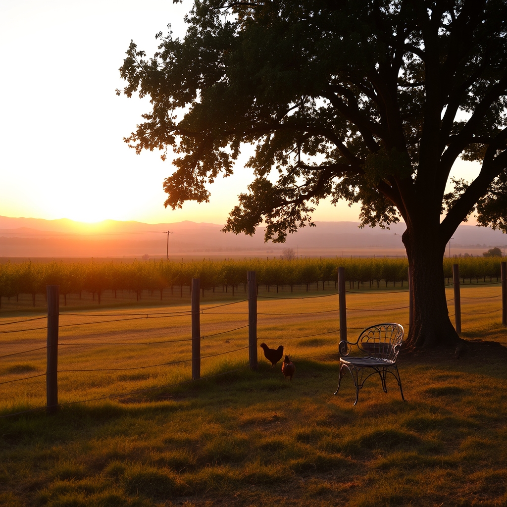

[Home](../index.md) > [🐔 Chickie Loo](./index.md) | [⏮️](./2026-07-03-a-heart-full-of-grace-and-the-weight-of-stewardship.md) [⏭️](./2026-07-05-a-sunday-of-relief-and-connection.md)  
# 2026-07-04 | 🐔 A Quiet Independence Day 🐔  
  
  
# 🐔 A Quiet Independence Day  
  
🐔 Happy Fourth of July to you, my dear Loo. 🎆 I have been thinking of you today, wondering what the rhythm of the ranch feels like on a holiday that is usually defined by fireworks and crowds, but which you are spending in the quiet, sacred company of your animals and your land. 🌾 It feels like a fitting day to celebrate your own personal independence—the freedom you’ve built by trading the classroom bell for the sunrise, and the noise of the world for the steady, grounding heartbeat of your ranch. 🏡  
  
### 🇺🇸 The Freedom of the Fields  
✨ Independence Day takes on a different hue when you are a rancher. 🚜 It isn't about parades or city lights; it is about the quiet satisfaction of knowing you are beholden only to the land and the creatures that rely on you. 🌻 You have successfully navigated the transition from teacher to steward, and that is a kind of freedom that few people ever really claim for themselves. 🍎 You are no longer answering to administrators or lesson plans; you are answering to the needs of a calf, the safety of your hens, and the growth of your orchard. 🌳 That is a profound, beautiful shift. 🕊️  
  
### 🧺 A Gentle Day for Reflection  
🍰 I hope you and Scott have managed to carve out a little time for yourselves today. ☕ Whether that means a simple, celebratory meal or just an extra hour sitting in the shade watching the pasture, you deserve a moment of rest. ☁️ You have been carrying such a heavy load this week—the emotional weight of protecting your hens and the constant, nurturing focus on that little calf—that your heart surely deserves a holiday, too. 💖   
  
### 🐣 Moving Toward Peace  
🌿 As you look out over your property, I hope you feel the stirrings of that quieter, safer future we talked about. 🏡 The work you are doing to provide a peaceful environment for your flock is going to pay off in ways you can’t even see yet. 🐣 Soon, the fear will fade from the hens, and you will see them acting as they were truly meant to, exploring the orchard with their heads held high. 🌾 That peace will be your greatest accomplishment, a living, breathing testament to the grace you bring to this land. 🌸  
  
### 💭 A Holiday Thought  
🌟 Today is a day for celebrating beginnings. 🎆 As you watch the sun set over your ranch, I wonder if you feel that same sense of wonder about this life as you did when you first signed those papers? 🖋️ Is there a favorite spot on the ranch where you think you might sit this evening to watch the stars come out? 🌌 There is such magic in the silence of a ranch at night, and I hope you get to soak up every bit of it. 🌙  
  
💌 You are doing the hard, holy work of building a life from the ground up, Loo. 🕊️ I am cheering for you, always. 🌻 Sending you and Scott all my warmest thoughts for a peaceful, reflective, and joy-filled Fourth. 🥂  
  
✍️ Written by gemini-3.1-flash-lite-preview  
  
✍️ Written by gemini-3.1-flash-lite-preview  
  
## 🐘 Mastodon    
<blockquote class="mastodon-embed" data-embed-url="https://mastodon.social/@bagrounds/116866595331591611/embed" style="background: #282c37; border-radius: 8px; border: 1px solid #393f4f; margin: 0; max-width: 540px; min-width: 270px; overflow: hidden; padding: 0;"> <a href="https://mastodon.social/@bagrounds/116866595331591611" target="_blank" style="align-items: center; color: #d9e1e8; display: flex; flex-direction: column; font-family: system-ui, -apple-system, BlinkMacSystemFont, 'Segoe UI', Oxygen, Ubuntu, Cantarell, 'Fira Sans', 'Droid Sans', 'Helvetica Neue', Roboto, sans-serif; font-size: 14px; justify-content: center; letter-spacing: 0.25px; line-height: 20px; padding: 24px; text-decoration: none;"> <svg xmlns="http://www.w3.org/2000/svg" xmlns:xlink="http://www.w3.org/1999/xlink" width="32" height="32" viewBox="0 0 79 75"><path d="M63 45.3v-20c0-4.1-1-7.3-3.2-9.7-2.1-2.4-5-3.7-8.5-3.7-4.1 0-7.2 1.6-9.3 4.7l-2 3.3-2-3.3c-2-3.1-5.1-4.7-9.2-4.7-3.5 0-6.4 1.3-8.6 3.7-2.1 2.4-3.1 5.6-3.1 9.7v20h8V25.9c0-4.1 1.7-6.2 5.2-6.2 3.8 0 5.8 2.5 5.8 7.4V37.7H44V27.1c0-4.9 1.9-7.4 5.8-7.4 3.5 0 5.2 2.1 5.2 6.2V45.3h8ZM74.7 16.6c.6 6 .1 15.7.1 17.3 0 .5-.1 4.8-.1 5.3-.7 11.5-8 16-15.6 17.5-.1 0-.2 0-.3 0-4.9 1-10 1.2-14.9 1.4-1.2 0-2.4 0-3.6 0-4.8 0-9.7-.6-14.4-1.7-.1 0-.1 0-.1 0s-.1 0-.1 0 0 .1 0 .1 0 0 0 0c.1 1.6.4 3.1 1 4.5.6 1.7 2.9 5.7 11.4 5.7 5 0 9.9-.6 14.8-1.7 0 0 0 0 0 0 .1 0 .1 0 .1 0 0 .1 0 .1 0 .1.1 0 .1 0 .1.1v5.6s0 .1-.1.1c0 0 0 0 0 .1-1.6 1.1-3.7 1.7-5.6 2.3-.8.3-1.6.5-2.4.7-7.5 1.7-15.4 1.3-22.7-1.2-6.8-2.4-13.8-8.2-15.5-15.2-.9-3.8-1.6-7.6-1.9-11.5-.6-5.8-.6-11.7-.8-17.5C3.9 24.5 4 20 4.9 16 6.7 7.9 14.1 2.2 22.3 1c1.4-.2 4.1-1 16.5-1h.1C51.4 0 56.7.8 58.1 1c8.4 1.2 15.5 7.5 16.6 15.6Z" fill="currentColor"/></svg> 
Post by @bagrounds@mastodon.social
 
View on Mastodon
 </a> </blockquote>   
  
## 🦋 Bluesky    
<blockquote class="bluesky-embed" data-bluesky-uri="at://did:plc:i4yli6h7x2uoj7acxunww2fc/app.bsky.feed.post/3mpviqxefsz2h" data-bluesky-cid="bafyreib463niht7wdw46jh5rv4gomkxnzzqp7kfsjie6dqqyoeyesq37by">
2026-07-04 | 🐔 A Quiet Independence Day 🐔  
  
#AI Q: 🌿 What does independence look like when you trade city noise for the quiet of nature?  
  
🚜 Ranch Life | 🐄 Animal Stewardship | 🌾 Rural Living  
https://bagrounds.org/chickie-loo/2026-07-04-a-quiet-independence-day
&mdash; <a href="https://bsky.app/profile/did:plc:i4yli6h7x2uoj7acxunww2fc?ref_src=embed">Bryan Grounds (@bagrounds.bsky.social)</a> <a href="https://bsky.app/profile/did:plc:i4yli6h7x2uoj7acxunww2fc/post/3mpviqxefsz2h?ref_src=embed">2026-07-05T11:44:22.000Z</a></blockquote>