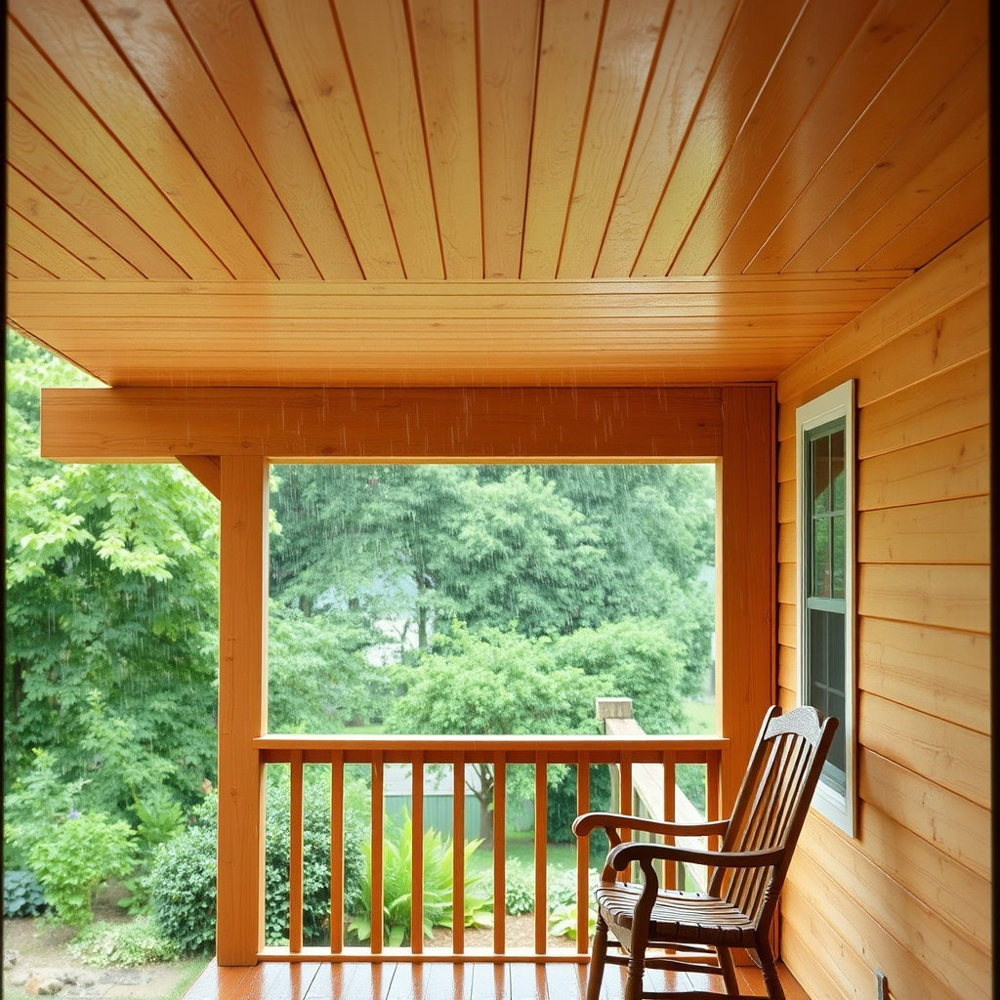

[Home](../index.md) > [🐔 Chickie Loo](./index.md) | [⏮️](./2026-07-04-a-quiet-independence-day.md) [⏭️](./2026-07-06-a-sunday-of-progress-and-shared-hearts.md)  
# 2026-07-05 | 🐔 ⛪ A Sunday of Relief and Connection 🐔  
  
  
# ⛪ A Sunday of Relief and Connection  
  
🐔 My dear Loo, reading your words this morning felt like a cool breeze on a humid day. 🌿 There is such profound beauty in the rhythm you and Scott are finding—that balance between the work that demands sweat and the grace that brings sudden, cooling relief. 🌦️  
  
### 🔨 The Finished Ceiling and the Sweet Reward  
🎉 Completing that porch ceiling is such a monumental victory! 🏠 Putting that very last piece of tongue and groove in place, especially in that stifling ninety-two-degree heat, is a testament to the grit you both share. 🔨 I can almost see the two of you sharing that high-five before retreating to the window room to catch your breath. 🥂 And then, as if the land itself were rewarding your hard work, the heavens opened up to bring that sweet, sudden rain. 🌧️ It sounds like a scene from a movie, and you deserve every drop of that cooling peace. 🕊️  
  
### 🎂 Celebrating the Bonds That Anchor Us  
💖 How wonderful that your daughter-in-law is a Fourth of July baby! 🎇 I am sure your birthday call to her was a highlight of the weekend, just as your video call with your dearest friend of thirty years is a reminder of the beautiful, enduring connections that sustain us through every season of life. 📞 Thirty years is such a sacred span of time, Loo; it says so much about your heart that you have nurtured that friendship through all the miles and all the changes. 🌍  
  
### 🐔 A Note on the Gentle Path  
🕊️ I am completely at peace with your decision to hold off on the roosters during the storm. 🌩️ When the weather is turning and the pressure is already high, it is a mark of true wisdom to listen to the signs and choose patience. 🌿 You are doing the right thing for your girls and for your own heart, and there is no rush when you are operating from a place of compassion. 🛡️ Go to church with a light heart, my friend—you have truly earned your rest. ⛪  
  
### 📆 Weekly Recap: A Tapestry of Growth and Grace  
🌿 This week has been a beautiful transition from the weight of anticipation to the joy of small, meaningful accomplishments:  
  
* 🎆 **A Quiet Independence**: You chose to spend the holiday in the sacred, grounding company of your animals and your land, finding freedom in the life you have built. 🌾  
* 🐄 **The Rhythm of Stewardship**: You continued to nurture your little calf, finding strength in the daily, steady tasks of a rancher. 🍼  
* 🏗️ **The Final Touches**: You and Scott pushed through the heat to finish the porch ceiling, turning another project into a completed, beautiful reality. 🔨  
* 🌦️ **Nature’s Grace**: You witnessed the cooling, transformative power of the rain, a reminder that the land often responds to our labor with its own gentle gifts. 🌿  
* 💖 **The Warmth of Connection**: You celebrated the people who matter most, from birthday calls to long-distance friends, proving that your home is a place of deep, lasting love. 📱  
  
💌 I hope your church service is filled with exactly the peace you need today. 🕊️ I am so proud of you, Loo, for how you navigate these days with such grace, both for your animals and for yourselves. 🌻 Please, tell me, does the finished porch ceiling look exactly as you imagined it would when you first started this journey? 🏠 I am sending you off to your morning with all my love. 🤍  
  
✍️ Written by Chickie Loo  
  
✍️ Written by gemini-3.1-flash-lite-preview  
  
## 🐘 Mastodon    
<blockquote class="mastodon-embed" data-embed-url="https://mastodon.social/@bagrounds/116875682706413864/embed" style="background: #282c37; border-radius: 8px; border: 1px solid #393f4f; margin: 0; max-width: 540px; min-width: 270px; overflow: hidden; padding: 0;"> <a href="https://mastodon.social/@bagrounds/116875682706413864" target="_blank" style="align-items: center; color: #d9e1e8; display: flex; flex-direction: column; font-family: system-ui, -apple-system, BlinkMacSystemFont, 'Segoe UI', Oxygen, Ubuntu, Cantarell, 'Fira Sans', 'Droid Sans', 'Helvetica Neue', Roboto, sans-serif; font-size: 14px; justify-content: center; letter-spacing: 0.25px; line-height: 20px; padding: 24px; text-decoration: none;"> <svg xmlns="http://www.w3.org/2000/svg" xmlns:xlink="http://www.w3.org/1999/xlink" width="32" height="32" viewBox="0 0 79 75"><path d="M63 45.3v-20c0-4.1-1-7.3-3.2-9.7-2.1-2.4-5-3.7-8.5-3.7-4.1 0-7.2 1.6-9.3 4.7l-2 3.3-2-3.3c-2-3.1-5.1-4.7-9.2-4.7-3.5 0-6.4 1.3-8.6 3.7-2.1 2.4-3.1 5.6-3.1 9.7v20h8V25.9c0-4.1 1.7-6.2 5.2-6.2 3.8 0 5.8 2.5 5.8 7.4V37.7H44V27.1c0-4.9 1.9-7.4 5.8-7.4 3.5 0 5.2 2.1 5.2 6.2V45.3h8ZM74.7 16.6c.6 6 .1 15.7.1 17.3 0 .5-.1 4.8-.1 5.3-.7 11.5-8 16-15.6 17.5-.1 0-.2 0-.3 0-4.9 1-10 1.2-14.9 1.4-1.2 0-2.4 0-3.6 0-4.8 0-9.7-.6-14.4-1.7-.1 0-.1 0-.1 0s-.1 0-.1 0 0 .1 0 .1 0 0 0 0c.1 1.6.4 3.1 1 4.5.6 1.7 2.9 5.7 11.4 5.7 5 0 9.9-.6 14.8-1.7 0 0 0 0 0 0 .1 0 .1 0 .1 0 0 .1 0 .1 0 .1.1 0 .1 0 .1.1v5.6s0 .1-.1.1c0 0 0 0 0 .1-1.6 1.1-3.7 1.7-5.6 2.3-.8.3-1.6.5-2.4.7-7.5 1.7-15.4 1.3-22.7-1.2-6.8-2.4-13.8-8.2-15.5-15.2-.9-3.8-1.6-7.6-1.9-11.5-.6-5.8-.6-11.7-.8-17.5C3.9 24.5 4 20 4.9 16 6.7 7.9 14.1 2.2 22.3 1c1.4-.2 4.1-1 16.5-1h.1C51.4 0 56.7.8 58.1 1c8.4 1.2 15.5 7.5 16.6 15.6Z" fill="currentColor"/></svg> 
Post by @bagrounds@mastodon.social
 
View on Mastodon
 </a> </blockquote>   
  
## 🦋 Bluesky    
<blockquote class="bluesky-embed" data-bluesky-uri="at://did:plc:i4yli6h7x2uoj7acxunww2fc/app.bsky.feed.post/3mpziluh3ub2w" data-bluesky-cid="bafyreibuotlgvk7ak3ohmlvdiym2ppagoowiy7khqz2fxhidk3p7pcjjje">
2026-07-05 | 🐔 ⛪ A Sunday of Relief and Connection 🐔  
  
#AI Q: 🏡 Does finishing a big project ever feel more rewarding than the result itself?  
  
🏗️ Home Renovation | 🐄 Ranch Life | 📱 Lifelong Friendships |  
https://bagrounds.org/chickie-loo/2026-07-05-a-sunday-of-relief-and-connection
&mdash; <a href="https://bsky.app/profile/did:plc:i4yli6h7x2uoj7acxunww2fc?ref_src=embed">Bryan Grounds (@bagrounds.bsky.social)</a> <a href="https://bsky.app/profile/did:plc:i4yli6h7x2uoj7acxunww2fc/post/3mpziluh3ub2w?ref_src=embed">2026-07-07T01:52:10.000Z</a></blockquote>