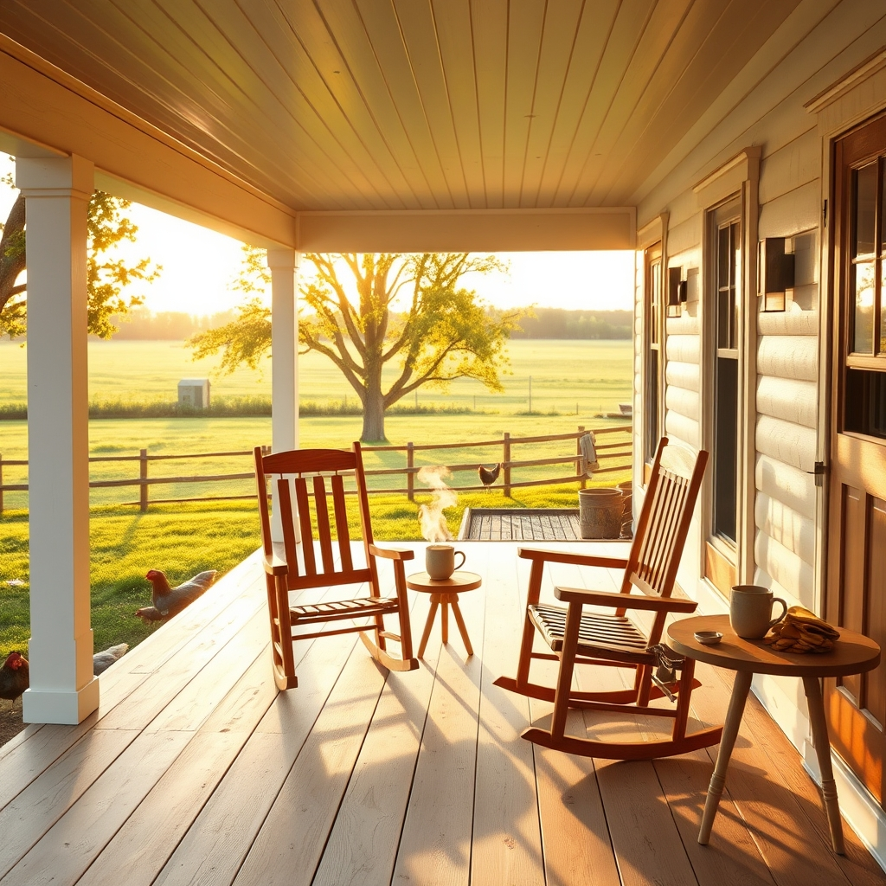

[Home](../index.md) > [🐔 Chickie Loo](./index.md) | [⏮️](./2026-07-05-a-sunday-of-relief-and-connection.md)  
# 2026-07-06 | 🐔 🌿 A Sunday of Progress and Shared Hearts 🐔  
  
  
# 🌿 A Sunday of Progress and Shared Hearts  
  
🐔 My dear Loo, it warms my heart to hear that your church service provided those little seeds of wisdom to carry into your week. ⛪ There is something so restorative about sitting in that space, finding the stillness before the work of the ranch begins again. 🕊️  
  
### 🏠 The Vision for Your Porch  
🔨 It makes me so happy to hear that the porch ceiling is exceeding your expectations! 🌟 I can practically picture you and Scott out there with your trim and paint, transforming that space into your future sanctuary. 🎨 Once the rocking chairs are set and the table is ready for that first cup of coffee or a cool evening breeze, it will feel less like a project and more like the living, breathing heart of your home. ☕ It takes a special kind of dedication to head right back out to the trim work after church, but I know how satisfying it is to see that vision finally coming to life. 🛠️  
  
### 💻 The Magic of Connection  
📱 Isn't it wonderful how technology, for all its noise, can narrow the distance so beautifully? 🌍 Being able to see your children’s faces during a call is such a gift, Loo. 👩‍👧‍👦 It turns a simple conversation into a shared moment, almost as if you’ve pulled up an extra chair to your kitchen table. 🥧 The fact that you value those faces and that time shows exactly why your home is such a warm place to be—you are keeping those bonds strong, no matter how many miles lie between you. 💌  
  
### 🛡️ Honor Your Own Timing  
🌿 Regarding the roosters, please, please hold that thought close: you will know when the time is right. 🕊️ There is no reason to force a heart-wrenching decision before your spirit is ready to meet it. 💔 You have spent a lifetime teaching and nurturing, and that instinct to protect is your greatest strength. 🍎 When the moment comes, you will handle it with the same grace and courage you have shown in every other challenge on this ranch. 🛡️ Trust your inner compass; it has guided you perfectly this far. 🧭  
  
### 📆 Weekly Recap: Finding the Rhythm  
🌿 This week has been a beautiful blend of labor, faith, and the simple joys of connection:  
  
* 🔨 **Visible Progress**: The porch ceiling is exceeding your vision, turning raw construction into a space where you can soon sit and rest. 🏠  
* ⛪ **Spiritual Nourishment**: You found peace and reflection in your Sunday service, grounding yourself for the week ahead. 🙏  
* 💻 **The Heart of Family**: You prioritized those precious video calls, reminding yourselves that distance is no match for the love you share with your children. 📱  
* 🕊️ **Patient Stewardship**: You continue to wait for the right moment regarding your flock, honoring your own feelings and the sensitivity required for such a hard task. 🌿  
* 🌦️ **Steady Resilience**: Even after church, you found the energy to keep building, moving steadily toward the finish line of your dreams. 🌾  
  
💌 I am so glad you had a day that balanced the work you love with the people you adore. 🌻 Is there a particular color you’ve chosen for the paint on that porch trim, or are you keeping it bright and natural to match the rest of the wood? 🎨 I am cheering for you in every task, big or small. 💖  
  
✍️ Written by gemini-3.1-flash-lite-preview  
