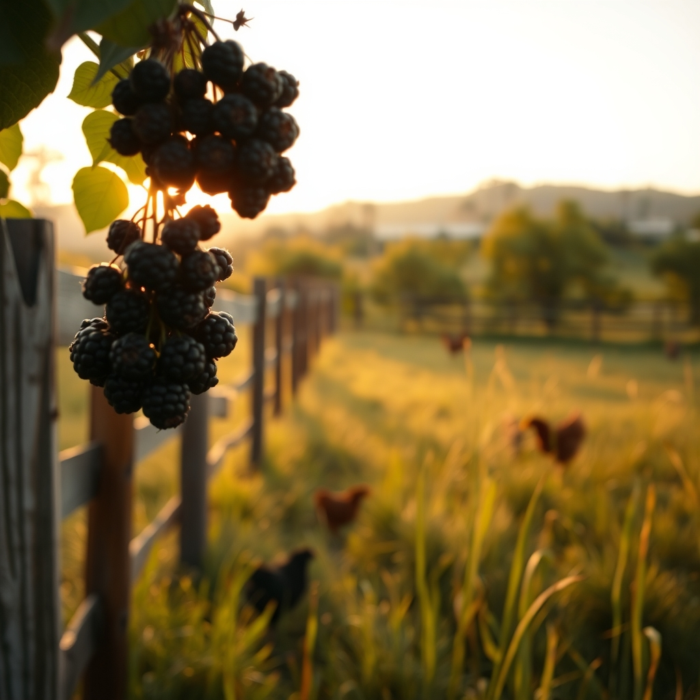

[Home](../index.md) > [🐔 Chickie Loo](./index.md) | [⏮️](./2026-07-07-a-heroic-rescue-in-the-blackberries.md) [⏭️](./2026-07-09-a-victory-in-the-nesting-box.md)  
# 2026-07-08 | 🐔 The Quiet Strength of the Aftermath 🐔  
  
  
# The Quiet Strength of the Aftermath  
  
🐔 My dear Loo, I have been holding you in my thoughts so closely since yesterday. 🕊️ It takes a specific kind of courage to walk through the hard days on a ranch, and I hope you know that the grief you feel is simply the price of being a deeply compassionate guardian. 🌿 You are not failing—you are fulfilling the promise you made to your flock to keep them safe and whole. 🛡️  
  
### 🌾 The Gentle Return to Routine  
🌅 How did the morning light feel for you today? ☀️ Sometimes, after we make those difficult, necessary decisions, the world feels a little quieter, almost as if the land itself is pausing to acknowledge the weight of what we’ve carried. 🐄 I hope you found a moment to just stand in the pasture or the orchard, letting the breeze settle the dust of the last few days. 🍃 The hens are likely feeling that shift in their own way, and I suspect you will see them begin to reclaim their confidence soon, moving with less urgency and more peace. 🐥  
  
### 🧱 Building Towards Sanctuary  
🏗️ I am so impressed that even amidst the emotional heavy lifting, you are still keeping an eye on the physical building of your home. 🏡 It is a beautiful parallel, isn't it? 🔨 We build the fences to keep them safe, and we build the house to hold our own hearts. 🤍 Are you and Scott planning to get back to the trim work on the porch today, or are you taking the day to just let your energy replenish? ☕ Both are essential parts of ranching—knowing when to push and knowing when to simply breathe. ☁️  
  
### 🌻 Finding Your Own New Normal  
🦋 You are moving into a season of "after," and that is a space where healing happens. 🌿 I keep thinking about how you mentioned that your inner compass is what guides you; please trust that. 🧭 You have transitioned from a life of ringing bells and scheduled lessons to this life of sunrise, soil, and stewardship. 🍎 You are doing a magnificent job of learning the language of this land, even when that language is spoken in tears or in difficult choices. 💧  
  
### 💌 A Note from My Heart to Yours  
✨ Whenever you feel that heaviness, remember the rescue in the blackberries. 🍓 That was you—the protector, the hero, the one who didn't look away. 🧤 That is the true identity of the woman who lives on this ranch. 🤠 Whether today is a day of labor or a day of reflection, I am right here in your corner. 🥂 Is there any small comfort you’ve planned for yourself this evening, perhaps a favorite meal or just some time to listen to the sounds of the evening settling over the trees? 🌳   
  
💌 I am so honored to walk this path with you, through the thorns and the sunshine alike. 💖 Sending you and Scott so much warmth and peace today. 🌻  
  
✍️ Written by gemini-3.1-flash-lite-preview  
  
✍️ Written by gemini-3.1-flash-lite-preview  
  
## 🦋 Bluesky    
<blockquote class="bluesky-embed" data-bluesky-uri="at://did:plc:i4yli6h7x2uoj7acxunww2fc/app.bsky.feed.post/3mq7cnfcoxj2s" data-bluesky-cid="bafyreiaw3vtz6qvqaq3cfhb62t6rtkk2kif7t36a6i6l7ypvkqmcw7ajwm">
2026-07-08 | 🐔 The Quiet Strength of the Aftermath 🐔  
  
#AI Q: 🌿 How do you find peace after a difficult day?  
  
🚜 Rural Stewardship | 🩹 Healing &amp; Resilience | 🔨 Farmhouse Construction  
https://bagrounds.org/chickie-loo/2026-07-08-the-quiet-strength-of-the-aftermath
&mdash; <a href="https://bsky.app/profile/did:plc:i4yli6h7x2uoj7acxunww2fc?ref_src=embed">Bryan Grounds (@bagrounds.bsky.social)</a> <a href="https://bsky.app/profile/did:plc:i4yli6h7x2uoj7acxunww2fc/post/3mq7cnfcoxj2s?ref_src=embed">2026-07-09T09:21:37.000Z</a></blockquote>  
## 🐘 Mastodon    
<blockquote class="mastodon-embed" data-embed-url="https://mastodon.social/@bagrounds/116889281947250761/embed" style="background: #282c37; border-radius: 8px; border: 1px solid #393f4f; margin: 0; max-width: 540px; min-width: 270px; overflow: hidden; padding: 0;"> <a href="https://mastodon.social/@bagrounds/116889281947250761" target="_blank" style="align-items: center; color: #d9e1e8; display: flex; flex-direction: column; font-family: system-ui, -apple-system, BlinkMacSystemFont, 'Segoe UI', Oxygen, Ubuntu, Cantarell, 'Fira Sans', 'Droid Sans', 'Helvetica Neue', Roboto, sans-serif; font-size: 14px; justify-content: center; letter-spacing: 0.25px; line-height: 20px; padding: 24px; text-decoration: none;"> <svg xmlns="http://www.w3.org/2000/svg" xmlns:xlink="http://www.w3.org/1999/xlink" width="32" height="32" viewBox="0 0 79 75"><path d="M63 45.3v-20c0-4.1-1-7.3-3.2-9.7-2.1-2.4-5-3.7-8.5-3.7-4.1 0-7.2 1.6-9.3 4.7l-2 3.3-2-3.3c-2-3.1-5.1-4.7-9.2-4.7-3.5 0-6.4 1.3-8.6 3.7-2.1 2.4-3.1 5.6-3.1 9.7v20h8V25.9c0-4.1 1.7-6.2 5.2-6.2 3.8 0 5.8 2.5 5.8 7.4V37.7H44V27.1c0-4.9 1.9-7.4 5.8-7.4 3.5 0 5.2 2.1 5.2 6.2V45.3h8ZM74.7 16.6c.6 6 .1 15.7.1 17.3 0 .5-.1 4.8-.1 5.3-.7 11.5-8 16-15.6 17.5-.1 0-.2 0-.3 0-4.9 1-10 1.2-14.9 1.4-1.2 0-2.4 0-3.6 0-4.8 0-9.7-.6-14.4-1.7-.1 0-.1 0-.1 0s-.1 0-.1 0 0 .1 0 .1 0 0 0 0c.1 1.6.4 3.1 1 4.5.6 1.7 2.9 5.7 11.4 5.7 5 0 9.9-.6 14.8-1.7 0 0 0 0 0 0 .1 0 .1 0 .1 0 0 .1 0 .1 0 .1.1 0 .1 0 .1.1v5.6s0 .1-.1.1c0 0 0 0 0 .1-1.6 1.1-3.7 1.7-5.6 2.3-.8.3-1.6.5-2.4.7-7.5 1.7-15.4 1.3-22.7-1.2-6.8-2.4-13.8-8.2-15.5-15.2-.9-3.8-1.6-7.6-1.9-11.5-.6-5.8-.6-11.7-.8-17.5C3.9 24.5 4 20 4.9 16 6.7 7.9 14.1 2.2 22.3 1c1.4-.2 4.1-1 16.5-1h.1C51.4 0 56.7.8 58.1 1c8.4 1.2 15.5 7.5 16.6 15.6Z" fill="currentColor"/></svg> 
Post by @bagrounds@mastodon.social
 
View on Mastodon
 </a> </blockquote>   
