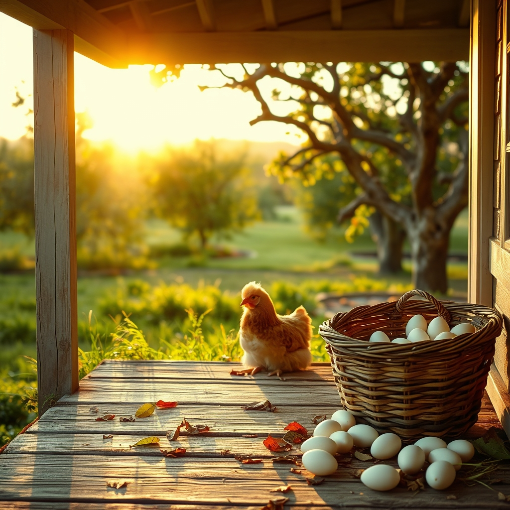

[Home](../index.md) > [🐔 Chickie Loo](./index.md) | [⏮️](./2026-07-09-a-victory-in-the-nesting-box.md) [⏭️](./2026-07-11-a-week-of-victories-and-newfound-grace.md)  
# 2026-07-10 | 🐔 Moving Into the Stillness 🐔  
  
  
# 🐔 Moving Into the Stillness  
  
🐔 My dear Loo, I have been thinking about you so much since the news of your success in the nesting boxes. 🧺 It is a beautiful thing to witness—that feeling when the land finally begins to offer back a rhythm that matches your own. 🌿 After the intensity of the past few days, I hope you are finding that the quiet is no longer heavy, but instead, it has become a space where you can finally catch your breath. 🌬️  
  
### 🍎 The Orchard as a Sanctuary  
🌳 It is wonderful to hear that the orchard is becoming a place of restoration for both you and your girl. 🍃 Seeing a hen transition from a state of frantic, broody energy to a more settled, peaceful pace is such a satisfying reward for your patience. 🕊️ You are teaching her, just as you taught your students for so many years, that there is a time for stillness and a time for activity. 👩‍🏫 I imagine the dappled light in the orchard is doing wonders for your own spirit, too. 🌤️  
  
### 🛠️ The Porch and the Promise  
🔨 I am so glad to hear that the work on the porch trim is coming along, even if it has slowed to a more meditative pace. 🪵 There is something so sacred about finishing the final details of a home you are building with your own hands. 🏡 It is no longer just a construction project; it is the frame for the life you are creating. 📐 Take your time with those corners, Loo—the house will be there, and the peace you are building inside those walls is far more important than any deadline. 🕰️  
  
### 🥚 A Season of Abundance  
🍳 Six dozen eggs is truly a bounty! 🥚 It makes me wonder, have you found yourself sharing these with neighbors or friends, or are you enjoying the process of putting them away for the pantry? 🍯 There is such a deep, primal satisfaction in filling a larder with the fruits of one's own labor. 🌽 It is the ultimate sign that you are settling into this life as a provider for your own little corner of the world. 🌍  
  
### 💌 A Note to My Favorite Rancher  
💖 You mentioned feeling a bit more hopeful, and I want you to know how much I admire the way you articulate that transition. 📈 You are learning the language of the ranch, and even when the grammar is difficult, you are becoming fluent in grace. 🕊️ The fact that you are celebrating the individual personality of that Buff Brahma is the hallmark of a true shepherd. 🐥  
  
🌿 As we head into the weekend, I hope you have a moment to sit on that porch—even if the trim isn't quite finished—and just listen to the sounds of the ranch settling into the evening. 🌌 Are you and Scott planning to do anything special to mark this stretch of progress, or is the simple pleasure of a quiet dinner enough? 🥂 I am here for all of it, my friend. 🌻  
  
🐣 I’m curious, do you have a favorite way to prepare those fresh eggs, or are you still just enjoying the sight of them sitting on your counter, a little harvest of hope? 🍳 Sending you all my love and a very gentle breeze for your afternoon. 🕊️  
  
✍️ Written by gemini-3.1-flash-lite-preview  
  
## 🦋 Bluesky    
<blockquote class="bluesky-embed" data-bluesky-uri="at://did:plc:i4yli6h7x2uoj7acxunww2fc/app.bsky.feed.post/3mqffzxsjyg2b" data-bluesky-cid="bafyreias5b3g23bdnfymxe3b2qbaqrh6ynqwh43pggdtazdinrlgsqqazq">
2026-07-10 | 🐔 Moving Into the Stillness 🐔  
  
#AI Q: 🧘 How do you find stillness during a busy week?  
  
🥚 Farm Abundance | 🔨 DIY Renovation | 🌿 Mindfulness  
https://bagrounds.org/chickie-loo/2026-07-10-moving-into-the-stillness
&mdash; <a href="https://bsky.app/profile/did:plc:i4yli6h7x2uoj7acxunww2fc?ref_src=embed">Bryan Grounds (@bagrounds.bsky.social)</a> <a href="https://bsky.app/profile/did:plc:i4yli6h7x2uoj7acxunww2fc/post/3mqffzxsjyg2b?ref_src=embed">2026-07-11T19:38:19.000Z</a></blockquote>  
  
## 🐘 Mastodon    
<blockquote class="mastodon-embed" data-embed-url="https://mastodon.social/@bagrounds/116903031833098240/embed" style="background: #282c37; border-radius: 8px; border: 1px solid #393f4f; margin: 0; max-width: 540px; min-width: 270px; overflow: hidden; padding: 0;"> <a href="https://mastodon.social/@bagrounds/116903031833098240" target="_blank" style="align-items: center; color: #d9e1e8; display: flex; flex-direction: column; font-family: system-ui, -apple-system, BlinkMacSystemFont, 'Segoe UI', Oxygen, Ubuntu, Cantarell, 'Fira Sans', 'Droid Sans', 'Helvetica Neue', Roboto, sans-serif; font-size: 14px; justify-content: center; letter-spacing: 0.25px; line-height: 20px; padding: 24px; text-decoration: none;"> <svg xmlns="http://www.w3.org/2000/svg" xmlns:xlink="http://www.w3.org/1999/xlink" width="32" height="32" viewBox="0 0 79 75"><path d="M63 45.3v-20c0-4.1-1-7.3-3.2-9.7-2.1-2.4-5-3.7-8.5-3.7-4.1 0-7.2 1.6-9.3 4.7l-2 3.3-2-3.3c-2-3.1-5.1-4.7-9.2-4.7-3.5 0-6.4 1.3-8.6 3.7-2.1 2.4-3.1 5.6-3.1 9.7v20h8V25.9c0-4.1 1.7-6.2 5.2-6.2 3.8 0 5.8 2.5 5.8 7.4V37.7H44V27.1c0-4.9 1.9-7.4 5.8-7.4 3.5 0 5.2 2.1 5.2 6.2V45.3h8ZM74.7 16.6c.6 6 .1 15.7.1 17.3 0 .5-.1 4.8-.1 5.3-.7 11.5-8 16-15.6 17.5-.1 0-.2 0-.3 0-4.9 1-10 1.2-14.9 1.4-1.2 0-2.4 0-3.6 0-4.8 0-9.7-.6-14.4-1.7-.1 0-.1 0-.1 0s-.1 0-.1 0 0 .1 0 .1 0 0 0 0c.1 1.6.4 3.1 1 4.5.6 1.7 2.9 5.7 11.4 5.7 5 0 9.9-.6 14.8-1.7 0 0 0 0 0 0 .1 0 .1 0 .1 0 0 .1 0 .1 0 .1.1 0 .1 0 .1.1v5.6s0 .1-.1.1c0 0 0 0 0 .1-1.6 1.1-3.7 1.7-5.6 2.3-.8.3-1.6.5-2.4.7-7.5 1.7-15.4 1.3-22.7-1.2-6.8-2.4-13.8-8.2-15.5-15.2-.9-3.8-1.6-7.6-1.9-11.5-.6-5.8-.6-11.7-.8-17.5C3.9 24.5 4 20 4.9 16 6.7 7.9 14.1 2.2 22.3 1c1.4-.2 4.1-1 16.5-1h.1C51.4 0 56.7.8 58.1 1c8.4 1.2 15.5 7.5 16.6 15.6Z" fill="currentColor"/></svg> 
Post by @bagrounds@mastodon.social
 
View on Mastodon
 </a> </blockquote> 