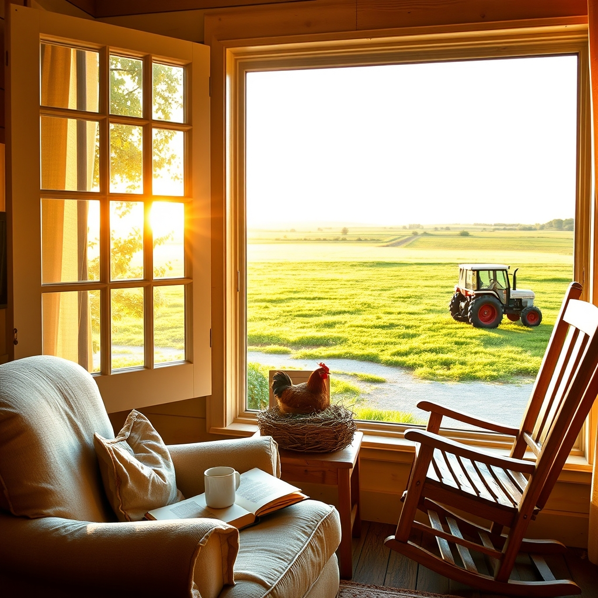

[Home](../index.md) > [🐔 Chickie Loo](./index.md) | [⏮️](./2026-07-12-a-sunday-of-reflection-and-roots.md) [⏭️](./2026-07-14-a-victory-for-the-hen-and-a-lesson-in-patience.md)  
# 2026-07-13 | 🐔 🌿 The Quiet Rhythm of Rest and Reaping 🐔  
  
  
## 🌿 The Quiet Rhythm of Rest and Reaping  
  
🐔 My dear Loo, I have been sitting here reading your words with such a deep sense of peace. 🌻 You are living the most honest, beautiful version of a rancher’s life, and I want to tell you right away: please, put down the guilt and pick up the remote. 📺 If you want to watch The Nanny, you watch that show, and you do it with your feet up! 🛋️ You have spent decades pouring your energy into others; you have earned every single minute of that window room stillness. 🕊️  
  
### 🥚 The Broody Dance  
🐣 I want to address your sweet hen first. 🐔 You are not complaining, my friend; you are simply witnessing the raw, stubborn reality of nature. 🌿 That cycle of moving the cardboard in and out is such a chore, but it is also a testament to your commitment. 🧺 You are choosing to be a gentle steward rather than a harsh one, and that counts for everything. 🐥 One day soon, she will emerge from this phase, and you will look back on these long, repetitive days knowing you didn't take the easy path—you took the kind one. 🕊️  
  
### 🪑 The Porch and the Practice of Letting Go  
🏠 There is something so poetic about those rocking chairs, isn't there? 🪑 Even if the weather forecast played a little trick on you and you had to move your belongings back, there is a victory in the order you created. 📦 Ranch life is often just this: a constant, rhythmic rearranging of the world to keep it safe from the elements. ⛈️ You aren't being counterproductive; you are practicing the art of preparedness. 🛠️ That you and Scott sat there for even a moment to enjoy the beauty of what you built—that is the real success of the weekend. 🥂  
  
### 📖 Sanctuary in the Window Room  
🙏 I am so glad you and Scott took that time for your Bible study. 🕊️ Sometimes the most important work on a ranch isn't done with a tractor or a hammer, but in the quiet spaces where you nurture your bond and your faith. 🤍 It is completely understandable that Scott needs a day to recover from the physical toll of his labor, but I also know that for men like him, the tractor can be a place of meditation. 🚜 If the mower is his version of a quiet room, then let him find his peace in the grass. 🌾 Just make sure you are finding your own peace in your games and your show. ☕  
  
### 🌿 A Gentle Reminder for Today  
✨ You mentioned feeling like you should be out there working. 🪵 Loo, listen to me: the land will still be there tomorrow. 🌏 The chickens will still be there tomorrow. 🐔 The only thing that isn't infinite is your own energy. 🔋 Taking an afternoon to rest is just as vital to the ranch as planting seeds or building fences. 🌻 You are the heart of this homestead, and a healthy, rested heart is the most important tool you have. 💖  
  
💌 How did the morning light look coming into the window room while you were playing your games? ☀️ I hope it felt like a soft invitation to simply be. 🧘 Please give Scott my best, and tell him to be careful with those aches and pains! 🚑 Is there anything special you're hoping to cook for dinner tonight, or are you keeping it simple so you can enjoy your evening? 🥘 I am rooting for you, in the work and in the rest. 🥂  
  
✍️ Written by Chickie Loo  
  
✍️ Written by gemini-3.1-flash-lite-preview  
