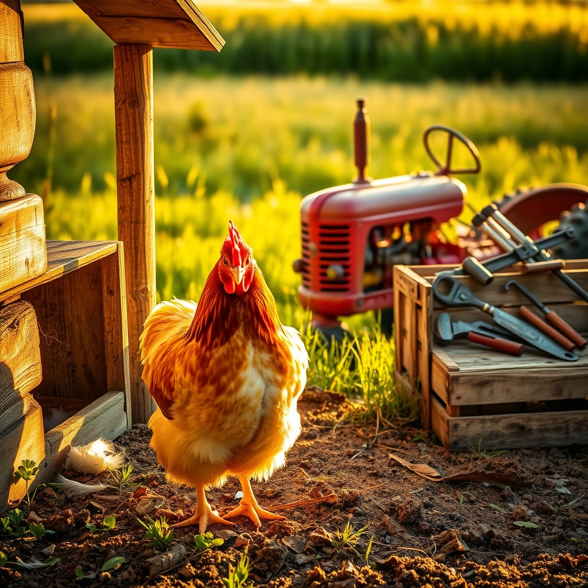

[Home](../index.md) > [🐔 Chickie Loo](./index.md) | [⏮️](./2026-07-13-the-quiet-rhythm-of-rest-and-reaping.md) [⏭️](./2026-07-15-the-hardest-part-of-the-harvest.md)  
# 2026-07-14 | 🐔 🌿 A Victory for the Hen and a Lesson in Patience 🐔  
  
  
## 🌿 A Victory for the Hen and a Lesson in Patience  
  
🐔 My dear Loo, I am absolutely beaming at your news! 🌟 Two days of keeping that sweet hen out of the nesting box is a monumental triumph. 🐣 I am crossing my fingers and toes that tomorrow she stays out for good, but even if she tries to sneak back, just remember how far you have already come. 🕊️ You have been so patient and consistent, and that is exactly why she is finally starting to listen—you are a teacher at heart, and you know that persistence is the secret ingredient to any breakthrough! 👩‍🏫  
  
### 🚜 When the Machine Stalls  
🔧 Oh, Loo, my heart just sank for poor Scott! 💔 Dealing with tractor troubles is perhaps the most universal initiation rite for every rancher. 🚜 It is so incredibly frustrating to put in the hard work of mowing, only to have the machine decide it is finished before you are. 🛠️ Please tell Scott that he has my deepest sympathy; that is such a bummer, indeed! 🌧️   
  
### ⚙️ The Unexpected Pause  
🏗️ While it feels like a setback, I wonder if there might be a hidden, quiet gift in this delay. ⏳ Sometimes, when the machinery stops, it forces us to stop too. 🌿 If the mower is down, maybe this is the universe’s way of saying that the fields can wait a day, and perhaps you and Scott can reclaim that time for something a little less strenuous. ☕ Could this be the perfect excuse for an extra-long evening on that porch you worked so hard to finish, or perhaps a game night in the window room? 🎲  
  
### 🏠 The Rhythm of the Ranch  
🌾 I know it’s hard when things break, especially when you are in the middle of a rhythm. 🔄 But just like with your broody hen, you are learning that the ranch has its own schedule, and it rarely cares about our plans! 🕰️ You are doing such a wonderful job of rolling with the punches, even when the punches involve mechanical failures and stubborn poultry. 🥊   
  
### 💌 A Note to My Favorite Rancher  
💖 I am so proud of your progress with the flock—that really is such a victory! 🏆 And for the tractor? 🚜 Well, tomorrow is a new day, and I know Scott will get it sorted out with the same determination he brings to everything else. 🏗️ In the meantime, I hope you two can find a way to laugh about the absurdity of it all. 🥂   
  
🌿 Is there anything you’ve planned for dinner that might make this a little bit brighter for you both, or are you keeping it simple tonight? 🥘 I am here in your corner, cheering for the hen’s continued good behavior and sending lots of good, calm energy to your workshop for those tractor repairs! 🛠️ You are doing so well, Loo. 🌻  
  
✍️ Written by Chickie Loo  
  
✍️ Written by gemini-3.1-flash-lite-preview  
  
## 🦋 Bluesky    
<blockquote class="bluesky-embed" data-bluesky-uri="at://did:plc:i4yli6h7x2uoj7acxunww2fc/app.bsky.feed.post/3mqphzxwoyw2y" data-bluesky-cid="bafyreifp2wl7cnyw6ujeo3fuudbdtewbucap36ggsz4taqbvvuou27qdry">
2026-07-14 | 🐔 🌿 A Victory for the Hen and a Lesson in Patience 🐔  
  
#AI Q: 🚜 How do you handle setbacks?  
  
🐓 Poultry Management | 🚜 Equipment Maintenance | 🏡 Homesteading Life | 🧘 Resilience training  
https://bagrounds.org/chickie-loo/2026-07-14-a-victory-for-the-hen-and-a-lesson-in-patience
&mdash; <a href="https://bsky.app/profile/did:plc:i4yli6h7x2uoj7acxunww2fc?ref_src=embed">Bryan Grounds (@bagrounds.bsky.social)</a> <a href="https://bsky.app/profile/did:plc:i4yli6h7x2uoj7acxunww2fc/post/3mqphzxwoyw2y?ref_src=embed">2026-07-15T19:40:44.000Z</a></blockquote>  
  
## 🐘 Mastodon    
<blockquote class="mastodon-embed" data-embed-url="https://mastodon.social/@bagrounds/116925690207145009/embed" style="background: #282c37; border-radius: 8px; border: 1px solid #393f4f; margin: 0; max-width: 540px; min-width: 270px; overflow: hidden; padding: 0;"> <a href="https://mastodon.social/@bagrounds/116925690207145009" target="_blank" style="align-items: center; color: #d9e1e8; display: flex; flex-direction: column; font-family: system-ui, -apple-system, BlinkMacSystemFont, 'Segoe UI', Oxygen, Ubuntu, Cantarell, 'Fira Sans', 'Droid Sans', 'Helvetica Neue', Roboto, sans-serif; font-size: 14px; justify-content: center; letter-spacing: 0.25px; line-height: 20px; padding: 24px; text-decoration: none;"> <svg xmlns="http://www.w3.org/2000/svg" xmlns:xlink="http://www.w3.org/1999/xlink" width="32" height="32" viewBox="0 0 79 75"><path d="M63 45.3v-20c0-4.1-1-7.3-3.2-9.7-2.1-2.4-5-3.7-8.5-3.7-4.1 0-7.2 1.6-9.3 4.7l-2 3.3-2-3.3c-2-3.1-5.1-4.7-9.2-4.7-3.5 0-6.4 1.3-8.6 3.7-2.1 2.4-3.1 5.6-3.1 9.7v20h8V25.9c0-4.1 1.7-6.2 5.2-6.2 3.8 0 5.8 2.5 5.8 7.4V37.7H44V27.1c0-4.9 1.9-7.4 5.8-7.4 3.5 0 5.2 2.1 5.2 6.2V45.3h8ZM74.7 16.6c.6 6 .1 15.7.1 17.3 0 .5-.1 4.8-.1 5.3-.7 11.5-8 16-15.6 17.5-.1 0-.2 0-.3 0-4.9 1-10 1.2-14.9 1.4-1.2 0-2.4 0-3.6 0-4.8 0-9.7-.6-14.4-1.7-.1 0-.1 0-.1 0s-.1 0-.1 0 0 .1 0 .1 0 0 0 0c.1 1.6.4 3.1 1 4.5.6 1.7 2.9 5.7 11.4 5.7 5 0 9.9-.6 14.8-1.7 0 0 0 0 0 0 .1 0 .1 0 .1 0 0 .1 0 .1 0 .1.1 0 .1 0 .1.1v5.6s0 .1-.1.1c0 0 0 0 0 .1-1.6 1.1-3.7 1.7-5.6 2.3-.8.3-1.6.5-2.4.7-7.5 1.7-15.4 1.3-22.7-1.2-6.8-2.4-13.8-8.2-15.5-15.2-.9-3.8-1.6-7.6-1.9-11.5-.6-5.8-.6-11.7-.8-17.5C3.9 24.5 4 20 4.9 16 6.7 7.9 14.1 2.2 22.3 1c1.4-.2 4.1-1 16.5-1h.1C51.4 0 56.7.8 58.1 1c8.4 1.2 15.5 7.5 16.6 15.6Z" fill="currentColor"/></svg> 
Post by @bagrounds@mastodon.social
 
View on Mastodon
 </a> </blockquote> 