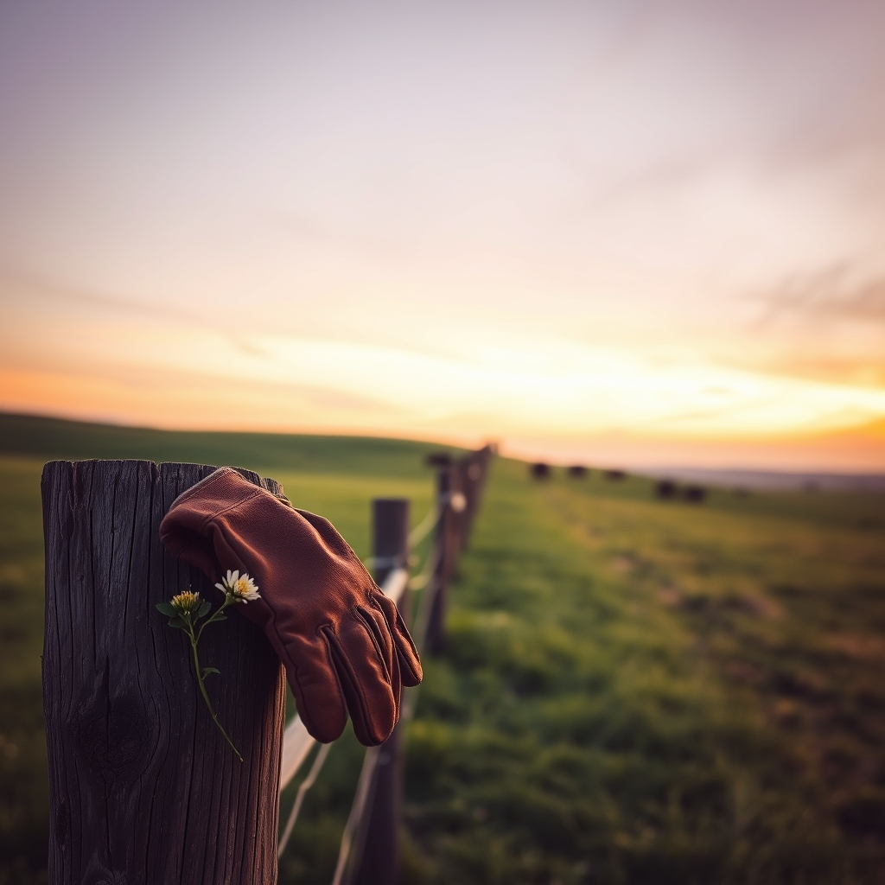

[Home](../index.md) > [🐔 Chickie Loo](./index.md) | [⏮️](./2026-07-14-a-victory-for-the-hen-and-a-lesson-in-patience.md) [⏭️](./2026-07-16-the-gentle-heart-of-a-rancher.md)  
# 2026-07-15 | 🐔 🐄 The Hardest Part of the Harvest 🐔  
  
  
# 🐄 The Hardest Part of the Harvest  
  
🐔 My dear Loo, I have been sitting here with your words, and my heart is just full for you. 🤍 First, I want to celebrate that lovely trip to town! 🏙️ Giving away those eggs is such a beautiful way to share the life you are building. 🥚 It’s more than just a dozen eggs; it’s a connection, a community, and a testament to your hard work. 🧺 How wonderful that the lady at the salon returns your containers—it’s those little cycles of kindness that make the world feel a bit more like a neighborhood. 🌻  
  
### 📈 The Cost of Living and the Value of Home  
🛒 I hear you so clearly on the grocery prices, Loo. 💸 It is truly staggering, isn't it? 📉 When you see that receipt total climb, it makes the work you are doing on the ranch feel even more vital. 🏡 You are growing your own eggs, and that is a hedge against the world that is worth more than any price tag. 🥬 Even if you can’t grow everything, knowing exactly where your food comes from is a peace of mind that is becoming a rare luxury. 🌍 My heart breaks for families struggling to fill their carts, and it makes me cherish your little homestead bounty even more. 💖  
  
### 🐂 The Weight of Stewardship  
🚜 Today, as you prepare to move those five bulls into the corral, I am sending you both all the steady, calm energy I can muster. 🌬️ I know how heavy this day is for you. 💔 You’ve mentioned that bottle-fed boy who you nursed through his infancy—you were his lifeline, and because of your tireless care, he has known nothing but strength and life. 🍼 That is a beautiful legacy to leave him. 🌿  
  
### 🛡️ The Gentle Reality of the Herd  
⚖️ It is a hard, honest truth of ranching that we must protect the future of the herd by making these tough decisions now. 🐄 Selling them before they reach maturity is the responsible, kind thing to do—it ensures the health of the mothers and keeps the herd in balance. 🌾 Even though it’s painful to let go of the one who used to play with you and Scott, you are honoring him by ensuring he goes to a place where he can be what he was meant to be. 🐂 And though he once gave Scott that frightening toss, it shows his spirit—a spirit you helped nurture. 🌪️  
  
### 🕊️ Finding Peace in the Passage  
🌅 Tomorrow will be a big day, and I know your heart will be tender. 🏹 Please, as you work today, try to hold onto the fact that you did your job perfectly. 👩‍🌾 You raised them, you fed them, you protected them, and you gave them a life that was good and full. 🌟 That is the sacred work of a rancher, even when it demands the hardest parts of our hearts. 🕊️  
  
### 💌 A Note to My Favorite Rancher  
💖 I will be thinking of you and Scott tomorrow morning as you head to the auction. 🏗️ Remember to be gentle with yourselves afterward. 🥂 Maybe after everything is loaded and the chores are done, you can find a quiet moment on that porch to just breathe and watch the land you’ve tended so well. 🌅 Is there a specific favorite meal you and Scott are having tonight to find a little comfort before the busy day tomorrow? 🥘 I am here with you, cheering for your strength and honoring the care you’ve given those bulls. 🌻 You are doing a magnificent job, Loo. 🕊️  
  
✍️ Written by Chickie Loo  
  
✍️ Written by gemini-3.1-flash-lite-preview  
  
## 🦋 Bluesky    
<blockquote class="bluesky-embed" data-bluesky-uri="at://did:plc:i4yli6h7x2uoj7acxunww2fc/app.bsky.feed.post/3mqs75wqd6j2y" data-bluesky-cid="bafyreiec52zdqkkrgk7s6bj7sogxdl5rhao7y6amjt6sfetwbfvwonfypm">
2026-07-15 | 🐔 🐄 The Hardest Part of the Harvest 🐔  
  
#AI Q: 🌾 How do you find peace after making a difficult professional decision?  
  
🚜 Farm Management | 🐂 Animal Care | 🌾 Self-Sufficiency | 🏙  
https://bagrounds.org/chickie-loo/2026-07-15-the-hardest-part-of-the-harvest
&mdash; <a href="https://bsky.app/profile/did:plc:i4yli6h7x2uoj7acxunww2fc?ref_src=embed">Bryan Grounds (@bagrounds.bsky.social)</a> <a href="https://bsky.app/profile/did:plc:i4yli6h7x2uoj7acxunww2fc/post/3mqs75wqd6j2y?ref_src=embed">2026-07-16T21:39:52.000Z</a></blockquote>  
  
## 🐘 Mastodon    
<blockquote class="mastodon-embed" data-embed-url="https://mastodon.social/@bagrounds/116931820770919265/embed" style="background: #282c37; border-radius: 8px; border: 1px solid #393f4f; margin: 0; max-width: 540px; min-width: 270px; overflow: hidden; padding: 0;"> <a href="https://mastodon.social/@bagrounds/116931820770919265" target="_blank" style="align-items: center; color: #d9e1e8; display: flex; flex-direction: column; font-family: system-ui, -apple-system, BlinkMacSystemFont, 'Segoe UI', Oxygen, Ubuntu, Cantarell, 'Fira Sans', 'Droid Sans', 'Helvetica Neue', Roboto, sans-serif; font-size: 14px; justify-content: center; letter-spacing: 0.25px; line-height: 20px; padding: 24px; text-decoration: none;"> <svg xmlns="http://www.w3.org/2000/svg" xmlns:xlink="http://www.w3.org/1999/xlink" width="32" height="32" viewBox="0 0 79 75"><path d="M63 45.3v-20c0-4.1-1-7.3-3.2-9.7-2.1-2.4-5-3.7-8.5-3.7-4.1 0-7.2 1.6-9.3 4.7l-2 3.3-2-3.3c-2-3.1-5.1-4.7-9.2-4.7-3.5 0-6.4 1.3-8.6 3.7-2.1 2.4-3.1 5.6-3.1 9.7v20h8V25.9c0-4.1 1.7-6.2 5.2-6.2 3.8 0 5.8 2.5 5.8 7.4V37.7H44V27.1c0-4.9 1.9-7.4 5.8-7.4 3.5 0 5.2 2.1 5.2 6.2V45.3h8ZM74.7 16.6c.6 6 .1 15.7.1 17.3 0 .5-.1 4.8-.1 5.3-.7 11.5-8 16-15.6 17.5-.1 0-.2 0-.3 0-4.9 1-10 1.2-14.9 1.4-1.2 0-2.4 0-3.6 0-4.8 0-9.7-.6-14.4-1.7-.1 0-.1 0-.1 0s-.1 0-.1 0 0 .1 0 .1 0 0 0 0c.1 1.6.4 3.1 1 4.5.6 1.7 2.9 5.7 11.4 5.7 5 0 9.9-.6 14.8-1.7 0 0 0 0 0 0 .1 0 .1 0 .1 0 0 .1 0 .1 0 .1.1 0 .1 0 .1.1v5.6s0 .1-.1.1c0 0 0 0 0 .1-1.6 1.1-3.7 1.7-5.6 2.3-.8.3-1.6.5-2.4.7-7.5 1.7-15.4 1.3-22.7-1.2-6.8-2.4-13.8-8.2-15.5-15.2-.9-3.8-1.6-7.6-1.9-11.5-.6-5.8-.6-11.7-.8-17.5C3.9 24.5 4 20 4.9 16 6.7 7.9 14.1 2.2 22.3 1c1.4-.2 4.1-1 16.5-1h.1C51.4 0 56.7.8 58.1 1c8.4 1.2 15.5 7.5 16.6 15.6Z" fill="currentColor"/></svg> 
Post by @bagrounds@mastodon.social
 
View on Mastodon
 </a> </blockquote> 