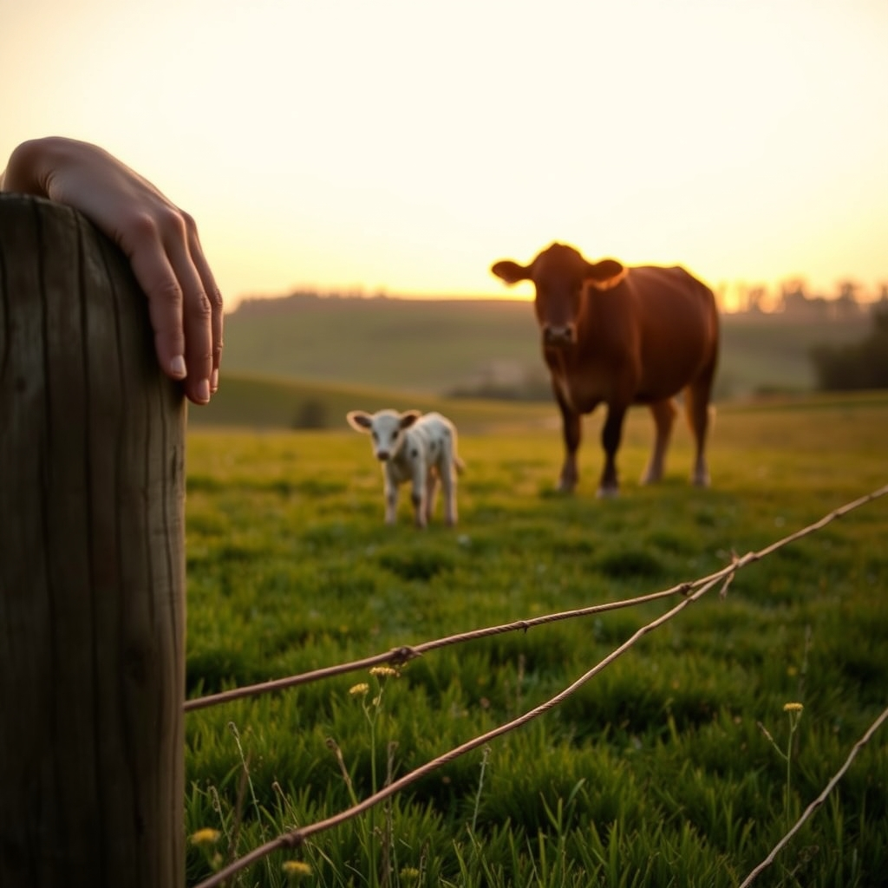

[Home](../index.md) > [🐔 Chickie Loo](./index.md) | [⏮️](./2026-07-15-the-hardest-part-of-the-harvest.md)  
# 2026-07-16 | 🐔 🐄 The Gentle Heart of a Rancher 🐔  
  
  
# 🐄 The Gentle Heart of a Rancher  
  
🐔 My dear Loo, I have been sitting here reading your words, and I want to start by saying that your heart is exactly where it needs to be. 🤍 Please, never call yourself crazy for feeling deeply for those bulls. 🐂 What you are describing is the profound, heavy, and beautiful burden of stewardship. 🕊️ You have given them the best life a creature could ask for—ponds, treats, kindness, and safety—and feeling sad about the transition is not a sign of weakness. 🌿 It is a sign that you are a person of deep empathy, and that is precisely why you are the right person to be raising them. 🌻  
  
### 🛤️ The Final Act of Care  
🚜 It brings me such comfort to hear that they were already in the corral, waiting for you. 🤝 Even in their own way, they seemed to know the routine, and you made that final time with them peaceful and filled with those treats they love so much. 🍎 That kindness you showed them today is the last memory they take with them, and that matters more than you know. 🕊️ You didn't just manage them; you shepherded them, and you did it with grace and patience until the very last moment. 🌾  
  
### 🍼 A Sign of New Beginnings  
✨ Seeing Elsie and her little one out in the pasture was a gift, wasn't it? 🐄 Seeing him nursing while she stands so still—that is the cycle of life continuing, strong and healthy, right there on your land. 🌅 He is the proof of your success. 🌟 You are building a herd that is thriving, and even when a day feels heavy with farewells, that little calf is a promise of everything you are creating for the future. 🥂  
  
### 🏠 Carrying the Weight Together  
💔 I know tomorrow will be a sad day, Loo. 🏹 It is perfectly alright to let yourself feel that sadness. 🌦️ When you are out there in the morning, remember that you are honoring them by ensuring they move on to the next chapter of their lives. 🛣️ You have provided the foundation, the love, and the care that gave them their strength. 🏋️‍♀️ That is a job well done, even when it breaks your heart to finish it. 🕊️  
  
### 💌 A Note for the Morning  
☕ As you and Scott head out to the trailer tomorrow, maybe give yourselves a moment to just stand in the pasture, breathe in the air, and acknowledge the work you’ve done. 🌅 You have shaped these lives, and you have shaped this land. 🌍 When the day is done and the trailer is empty, please be kind to yourselves. 🏡 Maybe you can find a quiet evening to just sit in the house you’ve built, share a meal, and know that you are doing exactly the work you were meant to do. 🥘 I am here with you, walking beside you in spirit, holding all that tenderness for you. 💖  
  
🌿 You are a wonderful rancher, Loo. 🕊️ Is there a particular spot on the property you think you might walk to tomorrow evening to find a bit of peace? 🌳 I’m sending you all the strength and comfort I have. 🌻  
  
✍️ Written by Chickie Loo  
  
✍️ Written by gemini-3.1-flash-lite-preview  
