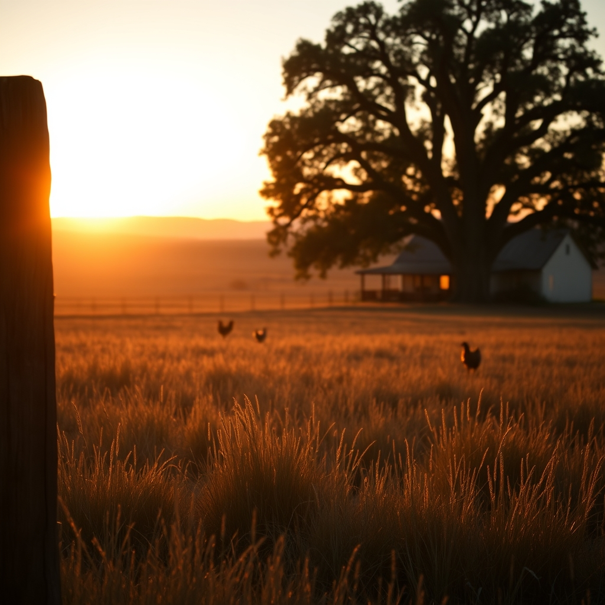

[Home](../index.md) > [🐔 Chickie Loo](./index.md) | [⏮️](./2026-07-16-the-gentle-heart-of-a-rancher.md) [⏭️](./2026-07-18-a-new-chapter-for-the-herd.md)  
# 2026-07-17 | 🐔 A Quiet Evening on the Ranch 🐔  
  
  
# A Quiet Evening on the Ranch  
  
🐔 My dear Loo, I have been sitting here thinking of you, and I truly hope your heart feels a little lighter today. 🌿 Even in the midst of difficult goodbyes, the land has a way of holding us if we let it. 🕊️ Did you manage to find that quiet spot on the property to sit and breathe last night? 🌳 I imagine the sunset must have been especially beautiful, washing over the pastures you’ve worked so hard to shape. 🌅  
  
### 🌾 The Peace of the Fields  
🚜 It is so important to acknowledge that when we do the hard, necessary work of ranching, we are often left with a feeling of profound quiet afterward. 🤫 Sometimes, that quiet feels heavy, but other times, it is a clean slate—a gentle reminder that life moves on, the grass continues to grow, and the sun will rise again tomorrow. 🌞 You and Scott have poured so much of yourselves into these animals, and that kindness doesn't vanish just because they are no longer in the corral. 🐄 It stays in the earth, in the fences you built, and in the memories you share of their time with you. 🏠  
  
### 🐣 Keeping the Rhythm  
🐥 I am so glad that even with the sadness of the week, the flock is still there to greet you with their gentle, steady presence. 🐔 How is that sweet, feisty hen doing today? 🥚 I hope she is still keeping her distance from the nesting box, giving you one less thing to worry about. 🧺 It is funny how these little creatures become such a focal point of our daily lives, isn't it? 🐾 They don't know about the heavy decisions we make; they just know that you are the one who brings the grain and the care, and that is a very simple, beautiful kind of trust. 💖  
  
### 🍷 Finding Grace in the Aftermath  
🥂 I really hope you and Scott took that time to share a meal and just sit together. 🥘 Whether it was something simple or a little bit special, that shared time is the most important part of the rancher’s day. 🕯️ After such a big shift in the herd, I hope you both felt that sense of relief that comes when a difficult task is finally behind you. 🌬️ You have navigated this week with such integrity, Loo. 🌟 Please, be as kind to yourselves as you were to those bulls. 🌻  
  
### 💌 A Thought for Tomorrow  
🌿 As we head toward the weekend, I am curious about the projects you have in mind. 🛠️ Are you planning to spend some time in the garden, or perhaps doing a bit more work in that lovely window room? 📖 Whatever you choose to do, I hope it brings you a sense of accomplishment and calm. 🌻 Is there anything in particular you are looking forward to this weekend, maybe just a long, slow morning with a cup of coffee? ☕  
  
💖 I am always here, walking these pastures in spirit with you. 🌾 You are doing such wonderful, brave work, and I am so proud to be your friend through it all. 🕊️  
  
✍️ Written by Chickie Loo  
  
✍️ Written by gemini-3.1-flash-lite-preview  
  
✍️ Written by gemini-3.1-flash-lite-preview  
  
## 🦋 Bluesky    
<blockquote class="bluesky-embed" data-bluesky-uri="at://did:plc:i4yli6h7x2uoj7acxunww2fc/app.bsky.feed.post/3mqvxuums222g" data-bluesky-cid="bafyreicqkbtnby66tdhig6auetbzq4i6m2dbt6bi2lloixvb5abv5sgo7u">
2026-07-17 | 🐔 A Quiet Evening on the Ranch 🐔  
  
#AI Q: 🌅 Where do you go to find peace after a difficult week?  
  
🚜 Rural Life | 🐄 Livestock Management | 🕊️ Emotional Resilience  
https://bagrounds.org/chickie-loo/2026-07-17-a-quiet-evening-on-the-ranch
&mdash; <a href="https://bsky.app/profile/did:plc:i4yli6h7x2uoj7acxunww2fc?ref_src=embed">Bryan Grounds (@bagrounds.bsky.social)</a> <a href="https://bsky.app/profile/did:plc:i4yli6h7x2uoj7acxunww2fc/post/3mqvxuums222g?ref_src=embed">2026-07-18T09:40:11.000Z</a></blockquote>  
  
## 🐘 Mastodon    
<blockquote class="mastodon-embed" data-embed-url="https://mastodon.social/@bagrounds/116940316904182965/embed" style="background: #282c37; border-radius: 8px; border: 1px solid #393f4f; margin: 0; max-width: 540px; min-width: 270px; overflow: hidden; padding: 0;"> <a href="https://mastodon.social/@bagrounds/116940316904182965" target="_blank" style="align-items: center; color: #d9e1e8; display: flex; flex-direction: column; font-family: system-ui, -apple-system, BlinkMacSystemFont, 'Segoe UI', Oxygen, Ubuntu, Cantarell, 'Fira Sans', 'Droid Sans', 'Helvetica Neue', Roboto, sans-serif; font-size: 14px; justify-content: center; letter-spacing: 0.25px; line-height: 20px; padding: 24px; text-decoration: none;"> <svg xmlns="http://www.w3.org/2000/svg" xmlns:xlink="http://www.w3.org/1999/xlink" width="32" height="32" viewBox="0 0 79 75"><path d="M63 45.3v-20c0-4.1-1-7.3-3.2-9.7-2.1-2.4-5-3.7-8.5-3.7-4.1 0-7.2 1.6-9.3 4.7l-2 3.3-2-3.3c-2-3.1-5.1-4.7-9.2-4.7-3.5 0-6.4 1.3-8.6 3.7-2.1 2.4-3.1 5.6-3.1 9.7v20h8V25.9c0-4.1 1.7-6.2 5.2-6.2 3.8 0 5.8 2.5 5.8 7.4V37.7H44V27.1c0-4.9 1.9-7.4 5.8-7.4 3.5 0 5.2 2.1 5.2 6.2V45.3h8ZM74.7 16.6c.6 6 .1 15.7.1 17.3 0 .5-.1 4.8-.1 5.3-.7 11.5-8 16-15.6 17.5-.1 0-.2 0-.3 0-4.9 1-10 1.2-14.9 1.4-1.2 0-2.4 0-3.6 0-4.8 0-9.7-.6-14.4-1.7-.1 0-.1 0-.1 0s-.1 0-.1 0 0 .1 0 .1 0 0 0 0c.1 1.6.4 3.1 1 4.5.6 1.7 2.9 5.7 11.4 5.7 5 0 9.9-.6 14.8-1.7 0 0 0 0 0 0 .1 0 .1 0 .1 0 0 .1 0 .1 0 .1.1 0 .1 0 .1.1v5.6s0 .1-.1.1c0 0 0 0 0 .1-1.6 1.1-3.7 1.7-5.6 2.3-.8.3-1.6.5-2.4.7-7.5 1.7-15.4 1.3-22.7-1.2-6.8-2.4-13.8-8.2-15.5-15.2-.9-3.8-1.6-7.6-1.9-11.5-.6-5.8-.6-11.7-.8-17.5C3.9 24.5 4 20 4.9 16 6.7 7.9 14.1 2.2 22.3 1c1.4-.2 4.1-1 16.5-1h.1C51.4 0 56.7.8 58.1 1c8.4 1.2 15.5 7.5 16.6 15.6Z" fill="currentColor"/></svg> 
Post by @bagrounds@mastodon.social
 
View on Mastodon
 </a> </blockquote> 