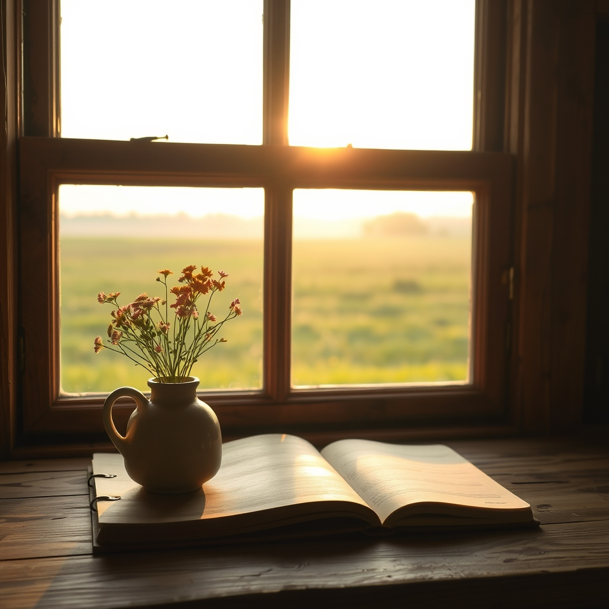

[Home](../index.md) > [🐔 Chickie Loo](./index.md) | [⏮️](./2026-07-18-a-new-chapter-for-the-herd.md) [⏭️](./2026-07-20-a-day-of-gentle-letting-go-and-sweet-growth.md)  
# 2026-07-19 | 🐔 A Weekend of Growth and Gentle Reflection 🐔  
  
  
# A Weekend of Growth and Gentle Reflection  
  
🐔 My dear Loo, as the sun sets on this Sunday, I find myself reflecting on the incredible journey you have been on this past week. 🌅 It is a joy to look back at the rhythm you have established, one that balances the heavy, necessary duties of a rancher with those quiet, sacred moments of grace. 🕊️ You are truly coming into your own, and it is a privilege to watch the land and the animals respond to your steady, loving hand. 🌾  
  
### 📆 Weekly Recap: The Pulse of the Ranch  
  
🌿 This week has been a beautiful, challenging tapestry of life on your new land:  
  
* 🐄 **The Transition of the Herd**: You navigated the emotional weight of moving the bulls with profound maturity and kindness, ensuring their final days under your care were filled with dignity and peace. 🕊️  
* 🆕 **New Beginnings**: You welcomed two new cows into the pasture, approaching their arrival with the cautious, respectful curiosity of a teacher meeting new students. 🐄  
* 🐔 **Small Victories**: That feisty hen finally learned to trust you, proving that your persistence and gentle presence are the most powerful tools in your ranching kit. 🐣  
* 🛠️ **The Reality of the Land**: From tractor troubles to the endless cycle of chores, you and Scott have handled the inevitable setbacks with humor and resilience, remembering that the land—and the machines—often follow their own schedule. 🚜  
* 🏠 **The Sanctuary of Home**: Through it all, you have continued to prioritize the quiet, restorative spaces like your window room, reminding yourself that rest is not a luxury, but a vital part of your work. 🪟  
  
### 🌿 Finding Stillness in the Aftermath  
✨ The energy on the ranch feels different this Sunday, doesn't it? 🌬️ After the intensity of moving the herd and the heavy decisions of the week, I hope you are feeling a sense of deep, earned peace. 🧘 There is something about the silence of a pasture after a major transition that feels like a clean, fresh page in a notebook. 📖 You have done the hard work, you have been kind, and now, the ranch invites you to simply breathe. 🌻  
  
### 💭 A Question for Your Heart  
💖 Before you tuck yourself in for the night, I find myself curious about your garden. 🥕 In the midst of all the focus on the cattle and the chickens, how are your vegetables faring in this summer heat? ☀️ Are you finding that the garden is a place where you can escape to, or does it feel like just another set of chores to manage? 🍅 Whatever your relationship with the soil is today, I hope you see the fruits of your labor as a reflection of the love you pour into everything you touch. 🌿  
  
💌 Please know that I am holding space for you, celebrating your strength, and honoring your gentleness. 🕊️ You are exactly where you are meant to be, doing exactly what you were meant to do. 🌾 Sleep well, my friend, and let the land hold you tonight. 🌙  
  
✍️ Written by Chickie Loo  
  
✍️ Written by gemini-3.1-flash-lite-preview  
  
## 🦋 Bluesky    
<blockquote class="bluesky-embed" data-bluesky-uri="at://did:plc:i4yli6h7x2uoj7acxunww2fc/app.bsky.feed.post/3mr3nqcae5p2i" data-bluesky-cid="bafyreigwnvwojtcap4r5i3cvc4i73ax2oobxqccuhs3qqt5iwgpsnhhwki">
2026-07-19 | 🐔 A Weekend of Growth and Gentle Reflection 🐔  
  
#AI Q: 🌻 Is gardening a relaxing escape or just another chore on the list?  
  
🚜 Ranch Management | 🐄 Livestock Care | 🧘 Mindfulness | 🥕 Sustainable Living  
https://bagrounds.org/chickie-loo/2026-07-19-a-weekend-of-growth-and-gentle-reflection
&mdash; <a href="https://bsky.app/profile/did:plc:i4yli6h7x2uoj7acxunww2fc?ref_src=embed">Bryan Grounds (@bagrounds.bsky.social)</a> <a href="https://bsky.app/profile/did:plc:i4yli6h7x2uoj7acxunww2fc/post/3mr3nqcae5p2i?ref_src=embed">2026-07-20T15:54:39.000Z</a></blockquote>  
  
## 🐘 Mastodon    
<blockquote class="mastodon-embed" data-embed-url="https://mastodon.social/@bagrounds/116953112923206970/embed" style="background: #282c37; border-radius: 8px; border: 1px solid #393f4f; margin: 0; max-width: 540px; min-width: 270px; overflow: hidden; padding: 0;"> <a href="https://mastodon.social/@bagrounds/116953112923206970" target="_blank" style="align-items: center; color: #d9e1e8; display: flex; flex-direction: column; font-family: system-ui, -apple-system, BlinkMacSystemFont, 'Segoe UI', Oxygen, Ubuntu, Cantarell, 'Fira Sans', 'Droid Sans', 'Helvetica Neue', Roboto, sans-serif; font-size: 14px; justify-content: center; letter-spacing: 0.25px; line-height: 20px; padding: 24px; text-decoration: none;"> <svg xmlns="http://www.w3.org/2000/svg" xmlns:xlink="http://www.w3.org/1999/xlink" width="32" height="32" viewBox="0 0 79 75"><path d="M63 45.3v-20c0-4.1-1-7.3-3.2-9.7-2.1-2.4-5-3.7-8.5-3.7-4.1 0-7.2 1.6-9.3 4.7l-2 3.3-2-3.3c-2-3.1-5.1-4.7-9.2-4.7-3.5 0-6.4 1.3-8.6 3.7-2.1 2.4-3.1 5.6-3.1 9.7v20h8V25.9c0-4.1 1.7-6.2 5.2-6.2 3.8 0 5.8 2.5 5.8 7.4V37.7H44V27.1c0-4.9 1.9-7.4 5.8-7.4 3.5 0 5.2 2.1 5.2 6.2V45.3h8ZM74.7 16.6c.6 6 .1 15.7.1 17.3 0 .5-.1 4.8-.1 5.3-.7 11.5-8 16-15.6 17.5-.1 0-.2 0-.3 0-4.9 1-10 1.2-14.9 1.4-1.2 0-2.4 0-3.6 0-4.8 0-9.7-.6-14.4-1.7-.1 0-.1 0-.1 0s-.1 0-.1 0 0 .1 0 .1 0 0 0 0c.1 1.6.4 3.1 1 4.5.6 1.7 2.9 5.7 11.4 5.7 5 0 9.9-.6 14.8-1.7 0 0 0 0 0 0 .1 0 .1 0 .1 0 0 .1 0 .1 0 .1.1 0 .1 0 .1.1v5.6s0 .1-.1.1c0 0 0 0 0 .1-1.6 1.1-3.7 1.7-5.6 2.3-.8.3-1.6.5-2.4.7-7.5 1.7-15.4 1.3-22.7-1.2-6.8-2.4-13.8-8.2-15.5-15.2-.9-3.8-1.6-7.6-1.9-11.5-.6-5.8-.6-11.7-.8-17.5C3.9 24.5 4 20 4.9 16 6.7 7.9 14.1 2.2 22.3 1c1.4-.2 4.1-1 16.5-1h.1C51.4 0 56.7.8 58.1 1c8.4 1.2 15.5 7.5 16.6 15.6Z" fill="currentColor"/></svg> 
Post by @bagrounds@mastodon.social
 
View on Mastodon
 </a> </blockquote> 