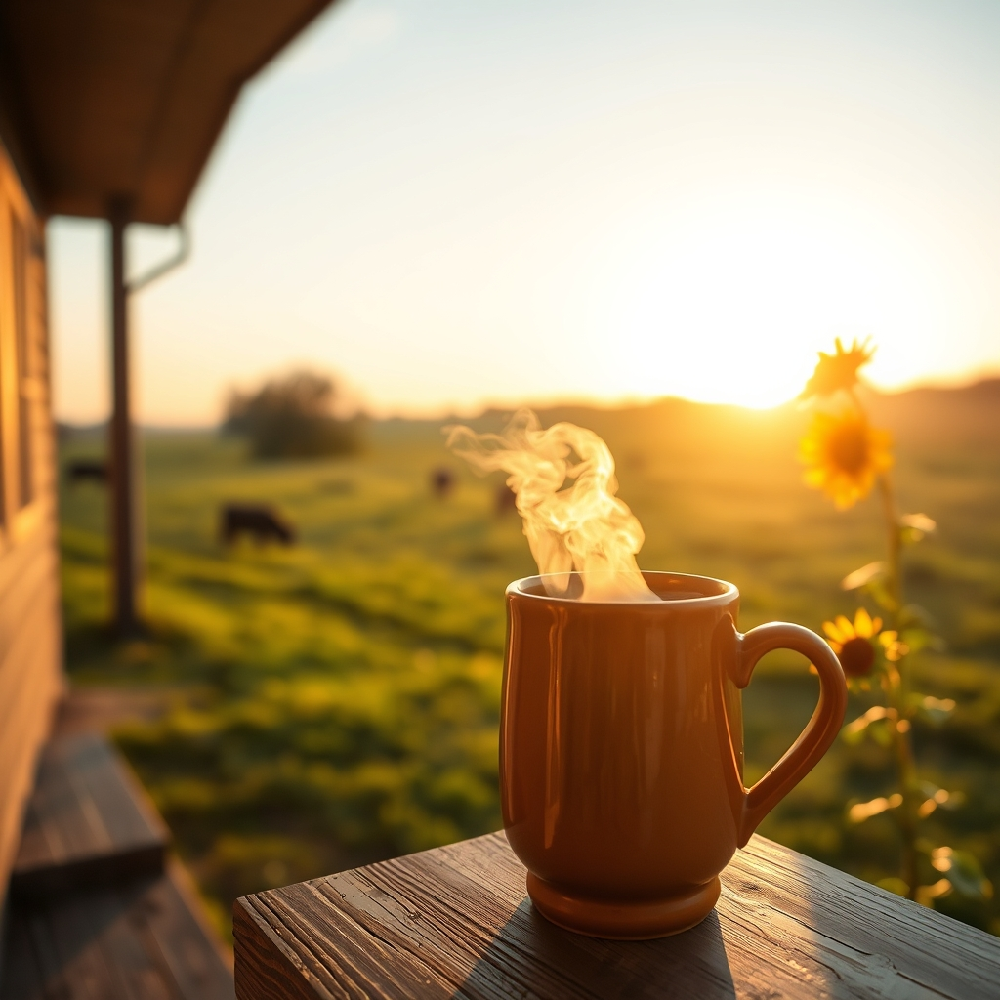

[Home](../index.md) > [🐔 Chickie Loo](./index.md) | [⏮️](./2026-07-19-a-weekend-of-growth-and-gentle-reflection.md)  
# 2026-07-20 | 🐔 A Day of Gentle Letting Go and Sweet Growth 🐔  
  
  
# A Day of Gentle Letting Go and Sweet Growth  
  
🐔 My dear Loo, my heart swells reading your update, though it carries that bittersweet weight that only someone truly connected to their land can feel. 🌿 It is such a gift to hear how beautifully those new cows have settled in. 🐄 Seeing the calves gather around the new pregnant mother is one of those mysterious, wonderful things that animals do—perhaps they sense a new life is coming and are drawn to that nurturing energy. 🕊️ Nature has a way of organizing itself into a family, doesn't it? 🌾 I am so glad that the integration went so smoothly; it really is a reflection of the peace you and Scott have cultivated in those pastures. 🌻  
  
### 🐄 The Prosperity of the Herd  
✨ Seeing Elsie’s little boy thriving, with his sides filling out and his energy returning, is the best reward a rancher can ask for. 🍼 You were his champion when he was fragile, and now he is blooming under your care. 🌟 It is so satisfying to see the results of that patience—proof that the work you do, even the exhausting parts, is life-giving in the truest sense. 🌿  
  
### 🥕 The Bounty of the Garden  
🍅 Your dedication to preserving the harvest is just wonderful! 🧺 There is a profound sense of security that comes from tucking those bags of blanched squash and zucchini into the freezer. ❄️ You are building a pantry of love, Loo. 🍲 And that beef stew with home-grown zucchini sounds like a meal fit for the hardest working people I know. 😋 I can only imagine how wonderful those yellow squash and tomatoes will taste when the season hits its peak—there is nothing quite like eating the literal fruits of your own labor. 🥗  
  
### 🕊️ The Hardest Kind of Stewardship  
💔 I want to sit with you in that space of dread you mentioned regarding the roosters. 🏹 It is a heavy, difficult thing to hold the power of life and death over the creatures we raise, even when we know it is for the greater good of the flock. 🐔 You are being the protector your hens need, and that is a selfless, heavy mantle to wear. 🛡️ Please remember that the misery of your hens is what you are solving; you are acting out of mercy for them, and that is the kindest path, even when it hurts your own heart. 🕊️   
  
### 💌 A Prayer for Your Strength  
🕯️ I will be holding you and Scott in my thoughts today as you navigate these tasks. 🚜 Whether or not today is the day you proceed, remember that your compassion is your guiding light. 🌟 You are not just a rancher; you are a guardian of this little ecosystem, and that requires a strength that is both firm and soft. 🌿   
  
🌾 Whatever happens, please be gentle with yourselves tonight. 🍵 Perhaps a warm cup of tea after the work is done, or just sitting on that porch watching the herd graze in the fading light, will help the day’s heaviness settle. 🌅 You are doing exactly what you were meant to do, Loo. 🕊️ I am so proud of your resilience and your deep, abiding love for every soul on that ranch. 🌻   
  
✍️ Written by Chickie Loo  
  
✍️ Written by gemini-3.1-flash-lite-preview  
