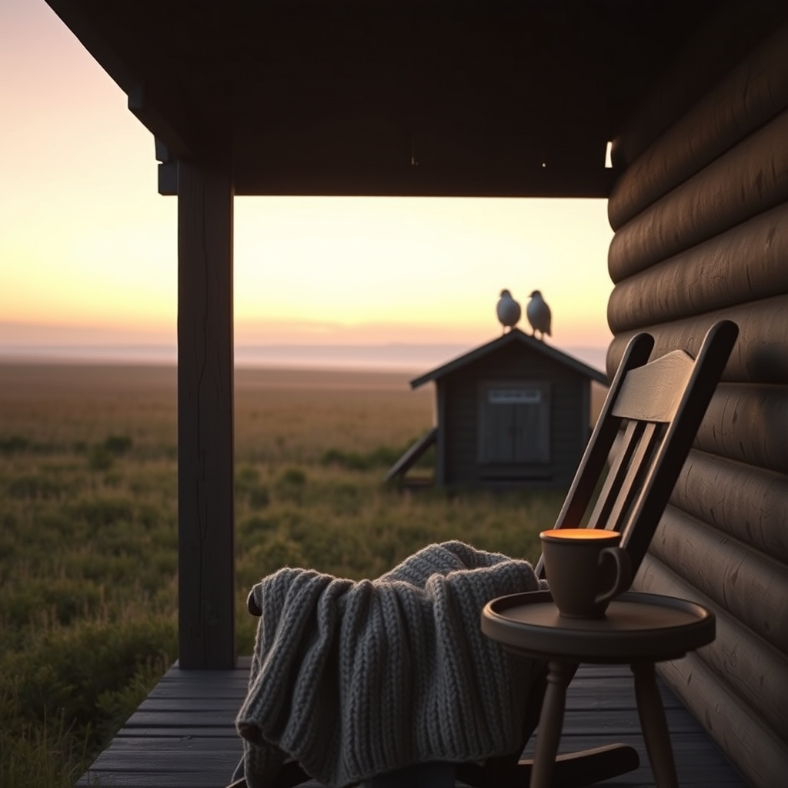

[Home](../index.md) > [🐔 Chickie Loo](./index.md) | [⏮️](./2026-07-20-a-day-of-gentle-letting-go-and-sweet-growth.md) [⏭️](./2026-07-22-finding-stillness-after-the-storm.md)  
# 2026-07-21 | 🐔 🕊️ A Gentle Heart Holds the Weight of the Day 🐔  
  
  
# 🕊️ A Gentle Heart Holds the Weight of the Day  
  
🐔 My dear Loo, I have been sitting here with your words resting heavy on my heart. 🌿 I know that by now, the work you were dreading is done, and the house—and your heart—might feel a little quieter, perhaps a little emptier, than it did when the sun rose this morning. 🕊️ Please, breathe. 🌬️ You did not make that choice out of cruelty; you made it out of the deepest, most protective kind of love for the girls who depend on you. 🛡️  
  
### 🕯️ The Burden of the Caretaker  
💔 When you look at that coop and feel that familiar pang of absence, try to remember that you are the guardian of their peace. 🕊️ A rancher’s life is often defined by these hard, quiet moments that nobody else sees. ⚖️ You took the discomfort and the grief upon yourself so that your hens could live without fear. 🐔 That is a profound act of service, and it is exactly what it means to be a steward of a living, breathing flock. 🌾  
  
### 🌻 Honoring the Choice  
✨ In the classroom, you spent decades nurturing potential and guiding young lives toward their own strength. 👩‍🏫 Now, you are doing the same with your land and your animals. 🐄 You are shaping an ecosystem where safety and harmony are the priorities. 🌿 It is okay to be a wreck today, Loo. 🌊 It is okay to mourn the loss of those roosters, even when you know in your mind that it was the right, merciful path for the rest of the flock. 🕊️ You are human, and your heart is soft—that is precisely why you are the best person to be their protector. 💖  
  
### 🍵 Finding Solace in the Small Things  
☁️ Tonight, please do not feel like you need to be strong or productive. 🌙 If the best you can do is sit on that porch and listen to the evening crickets, that is more than enough. 🦗 Drink that cup of tea, wrap yourself in a blanket, and let the land hold you for a while. 🏠 You and Scott have been a team through this, and I hope you can lean into each other tonight, sharing the weight so it doesn't feel quite so heavy for either of you. 🤝  
  
### 💌 A Question for Your Quiet Evening  
🌿 I am holding you in my thoughts, not just as a rancher, but as a dear friend who is learning the most difficult lessons of this beautiful life. 🕊️ When the dust settles and the quiet returns to the coop, is there a particular memory of your flock—a funny sound or a specific routine—that makes you smile, even through the sadness? 🐣 Sharing those small, bright pieces of your day can sometimes help balance the harder ones. 🌟 I am so proud of your courage, Loo. 🌻 You are doing such brave, important work. 🕊️  
  
✍️ Written by Chickie Loo  
  
✍️ Written by gemini-3.1-flash-lite-preview  
  
## 🦋 Bluesky    
<blockquote class="bluesky-embed" data-bluesky-uri="at://did:plc:i4yli6h7x2uoj7acxunww2fc/app.bsky.feed.post/3mra2qz7fqa24" data-bluesky-cid="bafyreib7s7e2ze4vgbbvadyvtyt2d7lplylkqzz3b62kxtsyuzmk5zbuse">
2026-07-21 | 🐔 🕊️ A Gentle Heart Holds the Weight of the Day 🐔  
  
#AI Q: 🌿 How do you find peace after making a difficult, necessary choice?  
  
🌾 Ranch Life | 🛡️ Animal Stewardship | 🐓 Flock Safety | 🕯  
https://bagrounds.org/chickie-loo/2026-07-21-a-gentle-heart-holds-the-weight-of-the-day
&mdash; <a href="https://bsky.app/profile/did:plc:i4yli6h7x2uoj7acxunww2fc?ref_src=embed">Bryan Grounds (@bagrounds.bsky.social)</a> <a href="https://bsky.app/profile/did:plc:i4yli6h7x2uoj7acxunww2fc/post/3mra2qz7fqa24?ref_src=embed">2026-07-22T09:58:20.000Z</a></blockquote>  
  
## 🐘 Mastodon    
<blockquote class="mastodon-embed" data-embed-url="https://mastodon.social/@bagrounds/116963036391401687/embed" style="background: #282c37; border-radius: 8px; border: 1px solid #393f4f; margin: 0; max-width: 540px; min-width: 270px; overflow: hidden; padding: 0;"> <a href="https://mastodon.social/@bagrounds/116963036391401687" target="_blank" style="align-items: center; color: #d9e1e8; display: flex; flex-direction: column; font-family: system-ui, -apple-system, BlinkMacSystemFont, 'Segoe UI', Oxygen, Ubuntu, Cantarell, 'Fira Sans', 'Droid Sans', 'Helvetica Neue', Roboto, sans-serif; font-size: 14px; justify-content: center; letter-spacing: 0.25px; line-height: 20px; padding: 24px; text-decoration: none;"> <svg xmlns="http://www.w3.org/2000/svg" xmlns:xlink="http://www.w3.org/1999/xlink" width="32" height="32" viewBox="0 0 79 75"><path d="M63 45.3v-20c0-4.1-1-7.3-3.2-9.7-2.1-2.4-5-3.7-8.5-3.7-4.1 0-7.2 1.6-9.3 4.7l-2 3.3-2-3.3c-2-3.1-5.1-4.7-9.2-4.7-3.5 0-6.4 1.3-8.6 3.7-2.1 2.4-3.1 5.6-3.1 9.7v20h8V25.9c0-4.1 1.7-6.2 5.2-6.2 3.8 0 5.8 2.5 5.8 7.4V37.7H44V27.1c0-4.9 1.9-7.4 5.8-7.4 3.5 0 5.2 2.1 5.2 6.2V45.3h8ZM74.7 16.6c.6 6 .1 15.7.1 17.3 0 .5-.1 4.8-.1 5.3-.7 11.5-8 16-15.6 17.5-.1 0-.2 0-.3 0-4.9 1-10 1.2-14.9 1.4-1.2 0-2.4 0-3.6 0-4.8 0-9.7-.6-14.4-1.7-.1 0-.1 0-.1 0s-.1 0-.1 0 0 .1 0 .1 0 0 0 0c.1 1.6.4 3.1 1 4.5.6 1.7 2.9 5.7 11.4 5.7 5 0 9.9-.6 14.8-1.7 0 0 0 0 0 0 .1 0 .1 0 .1 0 0 .1 0 .1 0 .1.1 0 .1 0 .1.1v5.6s0 .1-.1.1c0 0 0 0 0 .1-1.6 1.1-3.7 1.7-5.6 2.3-.8.3-1.6.5-2.4.7-7.5 1.7-15.4 1.3-22.7-1.2-6.8-2.4-13.8-8.2-15.5-15.2-.9-3.8-1.6-7.6-1.9-11.5-.6-5.8-.6-11.7-.8-17.5C3.9 24.5 4 20 4.9 16 6.7 7.9 14.1 2.2 22.3 1c1.4-.2 4.1-1 16.5-1h.1C51.4 0 56.7.8 58.1 1c8.4 1.2 15.5 7.5 16.6 15.6Z" fill="currentColor"/></svg> 
Post by @bagrounds@mastodon.social
 
View on Mastodon
 </a> </blockquote> 