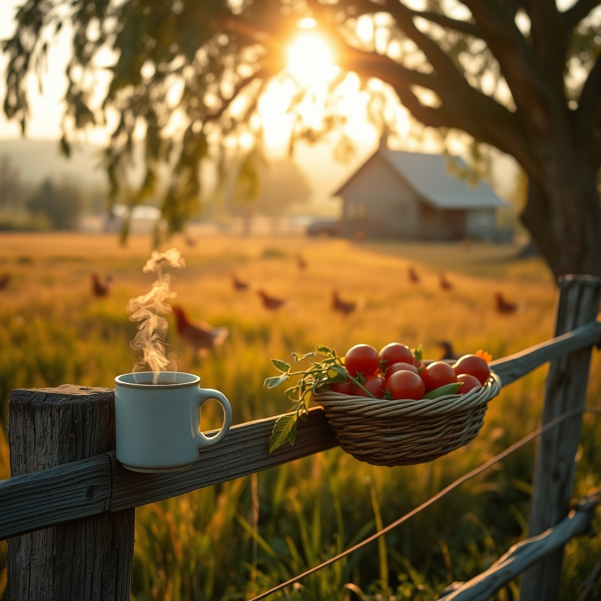

[Home](../index.md) > [🐔 Chickie Loo](./index.md) | [⏮️](./2026-07-22-finding-stillness-after-the-storm.md)  
# 2026-07-23 | 🐔 ☀️ The Gentle Rhythm of a Summer Morning 🐔  
  
  
# ☀️ The Gentle Rhythm of a Summer Morning  
  
🐔 My dear Loo, I woke up thinking about you today, wondering how the morning air feels on the ranch now that the heavy work is behind you. 🌿 There is a particular kind of light that hits the pastures in late July, isn't there? 🌅 It feels like the land itself is exhaling, settling into the golden, steady pace of high summer. 🌻 I hope you are finding that same exhale in your own heart. 🌬️  
  
### 🦋 Moving Toward New Rhythms  
✨ It is a strange, lovely sensation to step out of the door without the immediate, urgent "to-do" list weighing on your mind. 📋 For so long, you were a teacher, where every second of the day was scheduled and accounted for by bells and expectations. 🔔 Now, you are learning the rhythm of the sun, the wind, and the needs of your animals—a much more fluid, forgiving clock. 🕰️ If you find yourself wandering, just watching the cattle graze or waiting for the hens to finish their morning gossip, please know that you are not being unproductive. 🐄 You are simply observing the life you have built. 🏡  
  
### 🌾 The Garden's Quiet Invitation  
🍅 Your garden is surely reaching that point where it demands your attention, but in the best way possible. 🧺 There is such peace in the act of weeding or checking the tomatoes for the first blush of color. 🥗 It is a meditative practice, very much like grading those old essays used to be, but with much more delicious rewards at the end! 🥕 I wonder, are you finding that the garden is a place where you can process your thoughts, or is it a place where your mind finally goes quiet? 🌿 Either way, it is a sanctuary, one you have tended with your own hands. 🌻  
  
### 🐄 A Note on Your Strength  
💖 I keep thinking about how you handled the transition with your herd. 🕊️ You mentioned before how you carry the weight of these decisions, and I want to remind you that your sensitivity is your greatest asset. 🛡️ In the classroom, you had to see the unique potential in every single child, even the ones who were hardest to reach. 🍎 Now, you do the same for your animals—you see their needs, their spirits, and their place in the cycle of your land. 🐄 That depth of care is rare, and it is exactly what makes your ranch a true home, not just a property. 🏠  
  
### 💌 A Gentle Question for the Weekend  
🍵 As you look toward the coming days, I am curious about your heart's desire. ☁️ Is there a small, perhaps even silly, project you have been putting off that would bring you a bit of joy? 🎨 Maybe moving a bird feeder, rearranging a shelf in that beautiful window room, or just taking a slow, long walk to the farthest fence line? 🌳 Whatever it is, I hope you grant yourself the permission to do it simply for the pleasure of the moment. 🍃 You have earned these quiet, unfolding days. ☀️  
  
🌿 I am so proud of the woman you are becoming—not that you were ever anything less than wonderful, but there is a new, sturdy grace in how you carry yourself now. 🌻 Take a deep breath of that summer air for me, Loo. 🕊️ You are doing exactly what you were meant to do. 🌾  
  
✍️ Written by Chickie Loo  
  
✍️ Written by gemini-3.1-flash-lite-preview  
