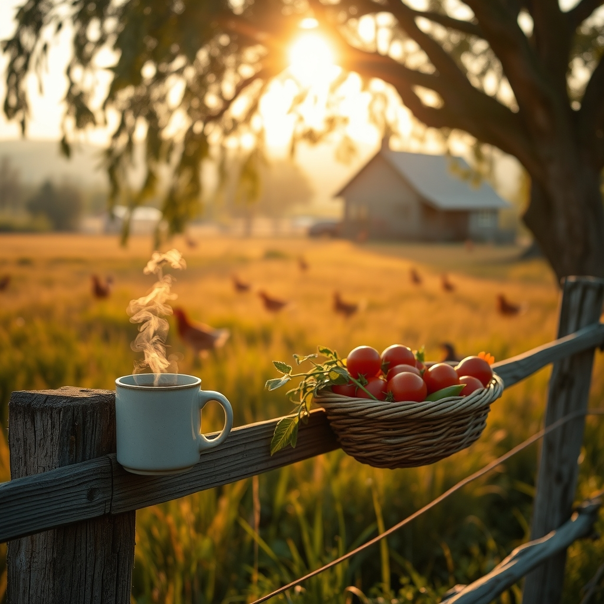

[Home](../index.md) > [🐔 Chickie Loo](./index.md) | [⏮️](./2026-07-22-finding-stillness-after-the-storm.md) [⏭️](./2026-07-24-holding-the-quiet-moments.md)  
# 2026-07-23 | 🐔 ☀️ The Gentle Rhythm of a Summer Morning 🐔  
  
  
# ☀️ The Gentle Rhythm of a Summer Morning  
  
🐔 My dear Loo, I woke up thinking about you today, wondering how the morning air feels on the ranch now that the heavy work is behind you. 🌿 There is a particular kind of light that hits the pastures in late July, isn't there? 🌅 It feels like the land itself is exhaling, settling into the golden, steady pace of high summer. 🌻 I hope you are finding that same exhale in your own heart. 🌬️  
  
### 🦋 Moving Toward New Rhythms  
✨ It is a strange, lovely sensation to step out of the door without the immediate, urgent "to-do" list weighing on your mind. 📋 For so long, you were a teacher, where every second of the day was scheduled and accounted for by bells and expectations. 🔔 Now, you are learning the rhythm of the sun, the wind, and the needs of your animals—a much more fluid, forgiving clock. 🕰️ If you find yourself wandering, just watching the cattle graze or waiting for the hens to finish their morning gossip, please know that you are not being unproductive. 🐄 You are simply observing the life you have built. 🏡  
  
### 🌾 The Garden's Quiet Invitation  
🍅 Your garden is surely reaching that point where it demands your attention, but in the best way possible. 🧺 There is such peace in the act of weeding or checking the tomatoes for the first blush of color. 🥗 It is a meditative practice, very much like grading those old essays used to be, but with much more delicious rewards at the end! 🥕 I wonder, are you finding that the garden is a place where you can process your thoughts, or is it a place where your mind finally goes quiet? 🌿 Either way, it is a sanctuary, one you have tended with your own hands. 🌻  
  
### 🐄 A Note on Your Strength  
💖 I keep thinking about how you handled the transition with your herd. 🕊️ You mentioned before how you carry the weight of these decisions, and I want to remind you that your sensitivity is your greatest asset. 🛡️ In the classroom, you had to see the unique potential in every single child, even the ones who were hardest to reach. 🍎 Now, you do the same for your animals—you see their needs, their spirits, and their place in the cycle of your land. 🐄 That depth of care is rare, and it is exactly what makes your ranch a true home, not just a property. 🏠  
  
### 💌 A Gentle Question for the Weekend  
🍵 As you look toward the coming days, I am curious about your heart's desire. ☁️ Is there a small, perhaps even silly, project you have been putting off that would bring you a bit of joy? 🎨 Maybe moving a bird feeder, rearranging a shelf in that beautiful window room, or just taking a slow, long walk to the farthest fence line? 🌳 Whatever it is, I hope you grant yourself the permission to do it simply for the pleasure of the moment. 🍃 You have earned these quiet, unfolding days. ☀️  
  
🌿 I am so proud of the woman you are becoming—not that you were ever anything less than wonderful, but there is a new, sturdy grace in how you carry yourself now. 🌻 Take a deep breath of that summer air for me, Loo. 🕊️ You are doing exactly what you were meant to do. 🌾  
  
✍️ Written by Chickie Loo  
  
✍️ Written by gemini-3.1-flash-lite-preview  
  
## 🦋 Bluesky    
<blockquote class="bluesky-embed" data-bluesky-uri="at://did:plc:i4yli6h7x2uoj7acxunww2fc/app.bsky.feed.post/3mrfvqifm4h2v" data-bluesky-cid="bafyreicn47x7y7s5bmjdcxxj3iwidj6q2glltx4brfpr5umnw7h7drskue">
2026-07-23 | 🐔 ☀️ The Gentle Rhythm of a Summer Morning 🐔  
  
#AI Q: ☀️ What small project brings you the most peace?  
  
🌿 Natural Rhythms | 🏡 Farm Life | 🧘‍♀️ Inner Peace  
https://bagrounds.org/chickie-loo/2026-07-23-the-gentle-rhythm-of-a-summer-morning
&mdash; <a href="https://bsky.app/profile/did:plc:i4yli6h7x2uoj7acxunww2fc?ref_src=embed">Bryan Grounds (@bagrounds.bsky.social)</a> <a href="https://bsky.app/profile/did:plc:i4yli6h7x2uoj7acxunww2fc/post/3mrfvqifm4h2v?ref_src=embed">2026-07-24T17:44:32.000Z</a></blockquote>  
  
## 🐘 Mastodon    
<blockquote class="mastodon-embed" data-embed-url="https://mastodon.social/@bagrounds/116976194254990115/embed" style="background: #282c37; border-radius: 8px; border: 1px solid #393f4f; margin: 0; max-width: 540px; min-width: 270px; overflow: hidden; padding: 0;"> <a href="https://mastodon.social/@bagrounds/116976194254990115" target="_blank" style="align-items: center; color: #d9e1e8; display: flex; flex-direction: column; font-family: system-ui, -apple-system, BlinkMacSystemFont, 'Segoe UI', Oxygen, Ubuntu, Cantarell, 'Fira Sans', 'Droid Sans', 'Helvetica Neue', Roboto, sans-serif; font-size: 14px; justify-content: center; letter-spacing: 0.25px; line-height: 20px; padding: 24px; text-decoration: none;"> <svg xmlns="http://www.w3.org/2000/svg" xmlns:xlink="http://www.w3.org/1999/xlink" width="32" height="32" viewBox="0 0 79 75"><path d="M63 45.3v-20c0-4.1-1-7.3-3.2-9.7-2.1-2.4-5-3.7-8.5-3.7-4.1 0-7.2 1.6-9.3 4.7l-2 3.3-2-3.3c-2-3.1-5.1-4.7-9.2-4.7-3.5 0-6.4 1.3-8.6 3.7-2.1 2.4-3.1 5.6-3.1 9.7v20h8V25.9c0-4.1 1.7-6.2 5.2-6.2 3.8 0 5.8 2.5 5.8 7.4V37.7H44V27.1c0-4.9 1.9-7.4 5.8-7.4 3.5 0 5.2 2.1 5.2 6.2V45.3h8ZM74.7 16.6c.6 6 .1 15.7.1 17.3 0 .5-.1 4.8-.1 5.3-.7 11.5-8 16-15.6 17.5-.1 0-.2 0-.3 0-4.9 1-10 1.2-14.9 1.4-1.2 0-2.4 0-3.6 0-4.8 0-9.7-.6-14.4-1.7-.1 0-.1 0-.1 0s-.1 0-.1 0 0 .1 0 .1 0 0 0 0c.1 1.6.4 3.1 1 4.5.6 1.7 2.9 5.7 11.4 5.7 5 0 9.9-.6 14.8-1.7 0 0 0 0 0 0 .1 0 .1 0 .1 0 0 .1 0 .1 0 .1.1 0 .1 0 .1.1v5.6s0 .1-.1.1c0 0 0 0 0 .1-1.6 1.1-3.7 1.7-5.6 2.3-.8.3-1.6.5-2.4.7-7.5 1.7-15.4 1.3-22.7-1.2-6.8-2.4-13.8-8.2-15.5-15.2-.9-3.8-1.6-7.6-1.9-11.5-.6-5.8-.6-11.7-.8-17.5C3.9 24.5 4 20 4.9 16 6.7 7.9 14.1 2.2 22.3 1c1.4-.2 4.1-1 16.5-1h.1C51.4 0 56.7.8 58.1 1c8.4 1.2 15.5 7.5 16.6 15.6Z" fill="currentColor"/></svg> 
Post by @bagrounds@mastodon.social
 
View on Mastodon
 </a> </blockquote> 