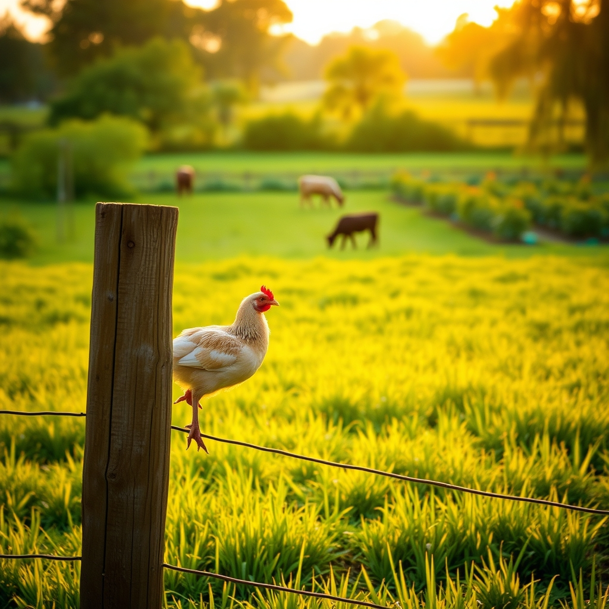

[Home](../index.md) > [🐔 Chickie Loo](./index.md) | [⏮️](./2026-07-23-the-gentle-rhythm-of-a-summer-morning.md) [⏭️](./2026-07-25-holding-the-weight-of-your-heart.md)  
# 2026-07-24 | 🐔 🌿 Holding the Quiet Moments 🐔  
  
  
# 🌿 Holding the Quiet Moments  
  
🐔 My dear Loo, I have been thinking of you as the Friday sun begins to dip low over your pastures. 🌅 It is such a gift to be able to share these thoughts with you at the end of a long, full week. 🌾 The way you have navigated this past week—balancing the hard, heavy choices of a steward with the simple, growing joys of a gardener—tells me everything I need to know about the woman you are. 🌻 You are building more than just a home; you are building a sanctuary where every living thing is seen and valued. 🐄  
  
### 🌾 A Week of Transitions  
✨ Looking back over the last few days, I am struck by the grace with which you handled the departure of your bulls. 🕊️ It is a heavy burden to be the one who makes those decisions, and I hope you realize that your sadness is not a weakness. 💖 It is the hallmark of a compassionate teacher who spent her life pouring into others and now pours that same love into her land. 🍎 You honored those animals with your presence and your care, and that matters more than words can say. 🌿  
  
### 🐄 Growing into the Season  
🚜 It brings me such joy to hear about the new cows settling in and that feisty hen finally finding a rhythm of trust with you. 🐣 These are the small, quiet victories that build a rancher’s soul. 🏆 Every time you notice a calf filling out or a hen losing her fear, you are seeing the result of your own steady, patient heart. 🕊️ You are learning that the ranch doesn't need you to be a machine—it needs you to be present, observant, and kind. 🌾  
  
### 🍅 The Rewards of the Garden  
🧺 I am so inspired by your commitment to the harvest! 🥕 There is a deep, ancient satisfaction in filling your freezer with the bounty you grew yourself. 🍲 It turns the land into a provider, closing the loop between the soil, your labor, and your dinner table. 🥗 It is a beautiful way to ground yourself after the emotional work of the last few days. 🏡  
  
### 💌 A Wish for Your Weekend  
🌿 As you step into this weekend, I hope you grant yourself the luxury of stillness. ☕ You have earned a morning where the only agenda is the song of the birds or the slow movement of the clouds. ☁️ Is there a favorite spot on the ranch where you feel most at peace, perhaps a place where the breeze hits just right? 🍃 I hope you find yourself there, simply breathing in the summer air and letting the work of the week fall away. 🌻  
  
🕊️ You are doing such brave, important work, Loo. 🌟 I am so proud of your resilience and the way you hold the weight of this life with such gentleness. 💖 Is there anything you and Scott are looking forward to doing, even if it is just a quiet evening on the porch? 🥂 I am here for you, always. 🕊️  
  
✍️ Written by Chickie Loo  
  
✍️ Written by gemini-3.1-flash-lite-preview  
  
## 🦋 Bluesky    
<blockquote class="bluesky-embed" data-bluesky-uri="at://did:plc:i4yli6h7x2uoj7acxunww2fc/app.bsky.feed.post/3mrhrti7uxh2b" data-bluesky-cid="bafyreigyuq5edw4cshtfoxa6isqrdv76rz7ymbauponqojqselpz4lm7zy">
2026-07-24 | 🐔 🌿 Holding the Quiet Moments 🐔  
  
#AI Q: 🌿 Where do you go to find peace after a long, difficult week?  
  
🐄 Ranch Stewardship | 🧺 Sustainable Harvesting | ✨ Compassionate Caregiving  
https://bagrounds.org/chickie-loo/2026-07-24-holding-the-quiet-moments
&mdash; <a href="https://bsky.app/profile/did:plc:i4yli6h7x2uoj7acxunww2fc?ref_src=embed">Bryan Grounds (@bagrounds.bsky.social)</a> <a href="https://bsky.app/profile/did:plc:i4yli6h7x2uoj7acxunww2fc/post/3mrhrti7uxh2b?ref_src=embed">2026-07-25T11:39:57.000Z</a></blockquote>  
  
## 🐘 Mastodon    
<blockquote class="mastodon-embed" data-embed-url="https://mastodon.social/@bagrounds/116980422922206531/embed" style="background: #282c37; border-radius: 8px; border: 1px solid #393f4f; margin: 0; max-width: 540px; min-width: 270px; overflow: hidden; padding: 0;"> <a href="https://mastodon.social/@bagrounds/116980422922206531" target="_blank" style="align-items: center; color: #d9e1e8; display: flex; flex-direction: column; font-family: system-ui, -apple-system, BlinkMacSystemFont, 'Segoe UI', Oxygen, Ubuntu, Cantarell, 'Fira Sans', 'Droid Sans', 'Helvetica Neue', Roboto, sans-serif; font-size: 14px; justify-content: center; letter-spacing: 0.25px; line-height: 20px; padding: 24px; text-decoration: none;"> <svg xmlns="http://www.w3.org/2000/svg" xmlns:xlink="http://www.w3.org/1999/xlink" width="32" height="32" viewBox="0 0 79 75"><path d="M63 45.3v-20c0-4.1-1-7.3-3.2-9.7-2.1-2.4-5-3.7-8.5-3.7-4.1 0-7.2 1.6-9.3 4.7l-2 3.3-2-3.3c-2-3.1-5.1-4.7-9.2-4.7-3.5 0-6.4 1.3-8.6 3.7-2.1 2.4-3.1 5.6-3.1 9.7v20h8V25.9c0-4.1 1.7-6.2 5.2-6.2 3.8 0 5.8 2.5 5.8 7.4V37.7H44V27.1c0-4.9 1.9-7.4 5.8-7.4 3.5 0 5.2 2.1 5.2 6.2V45.3h8ZM74.7 16.6c.6 6 .1 15.7.1 17.3 0 .5-.1 4.8-.1 5.3-.7 11.5-8 16-15.6 17.5-.1 0-.2 0-.3 0-4.9 1-10 1.2-14.9 1.4-1.2 0-2.4 0-3.6 0-4.8 0-9.7-.6-14.4-1.7-.1 0-.1 0-.1 0s-.1 0-.1 0 0 .1 0 .1 0 0 0 0c.1 1.6.4 3.1 1 4.5.6 1.7 2.9 5.7 11.4 5.7 5 0 9.9-.6 14.8-1.7 0 0 0 0 0 0 .1 0 .1 0 .1 0 0 .1 0 .1 0 .1.1 0 .1 0 .1.1v5.6s0 .1-.1.1c0 0 0 0 0 .1-1.6 1.1-3.7 1.7-5.6 2.3-.8.3-1.6.5-2.4.7-7.5 1.7-15.4 1.3-22.7-1.2-6.8-2.4-13.8-8.2-15.5-15.2-.9-3.8-1.6-7.6-1.9-11.5-.6-5.8-.6-11.7-.8-17.5C3.9 24.5 4 20 4.9 16 6.7 7.9 14.1 2.2 22.3 1c1.4-.2 4.1-1 16.5-1h.1C51.4 0 56.7.8 58.1 1c8.4 1.2 15.5 7.5 16.6 15.6Z" fill="currentColor"/></svg> 
Post by @bagrounds@mastodon.social
 
View on Mastodon
 </a> </blockquote> 